# Advance Programable Interrupt Controller
(记自《Intel® 64 和 IA-32 架构软件开发者手册，第 3A 卷》11章)
高级可编程中断控制器（APIC），在以下称为本地 APIC，其为处理器执行两项主要功能：
- 它接收来自处理器中断针脚的中断、来自内部源的中断以及来自外部 I/O APIC（或其他外部中断控制器）的中断，并将这些中断发送到处理器核心进行处理。
- 在多处理器（MP）系统中，它发送和接收系统总线上来自其他逻辑处理器的处理器间中断（IPI）消息。IPI 消息可以用于在系统中的处理器之间分发中断，或用于执行系统范围的功能（如启动处理器或在一组处理器之间分配工作）。

外部 I/O APIC 是 Intel 系统芯片组的一部分。其主要功能是从系统及其相关的 I/O 设备接收外部中断事件，并将它们作为中断消息中继到本地 APIC。在 MP 系统中，I/O APIC 还提供了一种机制，用于将外部中断分发到系统总线上选定处理器或处理器组的本地 APIC。

### 11.1 本地 APIC 和 I/O APIC 概述
---
每个本地 APIC 由一组 APIC 寄存器（参见表 11-1）和相关硬件组成，这些硬件控制中断向处理器核心的传递和 IPI（处理器间中断）消息的生成。APIC 寄存器是内存映射的，可以通过 MOV 指令进行读写。

本地 APIC 可以从以下来源接收中断：

- **本地连接的 I/O 设备**：这些中断源自直接连接到处理器本地中断针脚（LINT0 和 LINT1）的 I/O 设备发出的边沿或电平信号。I/O 设备也可能连接到 8259 型中断控制器，该控制器通过一个本地中断针脚连接到处理器。
- **外部连接的 I/O 设备**：这些中断源自连接到 I/O APIC 的中断输入针脚的 I/O 设备发出的边沿或电平信号。中断作为 I/O 中断消息从 I/O APIC 发送到系统中的一个或多个处理器。
- **处理器间中断（IPIs）**：Intel 64 或 IA-32 处理器可以使用 IPI 机制中断系统总线上另一处理器或一组处理器。IPI 用于软件自中断、中断转发或抢占式调度。
- **APIC 计时器生成的中断**：当达到设定的计数值时，本地 APIC 计时器可以被编程发送一个本地中断到其关联的处理器（参见第 11.5.4 节 “APIC 计时器”）。
- **性能监控计数器中断**：P6 系列、奔腾 4 和 Intel Xeon 处理器提供了在性能监控计数器溢出时发送中断到其关联处理器的能力（参见第 20.6.3.5.8 节 “溢出时生成中断”）。
- **热传感器中断**：奔腾 4 和 Intel Xeon 处理器提供了在内部热传感器触发时发送中断给自身的能力（参见第 15.8.2 节 “热监控”）。
- **APIC 内部错误中断**：当本地 APIC 内部检测到错误情况（如试图访问未实现的寄存器）时，APIC 可以被编程为发送中断到其关联的处理器（参见第 11.5.3 节 “错误处理”）。

在这些中断来源中：处理器的 LINT0 和 LINT1 针脚、APIC 计时器、性能监控计数器、热传感器和内部 APIC 错误检测器被称为**本地中断源**。
收到本地中断源的信号后，本地 APIC 使用一组称为**本地向量表**（LVT）的 APIC 寄存器设置的中断传递协议将中断传递给处理器核心（参见第 11.5.1 节 “本地向量表”）。本地向量表为每个本地中断源提供一个单独的条目，这允许为每个源设置特定的中断传递协议。例如，如果 LINT1 针脚将用作 NMI 针脚，则可以将本地向量表中的 LINT1 条目设置为向处理器核心传递向量号为 2（NMI 中断）的中断。
本地 APIC 通过其 IPI 消息处理设施处理来自其他两个中断源（外部连接的 I/O 设备和 IPIs）的中断。

处理器可以通过编程其本地 APIC 中的中断命令寄存器（ICR）生成 IPIs（参见第 11.6.1 节 “中断命令寄存器（ICR）”）。写入 ICR 的操作会在系统总线（对于奔腾 4 和 Intel Xeon 处理器）或 APIC 总线（对于奔腾和 P6 系列处理器）上生成并发出一个 IPI 消息。参见第 11.2 节 “系统总线与 APIC 总线”。

IPIs 可以发送到系统中的其他处理器或发送到发起处理器自身（自中断）。当目标处理器收到 IPI 消息时，其本地 APIC 会自动处理该消息（使用消息中包含的信息，如向量号和触发模式）。参见第 11.6 节 “发出处理器间中断”，了解本地 APIC 的 IPI 消息传递和接收机制的详细说明。

本地 APIC 还可以通过 I/O APIC 接收来自外部连接设备的中断（参见图 11-1）。I/O APIC 负责接收由系统硬件和 I/O 设备生成的中断并将它们作为中断消息转发给本地 APIC。

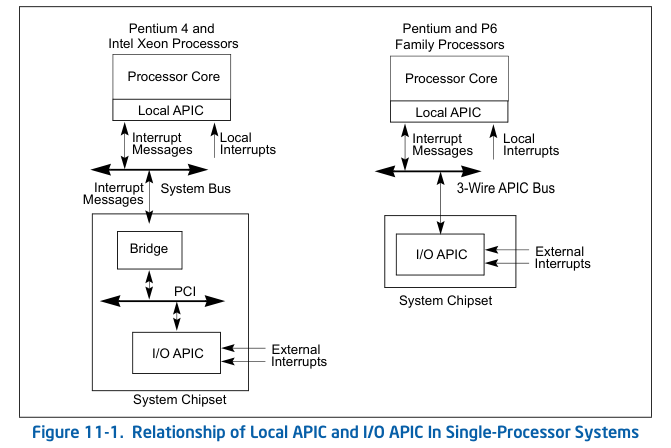

I/O APIC 上的各个针脚可以被编程为在触发时生成特定的中断向量。I/O APIC 还具有“虚拟线模式”，允许其与标准的 8259A 型外部中断控制器通信。需要注意的是，本地 APIC 可以被禁用（参见第 11.4.3 节 “启用或禁用本地 APIC”）。这允许关联的处理器核心直接从 8259A 中断控制器接收中断。

本地 APIC 和 I/O APIC 均设计为在多处理器（MP）系统中操作（参见图 11-2 和 11-3）。每个本地 APIC 处理来自 I/O APIC 的中断、来自系统总线上的处理器的 IPIs 以及自生成的中断。中断也可以通过本地中断针脚传递到各个处理器；然而，这种机制在 MP 系统中通常不使用。

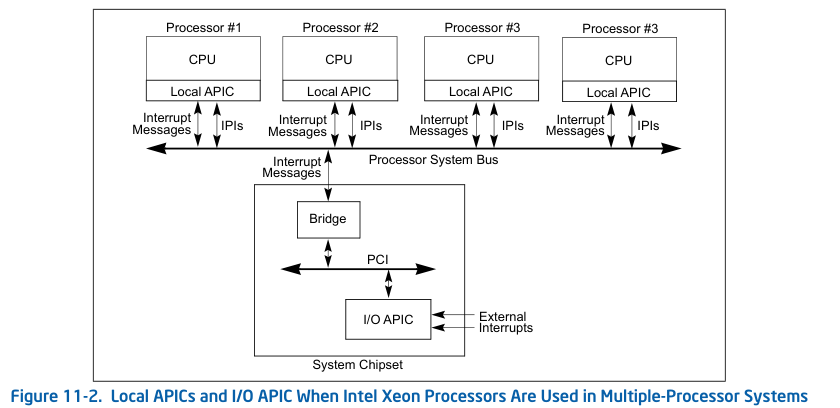

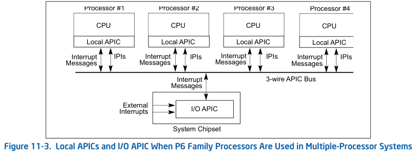

IPI 机制通常用于在 MP 系统中向系统总线上的处理器发送固定中断（针对特定向量号的中断）和专用中断。例如，本地 APIC 可以使用 IPI 将固定中断转发给另一处理器进行服务。专用 IPIs（包括 NMI、INIT、SMI 和 SIPI IPIs）允许系统总线上的一个或多个处理器执行系统范围的启动和控制功能。

### 11.2 系统总线与 APIC 总线
---
对于 P6 系列和奔腾处理器，I/O APIC 和本地 APIC 通过三线 inter-APIC 总线进行通信（见图 11-3）。本地 APIC 还使用 APIC 总线来发送和接收处理器间中断（IPI）。APIC 总线及其消息对软件是不可见的，且不被视为架构的一部分。

从奔腾 4 和 Intel Xeon 处理器开始，I/O APIC 和本地 APIC（使用 xAPIC 架构）通过系统总线进行通信（见图 11-2）。I/O APIC 通过 Intel 芯片组的一部分桥接硬件在系统总线上向处理器发送中断请求。桥接硬件生成发送到本地 APIC 的中断消息。本地 APIC 之间的 IPI 直接在系统总线上传输。

### 11.3 Intel® 82489DX 外部 APIC、APIC、xAPIC 和 x2APIC
---
P6 系列和奔腾处理器中的本地 APIC 是 Intel® 82489DX 外部 APIC 的架构子集。参见第 23.27.1 节 “本地 APIC 与 82489DX 之间的软件可见差异”。

奔腾 4 和 Intel Xeon 处理器中使用的 APIC 架构（称为 xAPIC 架构）是 P6 系列处理器中 APIC 架构的扩展。APIC 和 xAPIC 架构之间的主要区别在于，在 xAPIC 架构中，本地 APIC 和 I/O APIC 通过系统总线进行通信。而在 APIC 架构中，它们通过 APIC 总线通信（参见第 11.2 节 “系统总线与 APIC 总线”）。此外，xAPIC 架构中还扩展和/或修改了一些 APIC 架构特性。这些扩展和修改内容在第 11.4 节至第 11.10 节中进行了描述。

xAPIC 的基本工作模式是 xAPIC 模式。x2APIC 架构是 xAPIC 架构的扩展，主要是为了增加处理器可寻址性。x2APIC 架构提供了对 xAPIC 架构的向后兼容性和对未来 Intel 平台创新的向前扩展性。这些扩展和修改由一种新的执行模式（x2APIC 模式）支持，详细内容见第 11.12 节。

### 11.4 本地 APIC
---
以下章节描述了本地 APIC 的架构，以及如何检测、识别和确定其状态。关于如何编程本地 APIC 的描述，请参见第 11.5.1 节 “本地向量表” 和第 11.6.1 节 “中断命令寄存器（ICR）”。

#### 11.4.1 本地 APIC 方框图

图 11-4 提供了本地 APIC 的功能方框图。软件通过读取和写入其寄存器与本地 APIC 进行交互。APIC 寄存器被内存映射到处理器物理地址空间的一个 4KB 区域，起始地址为 FEE00000H。为了确保 APIC 的正确操作，这一地址空间必须映射到被指定为强制不可缓存（UC）的内存区域。

在多处理器（MP）系统配置中，系统总线上的 Intel 64 或 IA-32 处理器的 APIC 寄存器最初映射到物理地址空间的同一个 4KB 区域。软件可以选择将所有本地 APIC 的初始映射更改为一个不同的 4KB 区域，或者将每个本地 APIC 的 APIC 寄存器映射到各自的 4KB 区域。第 11.4.5 节 “重定位本地 APIC 寄存器” 描述了如何重定位 APIC 寄存器的基地址。

在支持 x2APIC 架构的处理器上（由 CPUID.01H:ECX\[21\] = 1 表示），本地 APIC 支持在 xAPIC 模式和（如果软件启用）x2APIC 模式下操作。x2APIC 模式提供了扩展的处理器可寻址性（参见第 11.12 节）。

> [!NOTE]
> 对于 P6 系列、奔腾 4 和 Intel Xeon 处理器，APIC 内部处理所有对 4KB APIC 寄存器空间地址的内存访问，不会产生外部总线周期。而对于带有片上 APIC 的奔腾处理器，访问 APIC 寄存器空间会产生总线周期。因此，针对在奔腾处理器上运行的软件，系统软件应明确地不要将 APIC 寄存器空间映射到常规系统内存。这样做可能会导致生成非法操作码异常（#UD）或产生不可预测的执行结果。

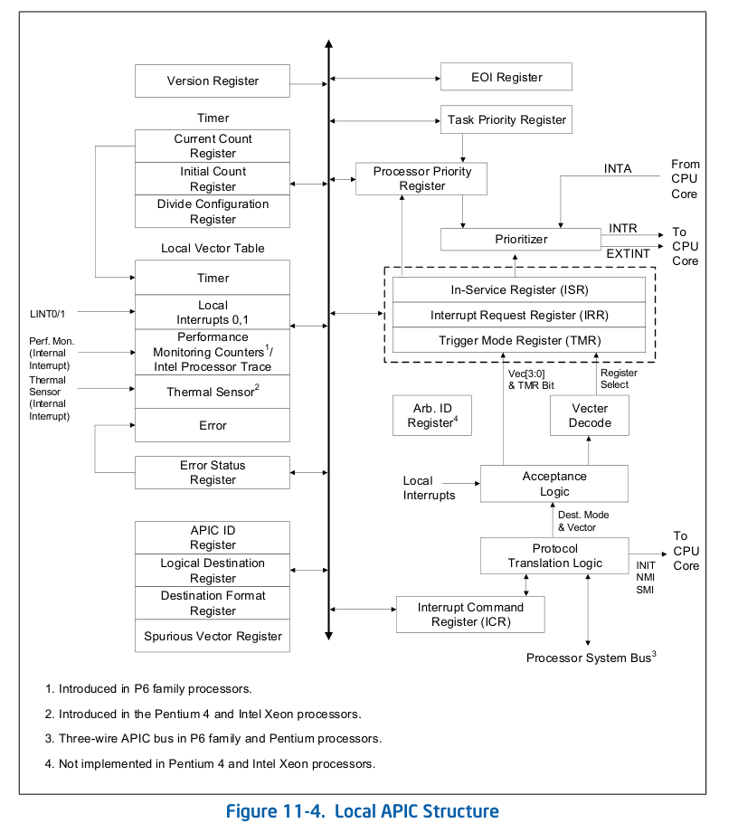

表 11-1 显示了 APIC 寄存器在 4KB APIC 寄存器空间中的映射方式。寄存器宽度为 32 位、64 位或 256 位；所有寄存器均在 128 位边界上对齐。所有 32 位寄存器应使用 128 位对齐的 32 位加载或存储进行访问。一些处理器可能支持对某些 APIC 寄存器的低于 32 位的加载和存储操作。这是具体型号的行为，不保证在所有处理器上都能正常工作。任何对 APIC 寄存器的 FP/MMX/SSE 访问，或任何触及 APIC 寄存器的 4 到 15 字节的访问，可能会导致未定义的行为，不得执行。这种未定义的行为可能包括系统挂起、不正确的结果或意外的异常（包括机器检查），并且在不同实现之间可能有所不同。宽寄存器（64 位或 256 位）必须使用多个 32 位加载或存储进行访问，并且所有访问都必须在 128 位边界上对齐。

表 11-1 中列出的本地 APIC 寄存器不是 MSR。唯一与本地 APIC 编程相关的 MSR 是 IA32_APIC_BASE MSR（参见第 11.4.3 节 “启用或禁用本地 APIC”）。

> [!NOTE]
>  在基于 Nehalem$^1$ 微架构的处理器中，本地 APIC ID 寄存器不再是读/写的；它是只读的。

1. 参见《Intel® 64 和 IA-32 架构软件开发者手册》第 4 卷中表 2-1 “CPUID 签名值的 DisplayFamily_DisplayModel” 和第 2.8 节 “基于 Nehalem 微架构的处理器中的 MSR”，以确定哪些处理器基于 Nehalem 微架构。

| 地址                      | 寄存器名                    | 软件读写                |
| ----------------------- | ----------------------- | ------------------- |
| FEE0 0000H              | 保留                      |                     |
| FEE0 0010H              | 保留                      |                     |
| FEE0 0020H              | 本地 APIC ID 寄存器          | 读/写                 |
| FEE0 0030H              | 本地 APIC 版本寄存器           | 只读                  |
| FEE0 0040H              | 保留                      |                     |
| FEE0 0050H              | 保留                      |                     |
| FEE0 0060H              | 保留                      |                     |
| FEE0 0070H              | 保留                      |                     |
| FEE0 0080H              | 任务优先级寄存器 (TPR)          | 读/写                 |
| FEE0 0090H              | 仲裁优先级寄存器 (APR)$^1$      | 只读                  |
| FEE0 00A0H              | 处理器优先级寄存器 (PPR)         | 只读                  |
| FEE0 00B0H              | EOI 寄存器                 | 只写                  |
| FEE0 00C0H              | 远程读取寄存器 (RRD)$^1$       | 只读                  |
| FEE0 00D0H              | 逻辑目标寄存器 (LDR)           | 读/写                 |
| FEE0 00E0H              | 目标格式寄存器                 | 读/写（参见第 11.6.2.2 节） |
| FEE0 00F0H              | 虚假中断向量寄存器               | 读/写（参见第 11.9 节）     |
| FEE0 0100H              | 服务中寄存器 (ISR)；位 31:0     | 只读                  |
| FEE0 0110H              | 服务中寄存器 (ISR)；位 63:32    | 只读                  |
| FEE0 0120H              | 服务中寄存器 (ISR)；位 95:64    | 只读                  |
| FEE0 0130H              | 服务中寄存器 (ISR)；位 127:96   | 只读                  |
| FEE0 0140H              | 服务中寄存器 (ISR)；位 159:128  | 只读                  |
| FEE0 0150H              | 服务中寄存器 (ISR)；位 191:160  | 只读                  |
| FEE0 0160H              | 服务中寄存器 (ISR)；位 223:192  | 只读                  |
| FEE0 0170H              | 服务中寄存器 (ISR)；位 255:224  | 只读                  |
| FEE0 0180H              | 触发模式寄存器 (TMR)；位 31:0    | 只读                  |
| FEE0 0190H              | 触发模式寄存器 (TMR)；位 63:32   | 只读                  |
| FEE0 01A0H              | 触发模式寄存器 (TMR)；位 95:64   | 只读                  |
| FEE0 01B0H              | 触发模式寄存器 (TMR)；位 127:96  | 只读                  |
| FEE0 01C0H              | 触发模式寄存器 (TMR)；位 159:128 | 只读                  |
| FEE0 01D0H              | 触发模式寄存器 (TMR)；位 191:160 | 只读                  |
| FEE0 01E0H              | 触发模式寄存器 (TMR)；位 223:192 | 只读                  |
| FEE0 01F0H              | 触发模式寄存器 (TMR)；位 255:224 | 只读                  |
| FEE0 0200H              | 中断请求寄存器 (IRR)；位 31:0    | 只读                  |
| FEE0 0210H              | 中断请求寄存器 (IRR)；位 63:32   | 只读                  |
| FEE0 0220H              | 中断请求寄存器 (IRR)；位 95:64   | 只读                  |
| FEE0 0230H              | 中断请求寄存器 (IRR)；位 127:96  | 只读                  |
| FEE0 0240H              | 中断请求寄存器 (IRR)；位 159:128 | 只读                  |
| FEE0 0250H              | 中断请求寄存器 (IRR)；位 191:160 | 只读                  |
| FEE0 0260H              | 中断请求寄存器 (IRR)；位 223:192 | 只读                  |
| FEE0 0270H              | 中断请求寄存器 (IRR)；位 255:224 | 只读                  |
| FEE0 0280H              | 错误状态寄存器                 | 写/读（参见第 11.5.3 节）   |
| FEE0 0290H - FEE0 02E0H | 保留                      |                     |
| FEE0 02F0H              | LVT 校正机器检查中断 (CMCI) 寄存器 | 读/写                 |
| FEE0 0300H              | 中断命令寄存器 (ICR)；位 0-31    | 读/写                 |
| FEE0 0310H              | 中断命令寄存器 (ICR)；位 32-63   | 读/写                 |
| FEE0 0320H              | LVT 计时器寄存器              | 读/写                 |
| FEE0 0330H              | LVT 热传感器寄存器$^2$         | 读/写                 |
| FEE0 0340H              | LVT 性能监控计数器寄存器$^3$      | 读/写                 |
| FEE0 0350H              | LVT LINT0 寄存器           | 读/写                 |
| FEE0 0360H              | LVT LINT1 寄存器           | 读/写                 |
| FEE0 0370H              | LVT 错误寄存器               | 读/写                 |
| FEE0 0380H              | 初始计数寄存器（用于计时器）          | 读/写                 |
| FEE0 0390H              | 当前计数寄存器（用于计时器）          | 只读                  |
| FEE0 03A0H - FEE0 03D0H | 保留                      |                     |
| FEE0 03E0H              | 分频配置寄存器（用于计时器）          | 读/写                 |
| FEE0 03F0H              | 保留                      |                     |
 表11-1 本地 APIC 寄存器地址映射表
> [!NOTE] 表格注:
> 1. 不支持在奔腾 4 和 Intel Xeon 处理器中。当写入这些寄存器时，ESR（错误状态寄存器）的非法寄存器访问位（位 7）将不会被设置。
> 2. 在奔腾 4 和 Intel Xeon 处理器中引入。这个 APIC 寄存器及其相关功能依赖于具体的实现，可能不会出现在未来的 IA-32 或 Intel 64 处理器中。
> 3. 在奔腾 Pro 处理器中引入。这个 APIC 寄存器及其相关功能依赖于具体的实现，可能不会出现在未来的 IA-32 或 Intel 64 处理器中。

#### 11.4.2 本地 APIC 的存在

从 P6 系列处理器开始，可以使用 CPUID 指令检测片上本地 APIC 的存在与否。CPUID.01H:EDX\[9\]指示本地 APIC 的存在（置位）或不存在（清除）。
#### 11.4.3 启用或禁用本地 APIC

可以通过以下两种方式启用或禁用本地 APIC：

1. 使用 IA32_APIC_BASE MSR（MSR 地址为 1BH，见图 11-5）中的 APIC 全局启用/禁用标志：
    
    - 当 IA32_APIC_BASE\[11\] 为 0 时，处理器在功能上等同于没有片上 APIC 的 IA-32 处理器。APIC 的 CPUID 特性标志（参见第 11.4.2 节 “本地 APIC 的存在”）也被设置为 0。
    - 当 IA32_APIC_BASE\[11\] 被设置为 0 时，基于三线 APIC 总线的处理器 APICs 通常不能被重新启用，直到系统硬件复位。三线总线丢失了重新启用所需的仲裁跟踪。不过，某些 APIC 功能仍然可以启用（例如：性能和热监控中断生成）。
    - 对于使用前端总线（FSB）进行中断传递的处理器，软件可以通过设置和重置 IA32_APIC_BASE\[11\] 来禁用或启用 APIC。如果软件能够保证在清除 IA32_APIC_BASE\[11\] 时不会向 APIC 发送中断，则不需要硬件复位即可重新启动 APIC 功能。
    - 当 IA32_APIC_BASE\[11\] 被设置为 0 时，APIC 的先前初始化可能会丢失，APIC 可能会返回到第 11.4.7.1 节 “上电或复位后的本地 APIC 状态” 中描述的状态。
    
2. 使用虚假中断向量寄存器中的 APIC 软件启用/禁用标志（见图 11-23）：
    
    - 如果 IA32_APIC_BASE\[11\] 为 1，软件可以随时通过清除虚假中断向量寄存器中的 APIC 软件启用/禁用标志来暂时禁用本地 APIC（参见图 11-23）。在这种软件禁用状态下的本地 APIC 状态在第 11.4.7.2 节 “软件禁用后的本地 APIC 状态” 中进行了描述。
    - 当本地 APIC 处于软件禁用状态时，可以随时通过将 APIC 软件启用/禁用标志设置为 1 来重新启用它。

对于奔腾处理器，APICEN 引脚（与 PICD1 引脚共享）在上电或复位期间用于禁用本地 APIC。

注意，本地向量表（LVT）中的每个条目都有一个掩码位，可用于抑制从选定的本地中断源（如 LINT0 和 LINT1 引脚、APIC 计时器、性能监控计数器、Intel® Processor Trace、热传感器和/或内部 APIC 错误检测器）传递到处理器的中断。

#### 11.4.4 本地 APIC 状态和位置

本地 APIC 的状态和位置包含在 IA32_APIC_BASE MSR 中（见图 11-5）。MSR 位的功能描述如下：

- **BSP 标志**，第 8 位 ⎯ 指示处理器是否为引导处理器（BSP）。参见第 9.4 节 “多处理器（MP）初始化”。在上电或复位后，这个标志会对选定为 BSP 的处理器设置为 1，对其他处理器（APs）设置为 0。
- **APIC 全局启用标志**，第 11 位 ⎯ 启用或禁用本地 APIC（参见第 11.4.3 节 “启用或禁用本地 APIC”）。该标志在奔腾 4、Intel Xeon 和 P6 系列处理器中可用。在未来的 Intel 64 或 IA-32 处理器中，可能不会保证它的可用性或位置相同。
- **APIC 基地址字段**，第 12 位至第 35 位 ⎯ 指定 APIC 寄存器的基地址。该 24 位值通过低端扩展 12 位来形成基地址。这会自动将地址对齐到 4-KB 边界。在上电或复位后，该字段被设置为 FEE0 0000H。
- IA32_APIC_BASE MSR 中的第 0 位至第 7 位、第 9 位和第 10 位以及 MAXPHYADDR$^2$ 到第 63 位的位是保留的。
> [!NOTE] MAXPHYADDR
> 2. MAXPHYADDR 对于不支持 CPUID leaf 80000008H 的处理器为 36 位，或对于支持 CPUID leaf 80000008H 的处理器由 CPUID.80000008H:EAX\[位 7:0\]指示。

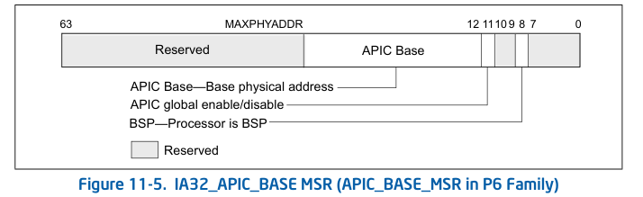

#### 11.4.5 重定位本地 APIC 寄存器

奔腾 4、Intel Xeon 和 P6 系列处理器允许通过修改 IA32_APIC_BASE MSR 中基地址字段的值，将 APIC 寄存器的起始地址从 FEE00000H 重新定位到另一个物理地址。APIC 架构的这一扩展旨在帮助解决与现有系统内存映射的冲突，并允许多处理器系统中的各个处理器将其 APIC 寄存器映射到物理内存中的不同位置。

#### 11.4.6 本地 APIC ID

在系统上电时，系统硬件会为系统总线（针对奔腾 4 和 Intel Xeon 处理器）或 APIC 总线（针对 P6 系列和奔腾处理器）上的每个本地 APIC 分配一个唯一的 APIC ID。硬件分配的 APIC ID 基于系统拓扑结构，并包括插槽位置和集群信息的编码（见图 9-2 和第 9.9.1 节 “共享资源的分层映射”）。

在多处理器（MP）系统中，本地 APIC ID 还被 BIOS 和操作系统用作处理器 ID。一些处理器允许软件修改 APIC ID。然而，软件是否能够修改 APIC ID 取决于处理器的具体型号。因此，操作系统软件应避免写入本地 APIC ID 寄存器。当使用 EAX 寄存器的源操作数值为 1 执行 CPUID 指令时，EBX 寄存器的第 31 到 24 位返回的值始终是**初始 APIC ID**（由平台初始化确定）。即使软件更改了本地 APIC ID 寄存器中的值，这一点也不变。

处理器通过采样 A11# 和 A12# 引脚以及 BR0# 至 BR3# 引脚（针对奔腾 4、Intel Xeon 和 P6 系列处理器）和 BE0# 至 BE3# 引脚（针对奔腾处理器）来接收硬件分配的 APIC ID（或初始 APIC ID）。从这些引脚锁存的 APIC ID 存储在本地 APIC ID 寄存器的 APIC ID 字段中（见图 11-6），并用作处理器的初始 APIC ID。

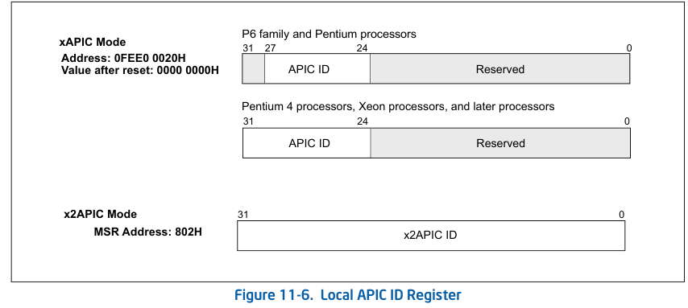

对于 P6 系列和奔腾处理器，本地 APIC ID 寄存器中的 APIC ID 字段为 4 位。编码 0H 至 EH 可用于唯一标识连接到 APIC 总线的 15 个不同处理器。对于奔腾 4 和 Intel Xeon 处理器，xAPIC 规范将本地 APIC ID 字段扩展到 8 位。这些位可以用于在系统中标识最多 255 个处理器。

#### 11.4.7 本地 APIC 状态

以下各节描述了在处理器上电或复位后、本地 APIC 软件禁用后、INIT 复位后以及接收 INIT 解除消息后本地 APIC 的状态及其寄存器的状态。x2APIC 将引入 32 位 ID；参见第 11.12 节。

##### 11.4.7.1 上电或复位后的本地 APIC 状态

在处理器上电或复位后，本地 APIC 及其寄存器的状态如下：

- 以下寄存器重置为全 0：
    - IRR(中断请求寄存器)、ISR(服务中寄存器)、TMR(触发模式寄存器)、ICR(中断命令寄存器)、LDR(逻辑目标寄存器) 和 TPR(任务优先级寄存器)。
    - 计时器初始计数和计时器当前计数寄存器。
    - 分频配置寄存器。
    - DFR 寄存器重置为全 1。
    - 除掩码位设置为 1 外，LVT 寄存器重置为 0。
    - 本地 APIC 版本寄存器不受影响。
    - 本地 APIC ID 寄存器设置为唯一的 APIC ID（仅适用于奔腾和 P6 系列处理器）。仲裁 ID 寄存器设置为 APIC ID 寄存器中的值。
    - 虚假中断向量寄存器 (spurious-interrupt vector register) 初始化为 000000FFH。通过将第 8 位设置为 0，软件禁用本地 APIC。
    - 如果处理器是系统中的唯一处理器，或者在 MP 系统中是 BSP（参见第 9.4.1 节 “BSP 和 AP 处理器”）；本地 APIC 将正常响应 INIT 和 NMI 消息、INIT# 信号和 STPCLK# 信号。如果处理器处于 MP 系统中并被指定为 AP；本地 APIC 将与 BSP 相同地响应。此外，它还将响应 SIPI 消息。仅适用于 P6 系列处理器，AP 将不会响应 STPCLK# 信号。

##### 11.4.7.2 软件禁用后的本地 APIC 状态

当虚假中断向量寄存器中的 APIC 软件启用/禁用标志被明确清除时（而不是在上电或复位期间被清除），本地 APIC 暂时禁用（参见第 11.4.3 节 “启用或禁用本地 APIC”）。本地 APIC 在这种软件禁用状态下的操作和响应如下：

- 本地 APIC 将正常响应 INIT、NMI、SMI 和 SIPI 消息。
- IRR 和 ISR 寄存器中的挂起中断将被保留，并且需要 CPU 进行屏蔽或处理。
- 本地 APIC 仍然可以发出 IPI。软件有责任避免通过 IPI 机制和 ICR 寄存器发出 IPI，如果不希望通过这种机制发送中断。
- 在本地 APIC 被禁用时进行的任何中断接收或 IPI 发送都将在本地 APIC 进入软件禁用状态之前完成。
- 所有 LVT 条目的掩码位被设置。尝试重置这些位将被忽略。
- （对于奔腾和 P6 系列处理器）本地 APIC 继续监听所有总线消息，以保持其仲裁 ID 与系统的其余部分同步。

##### 11.4.7.3 INIT 复位后的本地 APIC 状态（等待 SIPI 状态）

可以通过两种方式启动处理器的 INIT 复位：

- 通过断言处理器的 INIT# 引脚。
- 通过向处理器发送 INIT IPI（传递模式设置为 INIT 的 IPI）。

通过这些机制中的任何一个接收 INIT 后，处理器将响应开始处理器核心和本地 APIC 的初始化。INIT 复位后的本地 APIC 状态与上电或硬件复位后的状态相同，除了 APIC ID 和仲裁 ID 寄存器不受影响。此状态也称为“等待 SIPI”状态（另见：第 9.4.2 节 “MP 初始化协议的要求和限制”）。

##### 11.4.7.4 接收 INIT 解除 IPI 后的本地 APIC 状态

仅奔腾和 P6 系列处理器支持 INIT 解除 IPI。INIT 解除 IPI 对 APIC 状态没有影响，除了将仲裁 ID 寄存器重新加载为 APIC ID 寄存器中的值。

#### 11.4.8 本地 APIC 版本寄存器(Local APIC Version Register)

本地 APIC 包含一个硬连线的版本寄存器。软件可以使用该寄存器来识别 APIC 版本（见图 11-7）。此外，该寄存器还指定了特定实现中本地向量表（LVT）中的条目数量。

本地 APIC 版本寄存器中的字段如下：
- **版本**：
    - 本地 APIC 的版本号：
        - 0XH：82489DX 离散 APIC。
        - 10H - 15H：集成 APIC。
        - 其他值保留。
- **最大 LVT 条目**：
    - 显示 LVT 条目数减 1。对于奔腾 4 和 Intel Xeon 处理器（有 6 个 LVT 条目），Max LVT 字段返回的值为 5；对于 P6 系列处理器（有 5 个 LVT 条目），返回的值为 4；对于奔腾处理器（有 4 个 LVT 条目），返回的值为 3。对于基于 Nehalem 微架构的处理器（有 7 个 LVT 条目）及以后，返回的值为 6。
- **抑制 EOI 广播**：
    - 指示软件是否可以通过设置虚假中断向量寄存器的第 12 位来抑制 EOI 消息的广播；参见第 11.8.5 节和第 11.9 节。

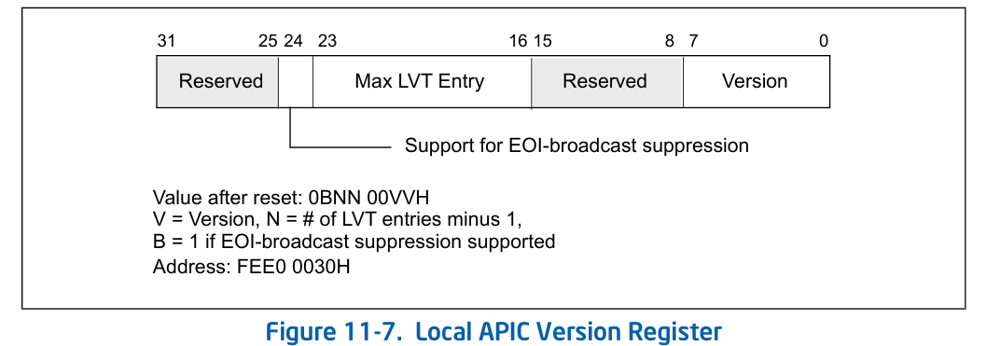

### 11.5 处理本地中断

以下章节描述了本地 APIC 提供的用于处理本地中断的设施。这些设施包括处理器的 LINT0 和 LINT1 引脚、APIC 计时器、性能监控计数器、Intel 处理器追踪(PT)、热传感器和内部 APIC 错误检测器。本地中断处理设施包括：本地向量表（LVT）、错误状态寄存器（ESR）、分频配置寄存器（DCR）、初始计数和当前计数寄存器。

#### 11.5.1 本地向量表

本地向量表（LVT）允许软件指定本地中断传递到处理器核心的方式。它由以下 32 位 APIC 寄存器组成（见图 11-8），每个本地中断对应一个寄存器：

- **LVT CMCI 寄存器（FEE0 02F0H）** — 指定当支持 CMCI (corrected machine check error interrupt)的机器检查库中已校正的机器检查错误计数达到阈值时发生溢出条件时的中断传递（见第 16.5.1 节 “CMCI 本地 APIC 接口”）。
- **LVT 计时器寄存器（FEE0 0320H）** — 指定当 APIC 计时器发出中断时的中断传递（见第 11.5.4 节 “APIC 计时器”）。
- **LVT 热监控寄存器（FEE0 0330H）** — 指定当热传感器生成中断时的中断传递（见第 15.8.2 节 “热监控”）。此 LVT 条目是实现特定的，不是架构性规定的。如果实现了，它将始终位于基地址 FEE0 0330H。
- **LVT 性能计数器寄存器（FEE0 0340H）** — 指定当性能计数器在溢出时生成中断 (见第 20.6.3.5.8 节 “在溢出时生成中断” ) 或当 Intel PT 发出 ToPA PMI 信号时的中断传递（第 33.2.7.2 节）。此 LVT 条目是实现特定的，不是架构性规定的。如果实现了，它不保证位于基地址 FEE0 0340H。
- **LVT LINT0 寄存器（FEE0 0350H）** — 指定当在 LINT0 引脚上发出中断信号时的中断传递。
- **LVT LINT1 寄存器（FEE0 0360H）** — 指定当在 LINT1 引脚上发出中断信号时的中断传递。
- **LVT 错误寄存器（FEE0 0370H）** — 指定当 APIC 检测到内部错误时的中断传递（见第 11.5.3 节 “错误处理”）。

LVT 性能计数器寄存器及其相关中断在 P6 处理器中引入，也存在于奔腾 4 和 Intel Xeon 处理器中。LVT 热监控寄存器及其相关中断在奔腾 4 和 Intel Xeon 处理器中引入。LVT CMCI 寄存器及其相关中断在 Intel Xeon 5500 处理器中引入。

如图 11-8 所示，一些字段和标志在某些条目中不可用（并且是保留的）。

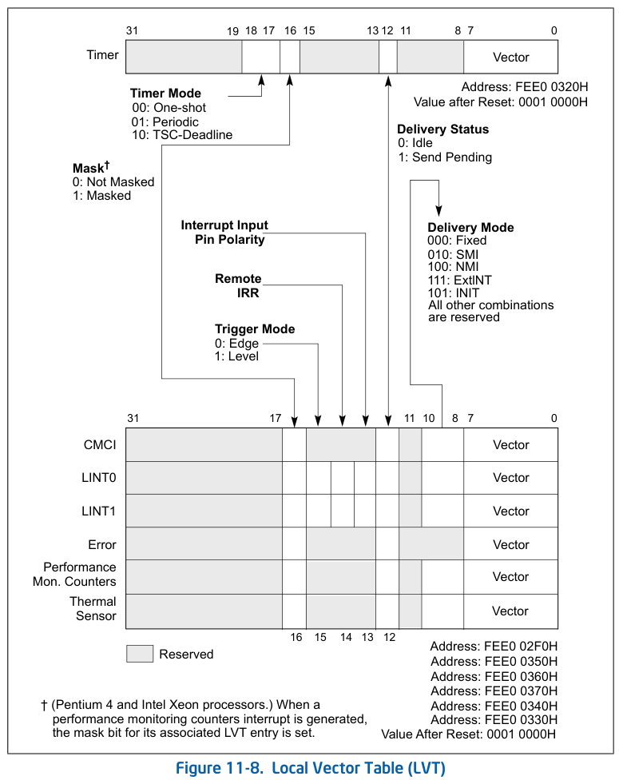

可以在 LVT 表寄存器中指定的设置信息如下：

- **向量**：中断向量号。
- **传递模式**：指定将中断发送到处理器的类型。某些传递模式仅在与特定的触发模式结合使用时才能按预期工作。允许的传递模式如下：
    - 000（固定）：传递向量字段中指定的中断。
    - 010（SMI）：通过处理器的本地 SMI 信号路径将 SMI 中断传递到处理器核心。在使用此传递模式时，向量字段应设置为 00H 以确保未来兼容性。
    - 100（NMI）：将 NMI 中断传递到处理器。向量信息被忽略。
    - 101（INIT）：将 INIT 请求传递到处理器核心，导致处理器执行 INIT。当使用此传递模式时，向量字段应设置为 00H 以确保未来兼容性。不支持 LVT CMCI 寄存器、LVT 热监控寄存器或 LVT 性能计数器寄存器。
    - 110：保留；不支持任何 LVT 寄存器。
    - 111（ExtINT）：使处理器响应中断，就像中断起源于外部连接的（兼容 8259A 的）中断控制器一样。对应于 ExtINT 的特殊 INTA 总线周期被路由到外部控制器。外部控制器应提供向量信息。APIC 架构仅支持系统中的一个 ExtINT 源，通常包含在兼容性桥中。系统中应只有一个处理器的 LVT 条目配置为使用 ExtINT 传递模式。不支持 LVT CMCI 寄存器、LVT 热监控寄存器或 LVT 性能计数器寄存器。
- **传递状态（只读）**：指示中断传递状态，具体如下：
    - 0（空闲）：当前没有该中断源的活动，或者来自该源的前一个中断已传递到处理器核心并被接受。
    - 1（发送待定）：指示来自该源的中断已传递到处理器核心但尚未被接受（见第 11.5.5 节 “本地中断接受”）。
- **中断输入引脚极性**：指定相应中断引脚的极性：（0）高电平有效或（1）低电平有效。
- **远程 IRR 标志（只读）**：对于固定模式、电平触发的中断；当本地 APIC 接受中断进行服务时，该标志被设置，当处理器收到 EOI 命令时，该标志被清除。对于边沿触发的中断和其他传递模式，该标志的含义未定义。
- **触发模式**：选择本地 LINT0 和 LINT1 引脚的触发模式：（0）边沿敏感和（1）电平敏感。此标志仅在传递模式为固定模式时使用。当传递模式为 NMI、SMI 或 INIT 时，触发模式始终为边沿敏感。当传递模式为 ExtINT 时，触发模式始终为电平敏感。计时器和错误中断始终被视为边沿敏感。
    - 如果本地 APIC 未与 I/O APIC 一起使用并选择了固定传递模式；则无论是否选择了边沿敏感触发，奔腾 4、Intel Xeon 和 P6 系列处理器将始终使用电平敏感触发。
    - 软件应始终将 LVT LINT1 寄存器中的触发模式设置为 0（边沿敏感）。LINT1 不支持电平敏感中断。
- **掩码**：中断掩码：（0）启用中断接收，（1）禁止中断接收。当本地 APIC 处理性能监控计数器中断时，它会自动设置 LVT 性能计数器寄存器中的掩码标志。该标志在复位时被设置为 1。只能由软件清除。
- **计时器模式**：第 18:17 位选择计时器模式（见第 11.5.4 节）：
    - （00b）单次模式，使用倒计时值，
    - （01b）周期模式，重新加载倒计时值，
    - （10b）TSC 截止日期模式，使用 IA32_TSC_DEADLINE MSR 中的绝对目标值（见第 11.5.4.1 节），
    - （11b）保留。

#### 11.5.2 有效中断向量

Intel 64 和 IA-32 架构定义了 256 个向量号，范围从 0 到 255（见第 6.2 节“异常和中断向量”）。本地和 I/O APIC 支持其中的 240 个向量（范围为 16 到 255）作为有效中断。

当通过本地 APIC 发送或接收范围为 0 到 15 的中断向量时，APIC 会在其错误状态寄存器中指示非法向量（见第 11.5.3 节“错误处理”）。Intel 64 和 IA-32 架构保留向量 16 到 31 用于预定义的中断、异常和 Intel 保留的编码（见表 6-1）。然而，本地 APIC 不会将此范围内的向量视为非法。

当非法向量值（0 到 15）被写入 LVT 条目且传递模式为固定模式（第 8-11 位等于 0）时，无论掩码位是否被设置，也不管输入上是否实际看到中断，APIC 可能会发出非法向量错误信号。

#### 11.5.3 错误处理

本地 APIC 在中断处理过程中检测到错误时，会在错误状态寄存器（ESR）中记录这些错误。ESR 的格式见图 11-9；其中包含以下标志：

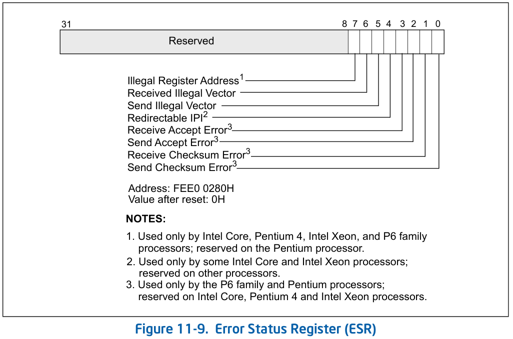

- **位 0：发送校验和错误**  
    当本地 APIC 检测到其在 APIC 总线上发送的消息存在校验和错误时设置此位。仅在 P6 系列和奔腾处理器中使用。
    
- **位 1：接收校验和错误**  
    当本地 APIC 检测到其在 APIC 总线上接收的消息存在校验和错误时设置此位。仅在 P6 系列和奔腾处理器中使用。
    
- **位 2：发送接受错误**  
    当本地 APIC 检测到其发送的消息未被 APIC 总线上的任何 APIC 接受时设置此位。仅在 P6 系列和奔腾处理器中使用。
    
- **位 3：接收接受错误**  
    当本地 APIC 检测到其接收的消息未被 APIC 总线上的任何 APIC（包括其自身）接受时设置此位。仅在 P6 系列和奔腾处理器中使用。
    
- **位 4：可重定向 IPI**  
    当本地 APIC 检测到尝试以最低优先级传递模式发送 IPI，而本地 APIC 不支持发送此类 IPI 时设置此位。该位在一些 Intel Core 和 Intel Xeon 处理器中使用。如第 11.6.2 节所述，处理器发送最低优先级 IPI 的能力取决于型号，应避免使用。
    
- **位 5：发送非法向量**  
    当本地 APIC 检测到在其发送的消息中存在非法向量（范围为 0 到 15）时设置此位。这发生在对 ICR（在 xAPIC 和 x2APIC 模式中）或 SELF IPI 寄存器（仅在 x2APIC 模式中）写入非法向量时。
    
    如果本地 APIC 不支持发送最低优先级 IPI 且软件写入 ICR 以发送带有非法向量的最低优先级 IPI，本地 APIC 仅设置“可重定向 IPI”错误位。中断不被处理，因此在 ESR 中不设置“发送非法向量”位。
    
- **位 6：接收非法向量**  
    当本地 APIC 检测到其接收的中断消息中或从本地向量表或通过 self IPI 本地生成的中断中存在非法向量（范围为 0 到 15）时设置此位。这些中断不会传递到处理器；本地 APIC 永远不会在范围为 0 到 15 的位上设置 IRR 位。
    
- **位 7：非法寄存器地址**  
    当本地 APIC 处于 xAPIC 模式且软件试图访问处理器的本地 APIC 寄存器地址空间中保留的寄存器时设置此位；见表 10-1。（本地 APIC 寄存器地址空间包括 IA32_APIC_BASE MSR 中指定的物理地址中的 4 KB）。仅在 Intel Core、Intel Atom、奔腾 4、Intel Xeon 和 P6 系列处理器中使用。
    
    在 x2APIC 模式中，软件使用 RDMSR 和 WRMSR 指令访问 APIC 寄存器。使用这些指令之一访问保留的寄存器会导致一般保护异常（见第 10.12.1.3 节）。它们不会在 ESR 中设置“非法寄存器访问”位。
    

ESR 是一个写/读寄存器。在尝试从 ESR 读取之前，软件应首先写入它。（写入的值不会影响随后读取的值；在 x2APIC 模式下只能写入 0）。此写入清除之前记录的所有错误，并使用自上次写入 ESR 以来检测到的任何错误更新 ESR。此写入还重新激活 APIC 错误中断触发机制。

LVT 错误寄存器（见第 11.5.1 节）允许指定 APIC 错误检测到时传递到处理器核心的中断向量。该寄存器还提供了屏蔽 APIC 错误中断的方法。此屏蔽仅阻止 APIC 错误中断的传递；APIC 继续在 ESR 中记录错误。

#### 11.5.4 APIC 计时器

本地 APIC 单元包含一个 32 位可编程计时器，软件可以使用它来计时事件或操作。该计时器通过编程四个寄存器来设置：分频配置寄存器（见图 11-10）、初始计数和当前计数寄存器（见图 11-11），以及 LVT 计时器寄存器（见图 11-8）。

如果 `CPUID.06H:EAX.ARAT[bit 2] = 1`，则处理器的 APIC 计时器将以恒定速率运行，无论 P 状态转换如何，并且在深度 C 状态下仍以相同速率运行。 如果 `CPUID.06H:EAX.ARAT[bit 2] = 0` 或不支持 `CPUID 06H`，则在处理器进入深度 C 状态或因增强型 Intel SpeedStep® 技术引起的转换期间，APIC 计时器可能会暂时停止。

> [!NOTE] P状态和C状态
> **P 状态**，也称为性能状态(Performance States)，是处理器在工作时的不同性能和功耗级别。P 状态通过调整处理器的频率和电压来控制功耗和性能。
> 
> - **P0 状态**：是最高性能状态，处理器运行在最高频率和电压下，提供最大计算能力，但功耗也最高。
> - **P1 到 Px 状态**：是较低的性能状态，处理器频率和电压逐步降低，以减少功耗和发热。P 状态的数量（如 P1、P2 等）和具体的频率、电压配置取决于处理器的设计和支持的电源管理技术。
> 
> **C 状态**，也称为空闲状态(Idle States)或低功耗状态，用于处理器在不活动或低活动负载下的电源管理。当处理器没有活跃的工作负载时，它可以进入不同的 C 状态以降低功耗。
> - **C0 状态**：处理器处于活跃状态，正在执行指令。所有处理器核心都处于 C0 状态时，处理器功耗最高。
> - **C1 状态**：处理器空闲但能够快速恢复到 C0 状态。功耗略低于 C0 状态。
> - **C2 到 Cn 状态**：这些是更深层次的空闲状态，每进入一个更深的 C 状态，处理器会关闭更多的内部电路或降低时钟频率以进一步减少功耗。恢复到 C0 状态的时间也相应增加。
> 
> **深度 C 状态（Deep C-States）** 是指处理器进入的非常低功耗的空闲状态（如 C3、C6、C7 等），在这些状态下，处理器的许多部分都被关闭或进入低功耗模式。虽然这些状态可以显著降低功耗，但从深度 C 状态恢复到活跃状态（C0）的时间会更长。

APIC 计时器的频率将是处理器的总线时钟或核心晶体时钟频率（当 `TSC/核心晶体时钟比率` 在 `CPUID` 叶 0x15 中枚举时），除以分频配置寄存器中指定的值。

通过计时器 LVT 条目，计时器可以配置为一次性（one-shot）或周期性（periodic）操作。在一次性模式中，计时器通过编程其初始计数寄存器启动。初始计数值被复制到当前计数寄存器中，计时开始。当计时器达到零时，会生成一个计时器中断，计时器将保持在 0 值，直到重新编程。

在周期性模式中，计时器通过写入初始计数寄存器启动（与一次性模式类似），写入的值被复制到当前计数寄存器中，计时开始。当计数器达到 0 时，当前计数寄存器会自动从初始计数寄存器重新加载，并生成一个计时器中断，计时过程重复进行。如果在计时过程中设置了初始计数寄存器，计数将使用新的初始计数值重新开始。初始计数寄存器是一个读写寄存器；当前计数寄存器则为只读寄存器。

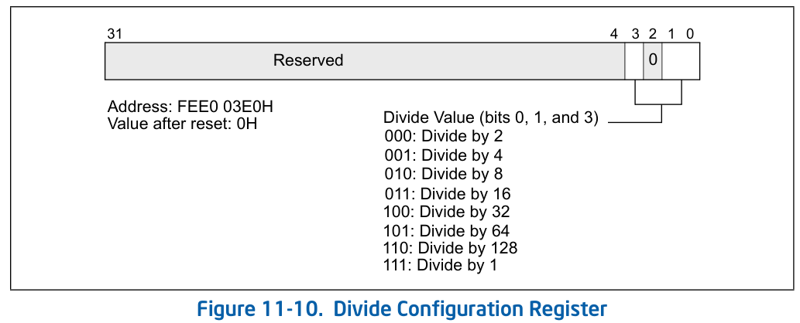

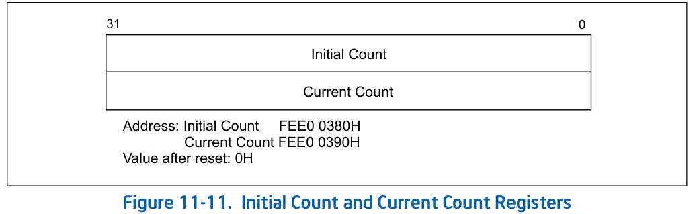

在一次性和周期性模式下，将 0 写入初始计数寄存器将有效地停止本地 APIC 计时器。

LVT 计时器寄存器决定了当计时器计数达到零时传递到处理器的中断向量。LVT 计时器寄存器中的掩码标志可用于屏蔽计时器中断。

**注意**： 通过写入计时器 LVT 条目更改 APIC 计时器的模式（从一次性到周期性或反之）并不会启动计时器。要启动计时器，必须如上所述写入初始计数寄存器。

#### 11.5.4.1 TSC-截止日期模式

- 本地 APIC 计时器的操作模式由 LVT 计时器寄存器确定。具体而言：
    - 如果 `CPUID.01H:ECX.TSC_Deadline[bit 24] = 0`，模式由寄存器的第 17 位确定。
    - 如果 `CPUID.01H:ECX.TSC_Deadline[bit 24] = 1`，模式由寄存器的第 18:17 位确定（见图 11-8）。(如果 `CPUID.01H:ECX.TSC_Deadline[bit 24] = 0`，寄存器的第 18 位保留不用。)

支持的计时器模式在表 11-2 中给出。本地 APIC 计时器的三种模式是互斥的。

| LVT Bits \[18:17\] | Timer Mode                                   |
| ------------------ | -------------------------------------------- |
| 00b                | 一次性模式，程序从初始计数寄存器的值开始倒数。见 11.5.4 节            |
| 01b                | 周期性模式，程序间断值为初始计数寄存器的值。见 11.5.4 节             |
| 10b                | TSC-截止日期模式， 程序目标值为IA32_TSC_DEADLINE MSR寄存器的值 |
| 11b                | 保留                                           |

TSC-截止日期模式允许软件使用本地 APIC 计时器在绝对时间发出中断。在 TSC-截止日期模式下，写入初始计数寄存器的操作被忽略；当前计数寄存器始终读取为 0。相反，计时器的行为通过使用 `IA32_TSC_DEADLINE MSR` 控制。

`IA32_TSC_DEADLINE MSR`（MSR 地址 6E0H）是每个逻辑处理器的 MSR，指定了计时器中断应发生的时间。将非零 64 位值写入 `IA32_TSC_DEADLINE` 会启动计时器。当逻辑处理器的时间戳计数器等于或超过 `IA32_TSC_DEADLINE MSR` $^3$中的目标值时，会生成中断。当计时器生成中断时，它会自动解除并清除 `IA32_TSC_DEADLINE MSR`。因此，每次写入 `IA32_TSC_DEADLINE MSR` 最多只能生成一次计时器中断。

> [!NOTE] 
> 3. 如果逻辑处理器处于 VMX 非根操作模式，读取时间戳计数器（使用 RDMSR、RDTSC 或 RDTSCP）可能不会返回实际的时间戳计数器值；详见《Intel® 64 和 IA-32 架构软件开发者手册》第 3C 卷第 26 章。在 VMX 根操作模式下运行的软件负责协调时间戳计数器和 IA32_TSC_DEADLINE MSR 的虚拟化。

在 TSC-截止日期模式下，将 0 写入 `IA32_TSC_DEADLINE MSR` 会解除本地 APIC 计时器。切换 TSC-截止日期模式和其他计时器模式也会解除计时器。

`IA32_TSC_DEADLINE MSR` 的硬件复位值为 0。在其他计时器模式（LVT 第 18 位 = 0）中，`IA32_TSC_DEADLINE MSR` 读取为 0，写操作被忽略。

软件可以通过以下算法配置 TSC-截止日期计时器以传递单次中断：

1. 通过验证 `CPUID.1:ECX.24 = 1` 检测对 TSC-截止日期模式的支持。
2. 通过编程 LVT 计时器寄存器的第 18:17 位为 10b 来选择 TSC-截止日期模式。
3. 用期望的计时器中断时间的目标 TSC 值编程 `IA32_TSC_DEADLINE MSR`。这会使处理器启动计时器。
4. 当时间戳计数器的值大于或等于 `IA32_TSC_DEADLINE` 的值时，处理器生成计时器中断。然后，计时器自动解除并清除 `IA32_TSC_DEADLINE MSR`。时间戳计数器和 `IA32_TSC_DEADLINE MSR` 都是 64 位无符号整数。
5. 软件可以通过重复第 3 步重新启动计时器。

- 以下是 TSC-截止日期模式的使用指南：
    - 写入 `IA32_TSC_DEADLINE MSR` 不是串行化的。因此，系统软件不应将 `WRMSR` 写入 `IA32_TSC_DEADLINE MSR` 作为串行化指令。对 `IA32_TSC_DEADLINE` 和其他 MSR 寄存器的读写访问将按程序顺序进行。
    - 软件可以随时通过将 0 写入 `IA32_TSC_DEADLINE MSR` 来解除计时器。
    - 如果计时器已启动，软件可以通过写入新值到 `IA32_TSC_DEADLINE MSR` 来改变截止时间（前移或后移）。
    - 如果软件解除计时器或推迟截止时间，可能会发生竞争条件，导致与原始截止日期相关的计时器中断。如果截止日期已推迟，软件可以通过读取时间戳计数器并将其值与新截止日期进行比较来识别此类中断。
    - 在 xAPIC 模式下（本地 APIC 寄存器被内存映射），软件必须确保启用 TSC-截止日期模式的 LVT 条目写入和任何后续写入 `IA32_TSC_DEADLINE MSR` 的操作顺序正确。软件可以通过在内存映射写入之后和任何 `WRMSR` 之前执行 `MFENCE` 指令来确保正确排序。（在 x2APIC 模式下，使用 `WRMSR` 指令写入 LVT 条目。处理器确保此写入和任何后续写入截止日期的顺序；不需要围栏操作。）

#### 11.5.5 接受本地中断
当一个本地中断被发送到处理器核心时，会按照图 11-17 中的中断接收流程图所指定的接受标准进行处理。如果中断被接受，它会被记录进 IRR 寄存器(中断请求寄存器)，并由处理器根据其优先级进行处理（参见第 11.8.4 节“固定中断的接受”）。如果中断未被接受，它会被本地 APIC 并重试。

### 11.6 发送处理器间中断（IPIs）

以下章节描述了本地 APIC 提供的软件发出处理器间中断（IPIs）的功能。用于发出 IPIs 的主要本地 APIC 设施是中断命令寄存器（ICR）。ICR 可以用于以下功能：

- 向另一个处理器发送中断。
- 允许处理器将其接收到但未处理的中断转发给另一个处理器进行处理。
- 指示处理器中断自己（执行自我中断）。
- 向其他处理器发送特殊 IPIs，例如启动 IPI（SIPI）消息。

通过该设施生成的中断通过系统总线（对于 Pentium 4 和 Intel Xeon 处理器）或 APIC 总线（对于 P6 系列和 Pentium 处理器）传递到系统中的其他处理器。处理器发送最低优先级 IPI 的能力是特定于处理器型号的，BIOS 和操作系统软件应避免使用。

#### 11.6.1 中断命令寄存器（ICR）

中断命令寄存器（ICR）是一个 64 位$^4$的本地 APIC 寄存器（见图 11-12），允许在处理器上运行的软件指定并向系统中的其他处理器发送处理器间中断（IPIs）。

> [!NOTE] 
> 4. 在 XAPIC 模式下，ICR 被映射为两个 32 位寄存器，ICR_LOW（FFE0 0300H）和 ICR_HIGH（FFE0 0310H）。在 x2APIC 模式下，ICR 使用 MSR 830H。

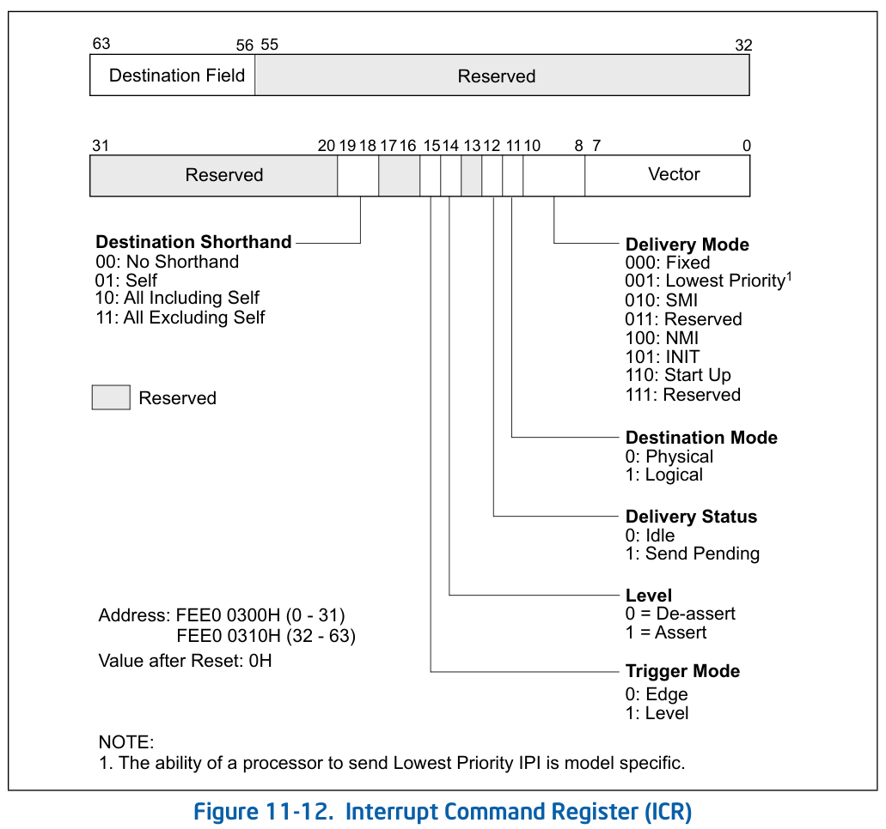

要发送 IPI，软件必须设置 ICR 以指示要发送的 IPI 消息类型以及目标处理器或处理器组。（ICR 的所有字段均可由软件读写，除了传递状态字段，它是只读的。）写入 ICR 的低双字操作会触发 IPI 的发送。

ICR 由以下字段组成：
- **向量**：正在发送的中断的向量号。
- **传递模式**：指定要发送的 IPI 类型。该字段也称为 IPI 消息类型字段。
    
    - 000（固定）: 将向量字段中指定的中断传递到目标处理器或处理器组。
    - 001（最低优先级）: 与固定模式相同，但中断传递到目标字段中指定的处理器组中执行优先级最低的处理器。处理器发送最低优先级 IPI 的能力是特定于处理器型号的，BIOS 和操作系统软件应避免使用。
    - 010（SMI）: 将 SMI 中断传递到目标处理器或处理器组。为了兼容未来，向量字段必须设置为 00H。
    - 011（保留）
    - 100（NMI）: 将 NMI 中断传递到目标处理器或处理器组。向量信息被忽略。
    - 101（INIT）: 将 INIT 请求传递到目标处理器或处理器组，导致它们执行 INIT。作为此 IPI 消息的结果，所有目标处理器都执行 INIT。为了兼容未来，向量字段必须设置为 00H。
    - 101（INIT 级别去激活）:（Pentium 4 和 Intel Xeon 处理器不支持）向系统中所有本地 APIC 发送同步消息，将它们的仲裁 ID（存储在它们的仲裁 ID 寄存器中）设置为它们的 APIC ID。对于这种传递模式，级别标志必须设置为 0，触发模式标志必须设置为 1。无论目标字段或目标简写字段的值如何，该 IPI 都会发送到所有处理器；但是，软件应指定“所有包括自己”的简写。
    - 110（启动）: 向目标处理器或处理器组发送特殊的“启动”IPI（称为 SIPI）。向量通常指向 BIOS 启动代码的一部分启动例程。以此传递模式发送的 IPIs 在源 APIC 无法传递时不会自动重试。由软件决定 SIPI 是否成功传递，并在必要时重新发送 SIPI。
- **目标模式**：选择物理（0）或逻辑（1）目标模式（参见第 11.6.2 节“确定 IPI 目标”）。
- **传递状态**（只读）：指示 IPI 的传递状态：
    
    - 0（空闲）: 表示本地 APIC 已完成发送任何先前的 IPIs。
    - 1（发送中）: 表示本地 APIC 尚未完成发送最后一个 IPI。

- **级别**：对于 INIT 级别去激活传递模式，该标志必须设置为 0；对于所有其他传递模式，该标志必须设置为 1。（此标志在 Pentium 4 和 Intel Xeon 处理器中没有意义，始终为 1。）

- **触发模式**：在使用 INIT 级别去激活传递模式时选择触发模式：边沿（0）或电平（1）。对于所有其他传递模式，该标志被忽略。（此标志在 Pentium 4 和 Intel Xeon 处理器中没有意义，始终为 0。）

- **目标简写**：指示是否使用简写符号指定中断的目标，如果使用，使用哪种简写。目标简写代替了 8 位目标字段，并且软件可以使用单次写入 ICR 的低双字来发送简写。简写定义如下：软件自中断、发送到系统中所有处理器包括发送者的 IPI、发送到系统中所有处理器不包括发送者的 IPI。
    - 00（无简写）: 目标在目标字段中指定。
    - 01（自身）: 发出 IPI 的 APIC 是唯一的目标处理器。该目标简写允许软件中断其正在执行的处理器。APIC 实现可以自由选择将自中断消息内部传递或像其他任何 IPI 消息一样发送到总线并“嗅探”它。
    - 10（所有包括自身）: IPI 发送到系统中的所有处理器，包括发送 IPI 的处理器。APIC 将向 Pentium 和 P6 系列处理器广播目标字段设置为 FH 的 IPI 消息，并向 Pentium 4 和 Intel Xeon 处理器广播目标字段设置为 FFH 的 IPI 消息。
    - 11（所有不包括自身）: IPI 发送到系统中的所有处理器，不包括发送 IPI 的处理器。APIC 使用物理目标模式和目标字段设置为 FH 向 Pentium 和 P6 系列处理器广播消息，并向 Pentium 4 和 Intel Xeon 处理器广播目标字段设置为 FFH 的消息。结合最低优先级传递模式使用此目标简写的支持是特定于处理器型号的。对于 Pentium 4 和 Intel Xeon 处理器，当与最低优先级传递模式一起使用此简写时，IPI 可能会被重定向回发出 IPI 的处理器。

- **目标**：指定目标处理器或处理器组。仅在目标简写字段设置为 00b 时使用。如果目标模式设置为物理，则第 56 到 59 位包含目标处理器的 APIC ID（对于 Pentium 和 P6 系列处理器），而第 56 到 63 位包含目标处理器的 APIC ID（对于 Pentium 4 和 Intel Xeon 处理器）。如果目标模式设置为逻辑，则 8 位目标字段的解释取决于系统中所有处理器的本地 APIC 的 DFR 和 LDR 寄存器的设置（参见第 11.6.2 节“确定 IPI 目标”）

ICR 的所有选项组合并非都有效。表 11-3 显示了 Pentium 4 和 Intel Xeon 处理器中 ICR 字段的有效组合；表 11-4 显示了 P6 系列处理器中 ICR 字段的有效组合。另外需要注意的是，ICR 的下半部分可能不会在切换到最深的 C 状态时保留。

x2APIC 模式下的 ICR 操作在第 11.12.9 节中讨论。

表11-3. 对于奔腾4和Intel Xeon处理器本地 xAPIC 中断命令寄存器的有效组合

| 目标速记 | 有效/无效  | 触发模式 | 传递模式                              | 目标模式  |
| ---- | ------ | ---- | --------------------------------- | ----- |
| 无速记  | 有效     | 边沿   | 所有模式1                             | 物理或逻辑 |
| 无速记  | 无效$^2$ | 电平   | 所有模式                              | 物理或逻辑 |
| 自身   | 有效     | 边沿   | 固定                                | X$^3$ |
| 自身   | 无效$^2$ | 电平   | 固定                                | X     |
| 自身   | 无效     | X    | 最低优先级、NMI、INIT、SMI、启动             | X     |
| 包含自身 | 有效     | 边沿   | 固定                                | X     |
| 包含自身 | 无效$^2$ | 电平   | 固定                                | X     |
| 包含自身 | 无效     | X    | 最低优先级、NMI、INIT、SMI、启动             | X     |
| 排除自身 | 有效     | 边沿   | 固定、最低优先级$^{1, 4}$、NMI、INIT、SMI、启动 | X     |
| 排除自身 | 无效$^2$ | 电平   | 固定、最低优先级$4$、NMI、INIT、SMI、启动       | X     |

> [!NOTE] 注释：
> 1. 处理器发送最低优先级中断（IPI）的能力是特定于型号的。
> 2. 对于这些中断，如果触发模式位为1（电平），本地xAPIC将覆盖该位设置，并将中断作为边沿触发中断发出。
> 3. X表示该设置被忽略。
> 4. 当使用“最低优先级”传递模式和“排除自身”目标时，中断请求（IPI）可能会被重定向回发出请求的APIC，这与“包含自身”目标模式本质上是一样的。

表 11-4. 对于 P6 系列处理器本地 xAPIC 中断命令寄存器的有效组合

| 目标速记 | 有效/无效  | 触发模式 | 传递模式                  | 目标模式  |
| ---- | ------ | ---- | --------------------- | ----- |
| 无速记  | 有效     | 边沿   | 所有模式$^1$              | 物理或逻辑 |
| 无速记  | 有效$^2$ | 电平   | 固定、最低优先级$^1$、NMI      | 物理或逻辑 |
| 无速记  | 有效$^3$ | 电平   | INIT                  | 物理或逻辑 |
| 自身   | 有效     | 边沿   | 固定                    | X$^4$ |
| 自身   | 有效$^2$ | 电平   | 固定                    | X     |
| 自身   | 无效$^5$ | X    | 最低优先级、NMI、INIT、SMI、启动 | X     |
| 包含自身 | 有效     | 边沿   | 固定                    | X     |
| 包含自身 | 有效$^2$ | 电平   | 固定                    | X     |
| 包含自身 | 无效$^5$ | X    | 最低优先级、NMI、INIT、SMI、启动 | X     |
| 排除自身 | 有效     | 边沿   | 所有模式$^1$              | X     |
| 排除自身 | 有效$^2$ | 电平   | 固定、最低优先级$^1$、NMI      | X     |
| 排除自身 | 无效$^5$ | 电平   | SMI、启动                | X     |
| 排除自身 | 有效$^3$ | 电平   | INIT                  | X     |
| X    | 无效$^5$ | 电平   | SMI、启动                | X     |

注释：
1. 处理器发送最低优先级处理器间中断（IPI）的能力是特定于型号的。
2. 如果电平位被设置为1，则被视为边沿触发；否则忽略。
3. 当电平位设置为1时，被视为边沿触发；当电平位设置为0（取消断言）时，被视为“INIT 电平取消断言”消息。只有INIT电平取消断言消息允许将电平位设置为0。对于所有其他消息，电平位必须设置为1。
4. X表示该设置被忽略。
5. APIC的行为是未定义的。

> [!NOTE] 电平触发中断与边沿触发中断
> - **边沿触发中断**：当中断信号从低电平到高电平（上升沿）或从高电平到低电平（下降沿）时，触发一次中断请求。即使信号保持高电平或低电平，不会重复触发中断。因此，边沿触发的中断只在信号变化的瞬间产生中断请求。
> - **电平触发中断**：中断信号保持高电平时，持续触发中断请求。换句话说，电平触发的中断会持续有效，直到信号返回到低电平。因此，必须在中断处理完成后，通知中断源（通常是I/O APIC）中断已被处理，以便其停止继续触发中断。

#### 11.6.2 确定IPI目标

IPI（中断请求, 处理器间中断, Inter-Processor Interrupt）的目标可以是系统总线上的一个、全部或一部分处理器。发送方通过以下APIC寄存器和寄存器中的字段来指定IPI的目标：

- **ICR寄存器** — ICR寄存器中的以下字段用于指定IPI的目标：
    - **目标模式** — 选择两种目标模式之一（物理或逻辑）。
    - **目标字段** — 在物理目标模式下，用于指定目标处理器的APIC ID；在逻辑目标模式下，用于指定**消息目标地址**（message destination address, MDA），该地址可以用于选择集群中的特定处理器。
    - **目标速记** — 一种快速指定所有处理器、排除自身的所有处理器或自身为目标的方法。
    - **传递模式，最低优先级** — 从架构上指定使用最低优先级仲裁机制，从指定的处理器组中选择一个目标处理器。处理器发送最低优先级IPI的能力是特定于型号的，BIOS和操作系统软件应避免使用这一模式。
- **本地目标寄存器（Local destination register, LDR）** — 与逻辑目标模式和MDA一起使用，以选择目标处理器。
- **目标格式寄存器（Destination format register, DFR）** — 与逻辑目标模式和MDA一起使用，以选择目标处理器。

如何使用ICR、LDR和DFR选择IPI的目标取决于所使用的目标模式：物理模式、逻辑模式、广播/自目标模式或最低优先级传递模式。以下章节介绍了这些目标模式。

##### 11.6.2.1 物理目标模式

在物理目标模式中，目标处理器通过其本地APIC ID指定（参见第11.4.6节“本地APIC ID”）。对于Pentium 4和Intel Xeon处理器，可以在物理目标模式下指定单个目标（本地APIC ID为00H到FEH）或广播给所有APIC（APIC ID为FFH）。

在物理目标模式下，不支持使用最低优先级传递模式的广播IPI（MDA的第28到31位为1）或I/O子系统发起的中断，软件不得配置此模式。此外，对于任何非广播IPI或使用最低优先级传递模式的I/O子系统发起的中断，软件必须确保中断地址中定义的APIC存在并启用，以接收中断。

对于P6系列和Pentium处理器，在物理目标模式下，单个目标通过本地APIC ID为0H到0EH指定，允许在APIC总线上寻址多达15个本地APIC。通过0FH指定广播给所有本地APIC。

**注**： 系统总线上可以寻址的本地APIC数量可能受到硬件限制。

##### 11.6.2.2 逻辑目标模式

在逻辑目标模式下，IPI目标通过一个8位的消息目标地址（MDA）指定，该地址输入到ICR的目标字段中。接收到通过逻辑目标模式发送的IPI消息后，本地APIC会将消息中的MDA与其LDR和DFR中的值进行比较，以确定是否应接受并处理IPI。对于逻辑目标模式的两种配置，结合最低优先级传递模式时，软件负责确保IPI或I/O子系统中断中包含或寻址的所有本地APIC都存在并启用，以接收中断。

图11-13显示了逻辑目标寄存器（LDR）的布局。该寄存器中的8位逻辑APIC ID字段用于创建一个可与MDA进行比较的标识符。

**注**： 逻辑APIC ID不应与本地APIC ID混淆，本地APIC ID包含在本地APIC ID寄存器中。

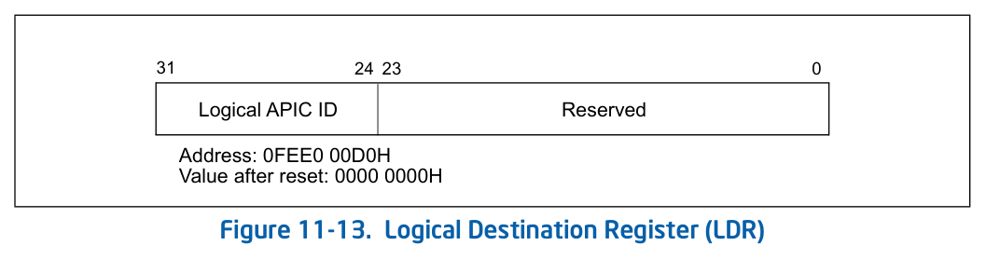

图11-14 展示了目标格式寄存器 (DFR) 的布局。该寄存器中的4位模式字段用于选择两种模型之一（平面或集群），这些模型可用于在使用逻辑目标模式时解释MDA（消息目标地址）。

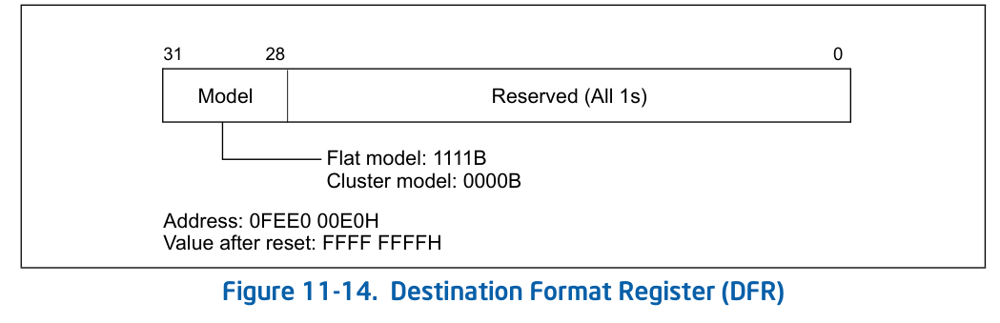

两种模型的MDA解释如下：

1. **平面模型（Flat Model）** — 通过将DFR的第28到31位设置为1111b选择该模型。在这里，可以通过在每个本地APIC的LDR（本地目标寄存器）中的逻辑APIC ID字段设置不同的位来为多达8个本地APIC建立唯一的逻辑APIC ID。然后可以通过在MDA中设置一个或多个位来选择一组本地APIC。

   每个本地APIC对MDA和其逻辑APIC ID执行按位“与”操作。如果检测到真条件（非零），则本地APIC接受IPI消息。通过将MDA设置为全1，可以实现广播到所有APIC的操作。

2. **集群模型（Cluster Model）** — 通过将DFR的第28到31位设置为0000b选择该模型。该模型支持两种基本的目标方案：**平面集群**和**分层集群**。

   - **平面集群目标模型** 仅支持P6家族和Pentium处理器。使用此模型时，假设所有APIC都通过APIC总线连接。MDA的第60到63位包含目标集群的编码地址，第56到59位识别集群中的多达4个本地APIC（每个位对应集群中的一个本地APIC，如同在平面连接模型中一样）。为了识别一个或多个本地APIC，MDA的第60到63位与LDR的第28到31位进行比较，以确定某个本地APIC是否属于该集群。MDA的第56到59位与LDR的第24到27位进行比较，以识别集群内的某个本地APIC。

     可以通过在MDA的第60到63位中写入目标集群地址，并在MDA的第56到59位中设置对应于集群成员的选定位，来指定集群中的处理器集合。在此模式下，可以在消息中指定15个集群（集群地址为0到14），每个集群有4个本地APIC。然而，对于P6和Pentium处理器的本地APIC，APIC仲裁ID仅支持15个APIC代理。因此，该模式支持的处理器和本地APIC的总数限制为15个。通过将所有目标位设置为1，可以实现广播到所有本地APIC的操作。这将保证在所有集群中匹配，并选择每个集群中的所有APIC。集群模式下不支持广播IPI或使用最低优先级传递模式的I/O子系统广播中断，软件不得配置此模式。

   - **分层集群目标模型** 可用于Pentium 4、Intel Xeon、P6家族或Pentium处理器。使用此模型时，可以通过独立的系统或APIC总线将不同的平面集群连接起来，创建一个分层网络。这种方案要求每个集群中有一个集群管理器，该管理器负责处理系统或APIC总线之间的消息传递。一个集群最多可以包含4个代理。通过15个集群管理器（每个管理器有4个代理），可以形成一个多达60个APIC代理的网络。请注意，分层APIC网络需要特殊的集群管理器设备，而该设备不是本地APIC或I/O APIC单元的一部分。

注意事项：
- 所有启用其APIC软件的处理器（通过使用虚假向量启用/禁用位）必须以相同的方式编程其DFR（目标格式寄存器）。
- DFR的默认模式是平面模式。如果使用集群模式，必须在软件启用APIC之前编程DFR。由于某些芯片组无法准确跟踪系统的逻辑模式视图，因此应尽早在启动处理器后对DFR进行编程。

##### 11.6.2.3 广播/自目标传递模式

ICR（中断命令寄存器）的目标速记字段允许绕过传递模式，将IPI广播到系统总线上的所有处理器，或者广播回发送处理器自身（参见第11.6.1节“中断命令寄存器（ICR）”）。支持三种目标速记：自身、排除自身的所有处理器、包含自身的所有处理器。使用目标速记时，将忽略目标模式。

##### 11.6.2.4 最低优先级传递模式

在**最低优先级传递模式**下，ICR被编程为通过逻辑或速记目标机制向系统总线上的多个处理器发送IPI。然后，被选中的处理器在系统总线或APIC总线上相互仲裁，**优先级最低**的处理器将接受该IPI。

对于基于Intel Xeon处理器的系统，芯片组总线控制器接受系统中I/O APIC代理发出的消息，并将中断定向到系统总线上的处理器。使用最低优先级传递模式时，芯片组会从可能的目标中选择一个处理器接收中断。Pentium 4处理器在系统总线上提供一个特殊的总线周期，通知芯片组每个逻辑处理器的当前任务优先级。芯片组保存此信息，并在收到中断时选择优先级最低的处理器。

对于基于P6系列处理器的系统，最低优先级仲裁使用每个本地APIC中的仲裁优先级寄存器（APR）中的处理器优先级。图11-15显示了APR的布局。

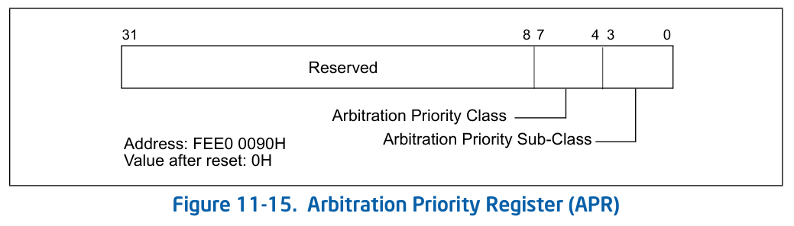

APR值的计算如下：
```
IF (TPR[7:4] ≥ IRRV[7:4]) AND (TPR[7:4] > ISRV[7:4]) THEN
    APR[7:0] ← TPR[7:0]
ELSE
    APR[7:4] ← max(TPR[7:4] AND ISRV[7:4], IRRV[7:4])
    APR[3:0] ← 0
```

其中，TPR值是任务优先级寄存器（TPR）中的任务优先级值（见图11-18），IRRV值是IRR（中断请求寄存器）中最高优先级位对应的向量号（见图11-20），如果IRR中没有设置任何位，则IRRV为00H；ISRV值是ISR（服务寄存器）中最高优先级位对应的向量号（见图11-20）。在目标处理器仲裁后，APR值最低的处理器处理IPI，其他处理器将忽略它。

（P6系列和Pentium处理器）对于这些处理器，如果存在焦点处理器，它可能会接受中断，无论其优先级如何。一个处理器被认为是中断的焦点处理器，如果它当前正在服务该中断或它有一个该中断的挂起请求。对于Intel Xeon处理器，不支持焦点处理器的概念。

在使用最低优先级传递模式但不更新TPR的操作系统中，芯片组中保存的TPR信息可能会导致中断始终被传递给逻辑集中同一个处理器。这种行为与P6系列处理器功能上是向后兼容的，但可能会导致意外的性能影响。

#### 11.6.3 IPI的传递与接受

当ICR的低双字写入时，本地APIC根据ICR中包含的信息创建一个IPI消息，并将该消息发送到系统总线（Pentium 4和Intel Xeon处理器）或APIC总线（P6系列和Pentium处理器）。这些IPI的处理方式在第11.8节“处理中断”中描述。

### 11.7 系统和APIC总线仲裁

当多个本地APIC和I/O APIC在系统总线（或APIC总线）上发送IPI和中断消息时，消息的发送和处理顺序通过总线仲裁机制确定。

对于Pentium 4和Intel Xeon处理器，本地和I/O APIC使用系统总线定义的仲裁机制来确定IPI的处理顺序。此机制是非架构性的，无法通过软件控制。

对于P6系列和Pentium处理器，本地和I/O APIC使用基于APIC的仲裁机制来确定IPI的处理顺序。在这里，每个本地APIC都有一个0到15的仲裁优先级，I/O APIC在仲裁时使用这个优先级来确定哪个本地APIC应该获得APIC总线的访问权。仲裁优先级最高的本地APIC总是赢得总线访问权。在一次仲裁回合结束后，胜出的本地APIC将其仲裁优先级降低为0，失败的本地APIC将其仲裁优先级各提升1。

本地APIC的当前仲裁优先级存储在一个4位、软件透明的仲裁ID（Arb ID）寄存器中。在复位时，该寄存器被初始化为本地APIC ID寄存器中存储的APIC ID号。通过ICR命令发出的INIT电平去断言IPI可用于重新同步本地APIC的仲裁优先级，将每个代理的Arb ID寄存器重置为其当前的APIC ID值。（Pentium 4和Intel Xeon处理器没有实现Arb ID寄存器。）

第11.10节“APIC总线消息传递机制和协议（P6系列、Pentium处理器）”描述了APIC总线仲裁协议和总线消息格式，第11.6.1节“中断命令寄存器（ICR）”描述了INIT电平去断言IPI消息。

请注意，除了SIPI IPI（参见第11.6.1节“中断命令寄存器（ICR））之外，所有未成功传递到其指定目标或目标的总线消息都会自动重试。软件应避免将IPI发送到禁用或不存在的本地APIC，这会导致消息反复重发。此外，针对APIC的中断源应被屏蔽或更改为不再目标APIC。

### 11.8 处理中断

当本地APIC接收到来自本地源的中断、来自I/O APIC的中断消息或IPI时，它如何处理这些消息取决于处理器的实现，如以下部分所述。

#### 11.8.1 使用Pentium 4和Intel Xeon处理器的中断处理

对于Pentium 4和Intel Xeon处理器，本地APIC按如下方式处理接收到的本地中断、中断消息和IPI：

1. 本地APIC确定它是否是指定的目标（参见图11-16）。如果是指定的目标，它接受该消息；如果不是，则丢弃该消息。

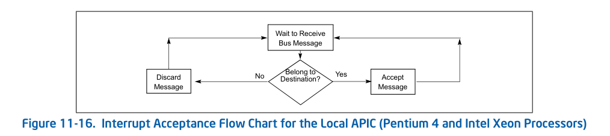

2. 如果本地APIC确定它是指定的中断目标，并且中断请求是NMI、SMI、INIT、ExtINT或SIPI，则中断直接发送到处理器核心进行处理。
3. 如果本地APIC确定它是指定的中断目标，但中断请求不属于第2步中的中断，本地APIC在IRR中设置相应的位。
4. 当IRR寄存器中有挂起的中断时，本地APIC根据中断的优先级和PPR（任务和处理器优先级，参见11.8.3.1节）的当前处理器优先级，一个一个地将它们分派给处理器。
5. 当固定中断被分派到处理器核心处理时，处理完成的标志是在指令处理程序代码中包含一条写入本地APIC的EOI（中断结束）寄存器的指令（参见11.8.5节“中断服务完成信号”）。写入EOI寄存器的操作会导致本地APIC从其ISR队列中删除中断，并且对于电平触发的中断，会在总线上发送一条消息，指示中断处理已完成。（对于NMI、SMI、INIT、ExtINT或SIPI，不应在处理程序中包含对EOI寄存器的写入。）

#### 11.8.2 使用P6家族和Pentium处理器的中断处理

对于P6家族和Pentium处理器，本地APIC按如下方式处理接收到的本地中断、中断消息和IPI（参见图11-17）：

1. （仅针对IPI）本地APIC检查IPI消息，确定它是否是该IPI的指定目标，如11.6.2节“确定IPI目标”所述。如果它是指定目标，则继续执行接受过程；如果不是目标，则丢弃IPI消息。当消息指定最低优先级传递模式时，本地APIC将与其他被指定为IPI消息接收者的处理器进行仲裁（参见11.6.2.4节“最低优先级传递模式”）。
2. 如果本地APIC确定它是指定的中断目标，并且中断请求是NMI、SMI、INIT、ExtINT或INIT取消断言中断，或是MP协议IPI消息（BIPI、FIPI和SIPI）之一，则中断直接发送到处理器核心进行处理。
3. 如果本地APIC确定它是指定的中断目标，但中断请求不属于第2步中的中断，本地APIC在其IRR和ISR寄存器中查找一个空闲的插槽（参见图11-20）。如果有可用插槽（参见11.8.4节“固定中断的接受”），则将中断放入该插槽。如果没有可用插槽，它将拒绝中断请求，并向发送方返回一条重试消息。
4. 当IRR寄存器中有挂起的中断时，本地APIC根据中断的优先级和PPR（任务和处理器优先级，参见11.8.3.1节）的当前处理器优先级，一个一个地将它们分派给处理器。
5. 当固定中断被分派到处理器核心处理时，处理完成的标志是在指令处理程序代码中包含一条写入本地APIC的EOI（中断结束）寄存器的指令（参见11.8.5节“中断服务完成信号”）。写入EOI寄存器的操作会导致本地APIC从其队列中删除中断，并且对于电平触发的中断，会在总线上发送一条消息，指示中断处理已完成。（对于NMI、SMI、INIT、ExtINT或SIPI，不应在处理程序中包含对EOI寄存器的写入。）

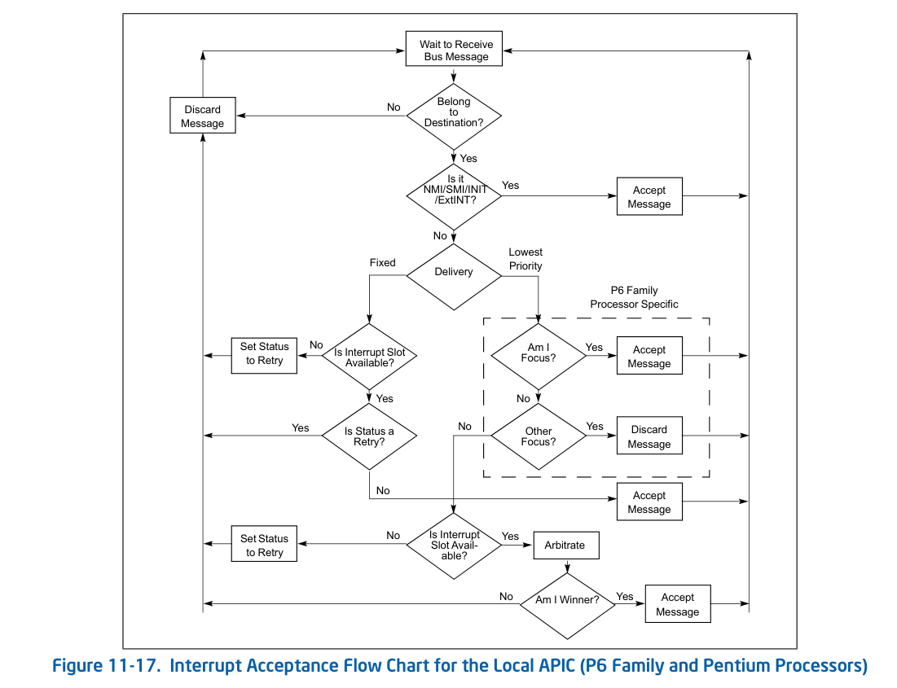

#### 11.8.3 中断、任务和处理器优先级

每个通过本地APIC传递给处理器的中断都有一个基于其向量号的优先级。本地APIC使用此优先级来决定何时处理中断，相对于处理器的其他活动，包括其他中断的处理。

每个中断向量是一个8位的值。中断优先级类别由中断向量的第7到4位的值决定。最低的中断优先级类别为1，最高为15；中断向量在0到15范围内（即优先级类别为0）的中断是非法的，不会被传递。由于向量0到31保留用于Intel 64和IA-32架构的特定用途，软件应配置中断向量，使其使用优先级类别在2到15范围内的向量。

每个中断优先级类别包含16个向量。优先级类别内的中断优先级由向量号的第3到0位的值决定。值越高，在该优先级类别内的优先级越高。因此，每个中断向量由两部分组成，高4位表示其中断优先级类别，低4位表示在该类别中的排名。

##### 11.8.3.1 任务和处理器优先级

本地APIC还定义了一个**任务优先级**和一个**处理器优先级**，它们决定中断的处理顺序。任务优先级类别是任务优先级寄存器（TPR）第7到4位的值，该寄存器可以由软件写入（TPR是一个可读写寄存器）；参见图11-18。

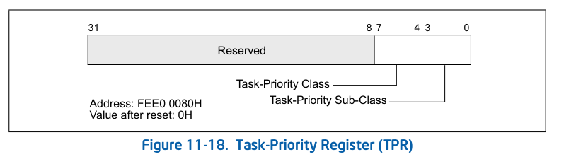

**注意**：在此讨论中，术语“任务”指的是操作系统调度到处理器上运行的软件定义的任务、进程、线程、程序或例程。这与IA-32架构中第8章“任务管理”中描述的任务不同。

任务优先级允许软件设置一个中断处理器的优先级阈值。这种机制使操作系统能够暂时阻止低优先级的中断，避免打断处理器正在执行的高优先级工作。阻止低优先级中断的能力来源于TPR如何控制处理器优先级寄存器（PPR）的值。（TPR还决定了本地处理器的仲裁优先级；参见11.6.2.4节“最低优先级传递模式”。）

处理器优先级类别是PPR寄存器第7到4位的一个0到15的值；参见图11-19。PPR是一个只读寄存器。处理器优先级类别代表处理器当前执行的优先级。

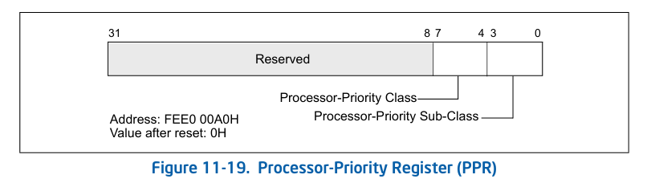

PPR的值基于TPR的值和ISRV的值；ISRV是ISR中最高优先级位所对应的向量号，或如果ISR中没有设置任何位，则为00H。（有关ISR的详细信息，参见11.8.4节。）

- PPR的值按如下方式确定：
    - PPR \[7:4\]（处理器优先级类别）为TPR \[7:4\]（任务优先级类别）和ISRV\[7:4\]（正在服务的最高优先级中断的优先级）中的最大值。
- PPR \[3:0]（处理器优先级子类别）的确定规则如下：
    - 如果TPR \[7:4\] > ISRV\[7:4\]，则PPR\[3:0\]为TPR\[3:0\]（任务优先级子类别）。
    - 如果TPR \[7:4\] < ISRV\[7:4\]，则PPR\[3:0\]为0。
    - 如果TPR \[7:4\] = ISRV\[7:4\]，则PPR\[3:0\]可以是TPR\[3:0\]或0，实际行为取决于处理器型号。

处理器优先级类别决定了中断处理器的优先级阈值。处理器将仅传递那些中断优先级类别高于PPR中处理器优先级类别的中断。如果处理器优先级类别为0，PPR不会阻止任何中断的传递；如果为15，处理器将阻止所有中断的传递。（处理器优先级机制不影响使用NMI、SMI、INIT、ExtINT、INIT取消断言和启动传递模式的中断的传递。）

处理器不会使用处理器优先级子类别来决定传递哪些中断以及阻止哪些中断。（处理器仅使用处理器优先级子类别来满足对PPR的读取操作。）

#### 11.8.4 固定中断的接受

本地APIC将接受的固定中断排队到两个中断挂起寄存器之一：中断请求寄存器（IRR）或服务寄存器（ISR）。这两个256位只读寄存器如图11-20所示。这些寄存器中的256个位代表256个可能的向量；向量0到15由APIC保留（参见第11.5.2节“有效中断向量”）。

**注意**：所有使用NMI、SMI、INIT、ExtINT、启动或INIT取消断言传递模式的中断都绕过IRR和ISR寄存器，直接发送到处理器核心进行处理。

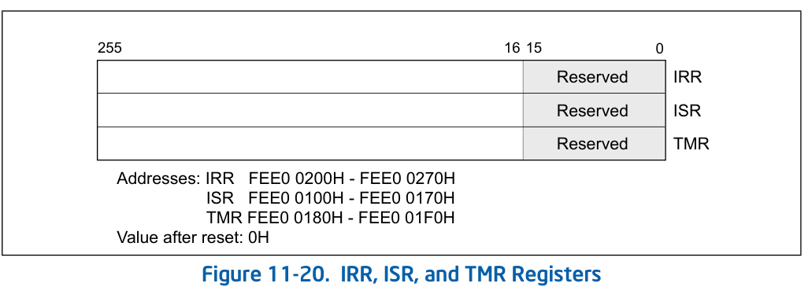

IRR包含已接受但尚未发送给处理器处理的活动中断请求。当本地APIC接受一个中断时，它会在IRR中设置与该中断向量对应的位。当处理器核心准备处理下一个中断时，本地APIC会清除已设置的最高优先级的IRR位，并设置相应的ISR位。ISR中已设置的最高优先级位的向量随后会发送给处理器核心进行处理。

当处理器正在处理最高优先级的中断时，本地APIC可以通过在IRR中设置位来发送额外的固定中断。当中断服务例程写入EOI寄存器（参见11.8.5节“中断服务完成信号”）时，本地APIC通过清除已设置的最高优先级ISR位作出响应。然后，它会重复清除IRR中的最高优先级位并设置相应的ISR位的过程。处理器核心随后开始执行ISR中已设置的最高优先级位的服务例程。

如果使用相同的向量号生成了多个中断，本地APIC可以同时在IRR和ISR中设置该向量的位。这意味着对于Pentium 4和Intel Xeon处理器，IRR和ISR可以为每个中断向量排队两个中断：一个在IRR中，一个在ISR中。为相同中断向量发出的任何其他中断都将合并到IRR中的单个位中。

对于P6家族和Pentium处理器，IRR和ISR寄存器最多可以为每个中断向量排队两个中断，超出此限的中断将被拒绝并返回重试消息。

如果本地APIC接收到优先级类别高于当前服务中断的中断，并且处理器核心启用了中断，本地APIC会立即将更高优先级的中断发送到处理器（无需等待EOI寄存器的写入）。正在执行的中断处理程序将被中断，以便处理更高优先级的中断。处理完成后，将恢复被中断的中断服务。

触发模式寄存器（TMR）指示中断的触发模式（参见图11-20）。在接受中断进入IRR时，对于边沿触发的中断，对应的TMR位会被清除；对于电平触发的中断，TMR位会被设置。如果在生成对应中断向量的EOI周期时TMR位已设置，则会向所有I/O APIC发送一条EOI消息。

#### 11.8.5 中断服务完成信号

对于除NMI、SMI、INIT、ExtINT、启动和INIT取消断言传递模式之外的所有中断，中断处理程序必须在结束时写入**中断结束（EOI）寄存器**（参见图11-21）。此写入操作必须在处理程序结束前、IRET指令之前完成。此操作表明当前中断的处理已完成，本地APIC可以从ISR中发出下一个中断。


当接收到EOI时，APIC清除ISR中已设置的最高优先级位，并将下一个最高优先级中断分派给处理器。如果被终止的中断是电平触发中断，本地APIC还会向所有I/O APIC发送中断结束消息。

系统软件可能更倾向于将EOI定向发送给特定的I/O APIC，而不是让本地APIC向所有I/O APIC发送中断结束消息。

通过设置伪中断向量寄存器的第12位（参见第11.9节），软件可以抑制EOI消息的广播。如果该位设置，则在EOI周期中不会生成广播EOI，即使关联的TMR位表明当前中断是电平触发的。该位的默认值为0，表示执行EOI广播。

如果处理器不支持抑制EOI广播，则伪中断向量寄存器的第12位保留为0。是否支持EOI广播抑制由本地APIC版本寄存器中的第24位报告（参见11.4.8节）；如果该位设置为1，则支持该功能。支持此功能时，它可在xAPIC模式和x2APIC模式下使用。

希望为电平触发中断执行定向EOI的系统软件应设置伪中断向量寄存器的第12位，并在本地xAPIC为电平触发中断发出EOI后，向生成中断的I/O APIC发出定向EOI（通过写入I/O APIC的EOI寄存器完成，用于防止电平触发中断在完成中断之后再次发送中断）。执行定向EOI的系统软件必须维护一个映射，将电平触发中断与系统中的I/O APIC关联起来。

#### 11.8.6 IA-32e模式下的任务优先级

在IA-32e模式下，操作系统可以显式地使用**任务优先级寄存器**（TPR）管理16个中断优先级类别（参见11.8.3节“中断、任务和处理器优先级”）。操作系统可以使用TPR暂时阻止特定的（低优先级）中断打断高优先级任务。通过将TPR加载为对应于要阻止的最高中断优先级类别的值来实现这一点。例如：

- 将TPR加载为任务优先级类别8（1000B）将阻止所有优先级类别为8或更低的中断，同时允许所有优先级类别为9或更高的中断。
- 将TPR加载为任务优先级类别0则启用所有外部中断。
- 将TPR加载为任务优先级类别0FH（1111B）则禁用所有外部中断。

TPR（如图11-18所示）在复位时被清零。在64位模式下，软件可以通过MOV CR8指令使用替代接口读取和写入TPR。新任务优先级类别在MOV CR8指令执行完成时生效。软件在使用MOV CR8加载TPR后不需要强制进行序列化操作。

使用MOV CRn指令需要特权级0。在特权级大于0的程序中，无法读取或写入TPR。尝试这样做会导致一般保护异常。TPR与中断控制器（IC）是分离的，IC负责优先级管理和外部中断传递。IC可以是一个外部设备，例如APIC或8259。通常情况下，IC提供与TPR类似或相同的优先级机制。然而，IC被视为实现依赖，底层的优先级机制可能会发生变化。相比之下，CR8是Intel 64架构的一部分，软件可以依赖该定义保持不变。

图11-22显示了CR8的布局；仅低4位被使用，剩余的60位保留，必须写入0。如果不这样做，将导致一般保护异常。


##### 11.8.6.1 CR8和APIC之间的任务优先级交互

Intel 64架构的第一个实现包括了一个本地高级可编程中断控制器（APIC），它类似于之前IA-32处理器使用的APIC。某些本地APIC的特性会影响架构定义的任务优先级寄存器（TPR）和使用CR8的编程接口的操作。

- 重要的CR8和APIC交互包括：
    - 处理器启动时，本地APIC被启用。
    - APIC必须启用，CR8才能作为TPR工作。对CR8的写入会反映到APIC任务优先级寄存器。
    - APIC.TPR \[7:4\] = CR8\[3:0\]，APIC.TPR \[3:0\] = 0。读取CR8返回一个64位值，其值是TPR \[7:4\]的值，并扩展为64位。

没有机制确保APIC.TPR的直接更新与CR8的更新之间的顺序。操作软件应实现直接APIC TPR更新或CR8样式的TPR更新，但不应混合使用这两者。软件可以使用序列化指令（例如CPUID）来序列化MOV CR8与APIC存储之间的更新。

### 11.9 虚假中断（Spurious Interrupt）

当处理器将任务优先级提升到大于或等于当前正在断言的INTR（中断请求）信号的中断级别时，可能会出现一种特殊情况。如果在发出INTA（中断确认）周期时，原本要分配的中断已经被屏蔽（由软件编程屏蔽），则本地APIC会传递一个虚假中断向量。分配虚假中断向量不会影响ISR（中断服务寄存器），因此虚假中断的处理程序应在没有EOI（中断结束）操作的情况下返回。

虚假中断向量(Spurious Interrupt Vector)的编号在虚假中断向量寄存器中指定（参见图11-23）。该寄存器中的各字段功能如下：
- **虚假向量**：确定当本地APIC生成虚假向量时传递给处理器的向量号。
    - （Pentium 4 和 Intel Xeon 处理器）该字段的第0至7位可由软件编程。
    - （P6家族和Pentium处理器）该字段的第4至7位可由软件编程，第0至3位固定为逻辑1。对第0至3位的写入操作无效。
- **APIC软件启用/禁用**：允许软件暂时启用（1）或禁用（0）本地APIC（参见第11.4.3节“启用或禁用本地APIC”）。
- **焦点处理器检查**：确定在使用最低优先级传递模式时，焦点处理器（当前正在处理某个中断或已经有未完成中断的处理器，本地APIC会优先将新的中断分配给焦点处理器，**即使它的优先级并非最低**。）检查是启用（0）还是禁用（1）。在Pentium 4和Intel Xeon处理器中，该位保留，应清零。
- **抑制EOI广播**：确定对于电平触发中断，EOI是否会导致EOI消息广播到I/O APIC（0）或不广播（1）。参见第11.8.5节。该位的默认值为0，表示执行EOI广播。如果处理器不支持EOI广播抑制，则该位保留为0。

**注意**： 不要将虚假向量编程到LVT（本地向量表）或IO APIC RTE（重定向表条目）中，即使设置了掩码位也不行。虚假向量的ISR不会执行EOI。如果由于某种原因LVT或RTE条目生成了中断，虚假向量的ISR位将保留在服务寄存器中，从而屏蔽同级或更低优先级的所有中断。

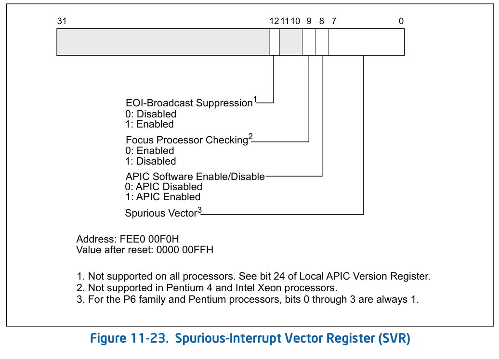

### 11.10 APIC总线消息传递机制与协议（P6家族，Pentium处理器）

Pentium 4和Intel Xeon处理器通过系统总线上的消息传递机制和协议，在本地APIC和I/O APIC之间传递消息。

P6家族和Pentium处理器通过串行APIC总线在本地APIC和I/O APIC之间传递消息。由于APIC总线上一次只能发送一条消息，因此I/O APIC和本地APIC采用“旋转优先级”仲裁协议，以获得在APIC总线上发送消息的许可。一个或多个APIC可能同时开始发送它们的消息。在每条消息的开始时，每个APIC会在APIC总线上展示它正在发送的消息类型及其当前的仲裁优先级。该信息用于仲裁。在每次仲裁周期后（在一个仲裁轮次内），只有可能的胜者继续驱动总线。到所有仲裁周期完成时，只剩下一个APIC在驱动总线。一旦选出胜者，它就获得了总线的独占使用权，并将继续驱动总线以发送其实际消息。

每成功传输一条消息后，所有APIC的仲裁优先级都会增加1。前一个胜者（即刚刚成功发送消息的那个APIC）的优先级将变为0（最低）。在仲裁中优先级为15（最高）但未发送消息的APIC，将采用前一个胜者的仲裁优先级，并加1。

请注意，上述仲裁协议在某个APIC发出特殊的中断结束（EOI）消息时略有不同。除非有多个APIC同时发出EOI消息，否则这个高优先级消息将无视其发送者的仲裁优先级而获得总线。如果多个APIC同时发送EOI消息，则这些APIC将通过它们的仲裁优先级进行仲裁。

如果APIC设置为使用“最低优先级”仲裁（参见第11.6.2.4节“最低优先级传递模式”），并且多个APIC当前的执行优先级相同（APR寄存器中的值），则使用仲裁ID寄存器中的唯一值来打破平局。所有8位的APR用于最低优先级仲裁。

### 11.11 消息信号中断（Message Signalled Interrupts, MSI）

**PCI本地总线规范2.2版**（www.pcisig.com）引入了消息信号中断（MSI）的概念。根据该规范的描述：

> [!NOTE] 消息信号中断
> **消息信号中断**（MSI）是一项可选功能，使得PCI设备可以通过向系统指定的地址写入系统指定的消息（PCI DWORD内存写事务）来请求服务。事务地址指定了消息的目标，而事务数据指定了消息内容。系统软件需要在设备配置期间初始化消息目标和消息内容，并为每个支持MSI的功能分配一个或多个不共享的消息。”

PCI本地总线规范提供的**功能机制**用于识别和配置支持MSI的PCI设备。在这个结构中，包括**消息数据寄存器**和**消息地址寄存器**等字段。为了请求服务，PCI设备功能将**消息数据寄存器**的内容写入**消息地址寄存器**（对于64位消息地址，还包括**消息上地址寄存器**）。

第11.11.1节和第11.11.2节提供了**消息地址寄存器**和**消息数据寄存器**的布局详情。设备发出的操作是将消息数据寄存器的内容写入消息地址寄存器的**PCI写入命令**。该操作遵循PCI写操作的语义规则，是一个DWORD操作。

#### 11.11.1 消息地址寄存器格式

图11-24展示了消息地址寄存器的格式（低32位）。

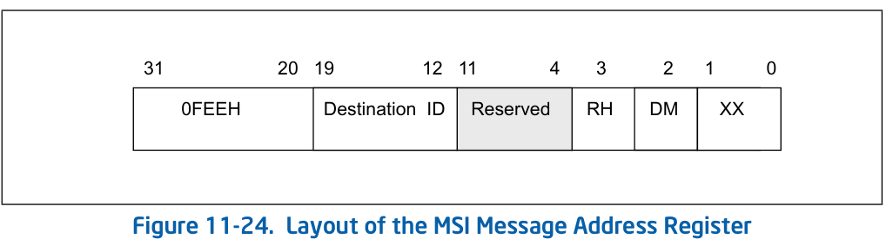

消息地址寄存器中的字段如下：

1. **第31至20位**：这些位包含中断消息的固定值（0FEEH）。这个值将中断定位在以`4G - 18M`为基地址的1M字节区域。所有对该区域的访问都被定向为中断消息。必须确保没有其他设备将该区域作为I/O空间使用。
2. **目标ID（Destination ID）**：此字段包含一个8位目标ID，用来标识消息的目标处理器。目标ID对应于I/O APIC重定向表项（Redirection Table Entry）中的第63到56位，如果使用IO APIC将中断调度到处理器。
3. **重定向提示指示（RH，Redirection Hint）**：当该位被设置时，消息会被发送给可接收中断的处理器中中断优先级最低的那个处理器。
    - 当RH为0时，中断会发送到目标ID字段中指定的处理器。
    - 当RH为1且使用物理目标模式时，目标ID字段不得设置为FFH，必须指向一个存在且已启用接收中断的处理器。
    - 当RH为1且在使用平面寻址模型的系统中激活了逻辑目标模式时，目标ID字段必须设置为使得置为1的位表示存在并已启用接收中断的处理器。
    - 如果RH为1且在使用集群寻址模型的系统中激活了逻辑目标模式，则目标ID字段不得设置为FFH；通过该字段标识的处理器必须存在并已启用接收中断。
4. **目标模式（DM，Destination Mode）**：该位指示目标ID字段是否应解释为用于最低优先级中断传递的逻辑或物理APIC ID。
    - 如果RH为1且DM为0，则目标ID字段处于物理目标模式，系统中仅具有匹配APIC ID的处理器会被考虑用于接收中断（这意味着没有重定向）。
    - 如果RH为1且DM为1，则目标ID字段被解释为逻辑目标模式，并且重定向仅限于基于处理器的逻辑APIC ID和每个本地APIC中的目标格式寄存器和逻辑目标寄存器的逻辑处理器组。逻辑处理器组由匹配8位目标ID与每个本地APIC的逻辑目标寄存器中的逻辑目标标识所识别的那些处理器组成。详情参见第11.6.2节“确定IPI目标”。
    - 如果RH为0，则忽略DM位，无论是物理还是逻辑目标模式，消息都将直接发送。

### 11.11.2 消息数据寄存器格式

图11-25展示了消息数据寄存器的布局。

保留字段不假定为任何值。软件在写入时必须保留其内容。消息数据寄存器中的其他字段如下描述：

1. **向量（Vector）**：该8位字段包含与消息关联的中断向量。值范围从010H到0FEH。软件必须保证该字段不会被编程为向量00H到0FH。
2. **传递模式（Delivery Mode）**：此3位字段指定如何处理中断接收。传递模式只能与指定的触发模式一起工作。软件必须保证正确的触发模式。限制如下：
    - 000B（固定模式）— 将信号传递给目标中列出的所有代理。固定传递模式的触发模式可以是边沿触发或电平触发。
    - 001B（最低优先级）— 将信号传递给目标字段中优先级最低的代理。触发模式可以是边沿触发或电平触发。
    - 010B（系统管理中断或SMI）— 传递模式只能是边沿触发。对于依赖SMI语义的系统，向量字段被忽略，但为了未来兼容性，该字段必须设置为全零。
    - 100B（NMI）— 将信号传递给目标字段中列出的所有代理。向量信息被忽略。NMI是边沿触发中断，无论触发模式设置为何。
    - 101B（INIT）— 将信号传递给目标字段中列出的所有代理。向量信息被忽略。INIT是边沿触发中断，无论触发模式设置为何。
    - 111B（ExtINT）— 将信号传递给目标字段中所有代理的INTR信号（作为源自8259A兼容中断控制器的中断）。向量由ExtINT激活时发出的INTA周期提供。ExtINT是边沿触发中断。
3. **电平（Level）**：边沿触发中断消息始终解释为断言消息。对于边沿触发中断，该字段不使用。对于电平触发中断，此位反映中断输入的状态。
4. **触发模式（Trigger Mode）**：此字段指示将触发消息的信号类型。
    - 0 — 表示边沿敏感。
    - 1 — 表示电平敏感。

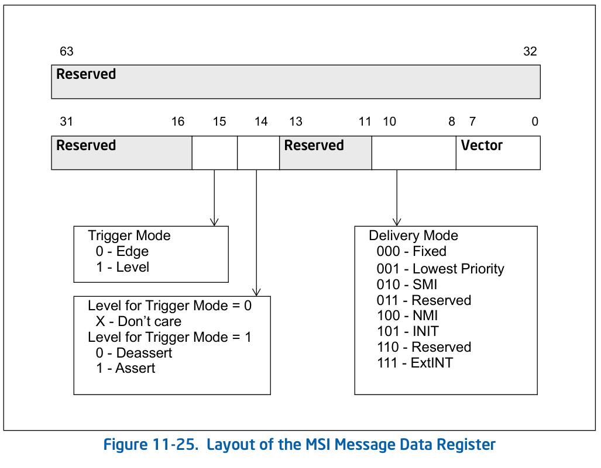

### 11.12 扩展xAPIC（x2APIC）

x2APIC架构以向后兼容的方式扩展了xAPIC架构（参见11.4节），为未来Intel平台的创新提供了前向扩展性。具体来说，x2APIC架构有以下特点：
- 保留了xAPIC架构的所有关键兼容元素：
  - 传递模式（Delivery modes）。
  - 中断和处理器优先级（Interrupt and processor priorities）。
  - 中断源（Interrupt sources）。
  - 中断目标类型（Interrupt destination types）。
- 提供了扩展以支持逻辑和物理目标模式下的处理器寻址能力。
- 添加了新的功能以增强中断传递的性能。
- 简化了基于链接的平台架构中的逻辑目标模式中断传递。
- 使用MSR编程接口访问x2APIC模式下的APIC寄存器，而不是内存映射接口。在xAPIC模式下支持内存映射接口。

#### 11.12.1 检测和启用x2APIC模式

可以通过执行`CPUID`指令，`EAX=1`，并检查`ECX`中的第21位来检测处理器是否支持x2APIC模式。如果`CPUID.(EAX=1):ECX.21`被置位，则表明处理器支持x2APIC功能，并且可以进入x2APIC模式。

系统软件可以通过在`IA32_APIC_BASE MSR`（地址为01BH）的第10位（x2APIC模式启用位）来将本地APIC设置为x2APIC模式。`IA32_APIC_BASE MSR`的布局如图11-26所示。

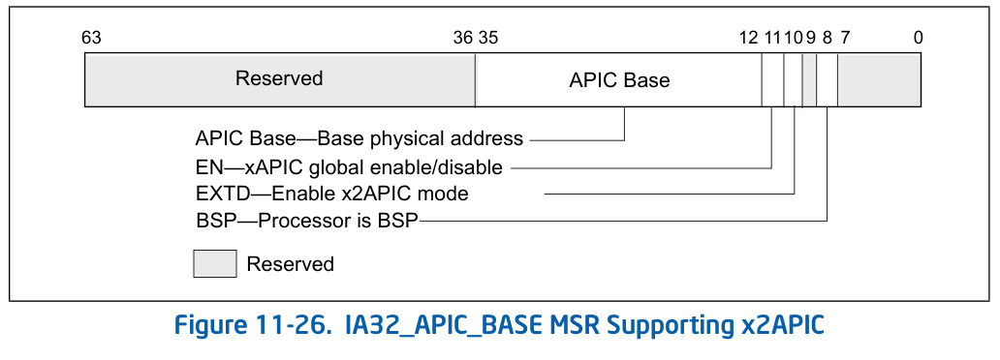

表 11-5 "x2APIC工作模式配置" 描述了IA32_APIC_BASE MSR中EN位和EXTD位的可能组合
###### 表11-5：x2APIC工作模式配置

| xAPIC全局启用（IA32_APIC_BASE[11]） | x2APIC启用（IA32_APIC_BASE[10]） | 描述 |
|-------------------------------------|--------------------------------|-----|
| 0                                   | 0                              | 本地APIC被禁用 |
| 0                                   | 1                              | 无效 |
| 1                                   | 0                              | 本地APIC以xAPIC模式启用 |
| 1                                   | 1                              | 本地APIC以x2APIC模式启用 |

一旦本地APIC切换到x2APIC模式（`EN = 1`，`EXTD = 1`），若要切换回xAPIC模式，系统软件需要先禁用本地APIC。具体来说，尝试在本地APIC启用且处于x2APIC模式时向`IA32_APIC_BASE MSR`写入`EN = 1, EXTD = 0`会导致一般保护异常（general-protection exception）。当`IA32_APIC_BASE MSR`的第10位被设置后，要退出x2APIC模式，唯一的方法是使用`WRMSR`将第11位和第10位同时清零。11.12.5节“x2APIC状态转换”提供了本地APIC允许的状态转换的详细状态图。

##### 11.12.1.1 访问APIC寄存器的指令

在x2APIC模式下，系统软件使用`RDMSR`和`WRMSR`指令来访问APIC寄存器。访问x2APIC寄存器的MSR地址在11.12.1.2节“x2APIC寄存器地址空间”中定义。执行`RDMSR`指令时，`ECX`中指定的APIC寄存器地址的内容会返回到`EAX`的0到31位。对于32位寄存器，`EDX`的32到63位是保留位。如果寄存器是64位寄存器，那么`WRMSR`指令会将`EDX`的0到31位写入到指定APIC寄存器的32到63位。**中断命令寄存器**是唯一以64位MSR实现的APIC寄存器。保留位处理的语义在11.12.1.3节“保留位检查”中定义。

##### 11.12.1.2 x2APIC寄存器地址空间

MSR地址范围800H到8FFH在架构上保留，用于访问x2APIC模式下的APIC寄存器。表11-6列出了x2APIC模式下可用的APIC寄存器。如果合适，表格还给出了xAPIC模式下的页偏移。

| MSR地址（x2APIC模式） | MMIO偏移（xAPIC模式） | 寄存器名称             | 读写语义   | 备注                  |     |
| --------------- | --------------- | ----------------- | ------ | ------------------- | --- |
| 802H            | 020H            | 本地APIC ID寄存器      | 只读$^1$ | 参见11.12.5.1节的初始值    |     |
| 803H            | 030H            | 本地APIC版本寄存器       | 只读     | 与xAPIC模式下的版本相同      |     |
| 808H            | 080H            | 任务优先级寄存器（TPR）     | 读/写    | 位31:8保留$^2$         |     |
| 80AH            | 0A0H            | 处理器优先级寄存器（PPR）    | 只读     |                     |     |
| 80BH            | 0B0H            | 中断结束（EOI）寄存器      | 只写$^3$ | WRMSR写入非零值将引发#GP(0) |     |
| 80DH            | 0D0H            | 逻辑目标寄存器（LDR）      | 只读     | 在xAPIC模式下为读/写       |     |
| 80FH            | 0F0H            | 虚假中断向量寄存器（SVR）    | 读/写    | 参见11.9节保留位          |     |
| 810H            | 100H            | 正在服务寄存器（ISR）位31:0 | 只读     |                     |     |
| 811H            | 110H            | ISR位63:32         | 只读     |                     |     |
| 812H            | 120H            | ISR位95:64         | 只读     |                     |     |
| 813H            | 130H            | ISR位127:96        | 只读     |                     |     |
| 814H            | 140H            | ISR位159:128       | 只读     |                     |     |
| 815H            | 150H            | ISR位191:160       | 只读     |                     |     |
| 816H            | 160H            | ISR位223:192       | 只读     |                     |     |
| 817H            | 170H            | ISR位255:224       | 只读     |                     |     |
| 818H            | 180H            | 触发模式寄存器（TMR）位31:0 | 只读     |                     |     |
| 819H            | 190H            | TMR位63:32         | 只读     |                     |     |
| 81AH            | 1A0H            | TMR位95:64         | 只读     |                     |     |
| 81BH            | 1B0H            | TMR位127:96        | 只读     |                     |     |
| 81CH            | 1C0H            | TMR位159:128       | 只读     |                     |     |
| 81DH            | 1D0H            | TMR位191:160       | 只读     |                     |     |
| 81EH            | 1E0H            | TMR位223:192       | 只读     |                     |     |
| 81FH            | 1F0H            | TMR位255:224       | 只读     |                     |     |
| 820H            | 200H            | 中断请求寄存器（IRR）位31:0 | 只读     |                     |     |
| 821H            | 210H            | IRR位63:32         | 只读     |                     |     |
| 822H            | 220H            | IRR位95:64         | 只读     |                     |     |
| 823H            | 230H            | IRR位127:96        | 只读     |                     |     |
| 824H            | 240H            | IRR位159:128       | 只读     |                     |     |
| 825H            | 250H            | IRR位191:160       | 只读     |                     |     |
| 826H            | 260H            | IRR位223:192       | 只读     |                     |     |
| 827H            | 270H            | IRR位255:224       | 只读     |                     |     |
| 828H            | 280H            | 错误状态寄存器（ESR）      | 读/写    | WRMSR写入非零值将引发#GP(0) |     |
| 82FH            | 2F0H            | LVT CMCI寄存器       | 读/写    | 参见图11-8中的保留位        |     |
| 830H$^4$        | 300H 和 310H     | 中断命令寄存器（ICR）      | 读/写    | 参见图11-28中的保留位       |     |
| 832H            | 320H            | LVT定时器寄存器         | 读/写    | 参见图11-8中的保留位        |     |
| 833H            | 330H            | LVT热传感器寄存器        | 读/写    | 参见图11-8中的保留位        |     |
| 834H            | 340H            | LVT性能监视寄存器        | 读/写    | 参见图11-8中的保留位        |     |
| 835H            | 350H            | LVT LINT0寄存器      | 读/写    | 参见图11-8中的保留位        |     |
| 836H            | 360H            | LVT LINT1寄存器      | 读/写    | 参见图11-8中的保留位        |     |
| 837H            | 370H            | LVT错误寄存器          | 读/写    | 参见图11-8中的保留位        |     |
| 838H            | 380H            | 初始计数寄存器（用于定时器）    | 读/写    |                     |     |
| 839H            | 390H            | 当前计数寄存器（用于定时器）    | 只读     |                     |     |
| 83EH            | 3E0H            | 分频配置寄存器（DCR，定时器）  | 读/写    | 参见图11-10中的保留位       |     |
| 83FH            | 不适用             | SELF IPI寄存器$^5$   | 只写     | 仅在x2APIC模式下可用       |     |
**注意：**
1. 对只读寄存器使用 WRMSR 会触发 \#GP(0) 
2. 尝试将可读可写寄存器的保留位设置为 1 会触发 \#GP(0) (包括每个寄存器的 63:32 位)
3. 对只写寄存器使用 RDMSR 会触发 \#GP(0)
4. MSR 831H 是保留的；对其进行读写操作会触发通用保护异常。MMIO 偏移为 310H 的 APIC 寄存器的内容在 x2APIC 模式下可通过 MSR 地址 830H 访问。
5. SELF IPI 寄存器只在 x2APIC 模式下被支持
##### 11.12.1.3 保留位检查

第11.12.1.2节和表11-6中指定了x2APIC模式下APIC寄存器的保留位定义。向这些寄存器的保留位写入非零值（通过WRMSR指令）将引发一般保护异常（general protection fault exception），而读取这些保留位时将返回零（RsvdZ语义）。

在x2APIC模式下，本地APIC ID寄存器扩展为32位宽，这使得在物理目标模式下可以寻址最多`2^32 - 1`个处理器。这个32位值被称为“x2APIC ID”。处理器的实现可能选择在硬件中支持少于32位。系统软件应该对实际实现的位数保持不敏感。所有未实现的位在被软件读取时将返回零。

APIC ID值`FFFF_FFFFH`和系统中本地APIC ID寄存器所实现的最高位宽所对应的最高值是保留的，不能分配给任何逻辑处理器。

在x2APIC模式下，本地APIC ID寄存器对系统软件来说是只读的，并将由硬件初始化。可以通过在0802H地址上执行RDMSR指令来访问它。

系统中的每个逻辑处理器（包括具有通信结构的集群）必须配置唯一的x2APIC ID，以避免x2APIC ID的冲突。在针对特定市场细分和系统配置的DP和高端MP处理器上，处于不同和“未连接”集群中的逻辑处理器在上电初始化时可能具有重叠的x2APIC ID。在这些配置中，可能提供特定于型号的方法，使BIOS和/或平台固件在将未连接的组件配置为单一系统之前，重新配置某些集群中的x2APIC ID，以提供唯一且不重叠的系统范围ID。

#### 11.12.2 x2APIC寄存器的可用性

只有当本地APIC切换到x2APIC模式（如11.12.1节所述）时，才能通过MSR接口访问本地APIC寄存器。当本地APIC不处于x2APIC模式时，通过RDMSR或WRMSR在MSR地址范围0800H到08FFH内访问任何APIC寄存器将导致一般保护异常。在x2APIC模式下，不提供内存映射接口，任何对MMIO接口的访问行为将类似于在全局禁用状态下的传统xAPIC。表11-7提供了传统模式和扩展模式与传统接口和寄存器接口之间的交互。

表 11-7 本地 x2APIC 的 MSR/MMIO 接口在不同模式下的操作

|           | MMIO 接口         | MSR 接口   |
| --------- | --------------- | -------- |
| xAPIC 模式  | 可用              | 触发通用保护异常 |
| x2APIC 模式 | 行为等同于全局禁用 xAPIC | 可用       |
#### 11.12.3 x2APIC模式下的MSR访问

为了在x2APIC模式下高效访问APIC寄存器，写入APIC寄存器时放松了WRMSR的序列化语义。因此，系统软件不应将“在x2APIC模式下对APIC寄存器的WRMSR”用作序列化指令。对APIC寄存器的读写访问将按照程序顺序进行。对APIC寄存器执行WRMSR可能在所有前面的存储全局可见之前完成；软件可以通过在WRMSR之前插入序列化指令或MFENCE;LFENCE序列来防止这种情况。

RDMSR指令不是序列化的，这种行为在x2APIC模式下读取APIC寄存器时保持不变。使用RDMSR指令访问APIC寄存器的系统软件不应期望序列化行为。（注：基于MMIO的xAPIC接口被系统软件映射为未缓存区域。因此，在xAPIC模式下对xAPIC-MMIO接口的读/写具有序列化语义。）

#### 11.12.4 x2APIC寄存器的VM退出控制

VMX架构允许VMM（虚拟机监控器）使用VMX转换MSR区域指定在VMX转换期间加载或存储的MSR列表（参见Intel® 64 和 IA-32 架构软件开发人员手册，卷3C中的VM退出MSR存储地址字段、VM退出MSR加载地址字段和VM进入MSR加载地址字段）。

x2APIC的MSR不能在VMX转换期间加载和存储。如果VMM指定在VMX转换期间访问地址范围从0000_0800H到0000_08FFH（用于访问x2APIC寄存器）的任何MSR，VMX转换将失败。特别是，如果VMX转换MSR区域中的128位条目的位31:0（表示为ENTRY_LOW_DW）满足以下表达式：“ENTRY_LOW_DW & FFFFF800H = 00000800H”，则处理该条目将失败。这种失败会导致关联的VM进入失败（通过重新加载主机状态）并导致关联的VM退出引发VMX中止。

#### 11.12.5 x2APIC 状态转换

本节详细描述了本地 x2APIC 单元的 x2APIC 状态、这些状态之间的转换以及这些状态与 INIT 和重置的交互。

##### 11.12.5.1 x2APIC 状态

- 本地 x2APIC 单元的有效状态列在表 11-5 中。
    - **APIC 禁用状态**：`IA32_APIC_BASE[EN]=0` 和 `IA32_APIC_BASE[EXTD]=0`。
    - **xAPIC 模式**：`IA32_APIC_BASE[EN]=1` 和 `IA32_APIC_BASE[EXTD]=0`。
    - **x2APIC 模式**：`IA32_APIC_BASE[EN]=1` 和 `IA32_APIC_BASE[EXTD]=1`。
    - **无效状态**：`IA32_APIC_BASE[EN]=0` 和 `IA32_APIC_BASE[EXTD]=1`。
    状态 `EXTD=1` 和 `EN=0` 是无效的，无法进入此状态。尝试从有效状态转换到此无效状态的 WRMSR 操作会导致一般保护异常。图 11-27 显示了本地 x2APIC 单元的完整状态转换图。

- 在重置后，本地 APIC 单元被启用并处于 xAPIC 模式：`IA32_APIC_BASE[EN]=1` 和 `IA32_APIC_BASE[EXTD]=0`。APIC 寄存器的初始化如下：
    - 本地 APIC ID 由硬件使用 32 位 ID（x2APIC ID）初始化。x2APIC ID 的最低 8 位是传统的本地 xAPIC ID，并存储在 APIC 寄存器的高 8 位中以供 xAPIC 模式访问。
    - 在 xAPIC 模式中定义的字段，以下 APIC 寄存器重置为全零：
        - IRR、ISR、TMR、ICR、LDR、TPR、分频配置寄存器（参见第 11.4 至 11.6 节了解各个 APIC 寄存器的详细信息）。
        - 定时器初始计数和当前计数寄存器。
    - LVT 寄存器重置为全零，除了掩码位，这些位被设置为 1。
    - 本地 APIC 版本寄存器不受影响。
    - 虚假中断向量寄存器初始化为 `000000FFH`。
    - DFR（仅在 xAPIC 模式中可用）重置为全 1。
    - SELF IPI 寄存器重置为零。

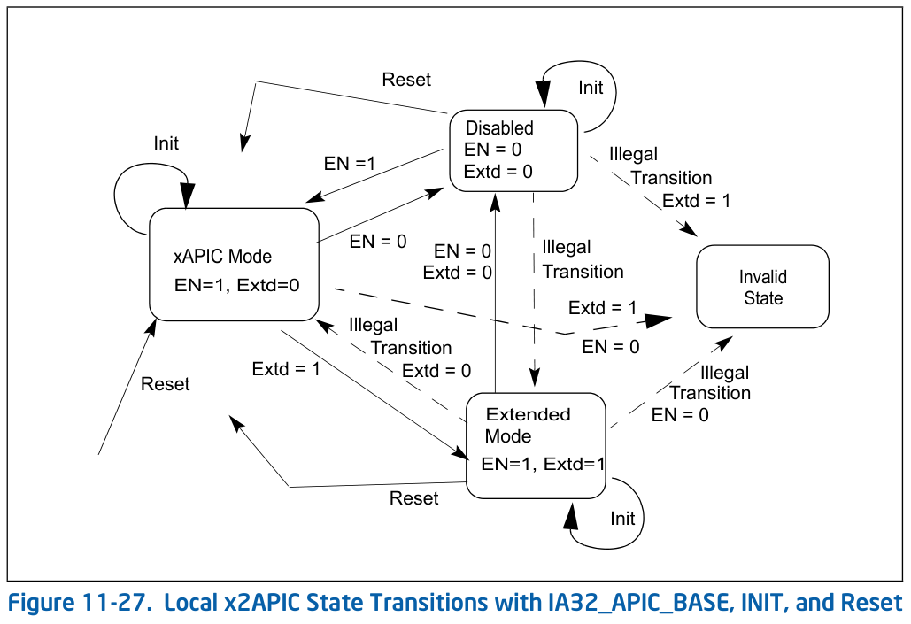

###### x2APIC 重置后的状态
- 从 xAPIC 模式状态的有效转换是：
    - 通过设置 EXT 为 1 转换到 x2APIC 模式（结果 EN=1，EXTD=1）。在此转换过程中，保留物理 x2APIC ID（见图 11-6），逻辑 x2APIC ID（见图 11-29）由硬件初始化。未在重置时初始化的其他 APIC 寄存器中的扩展字段在此转换期间在架构上未定义，系统软件应明确初始化这些可编程 APIC 寄存器。
    - 通过设置 EN 为 0 转换到禁用状态（结果 EN=0，EXTD=0）。
    
    在 xAPIC 状态中执行 INIT 将 APIC 置于 EN=1，EXTD=0 的状态。本地 APIC ID 寄存器的状态被保留（8 位 xAPIC ID 位于 APIC ID 寄存器的高 8 位）。INIT 结果导致所有其他 APIC 寄存器初始化。
    
    在此状态下重置将 APIC 置于 EN=1，EXTD=0 的状态。初始化的本地 APIC ID 寄存器状态如第 11.12.5.1 节所述。所有其他 APIC 寄存器的初始化如第 11.12.5.1 节所述。

###### x2APIC 模式的转换
- 从 x2APIC 模式进行的唯一有效转换是将 x2APIC 禁用，设置 EN 为 0 和 EXTD 为 0。x2APIC ID（32 位）和传统本地 xAPIC ID（8 位）在此转换期间被保留。从 x2APIC 模式到 xAPIC 模式的转换是无效的，对 IA32_APIC_BASE MSR 进行相应的 WRMSR 操作将引发一般保护异常。
- 在此状态下重置会将 x2APIC 置于 xAPIC 模式。所有 APIC 寄存器（包括本地 APIC ID 寄存器）均按第 11.12.5.1 节描述进行初始化。
- 在此状态下执行 INIT 保持 x2APIC 处于 x2APIC 模式。本地 APIC ID 寄存器的状态被保留（所有 32 位）。然而，INIT 转换会导致所有其他 APIC 寄存器初始化。

#### 从禁用模式到 x2APIC 模式的转换

- 从禁用状态，使用 IA32_APIC_BASE 进行的唯一有效 x2APIC 转换是到 xAPIC 模式（EN=1，EXTD=0）。因此，从 x2APIC 模式到 xAPIC 模式的唯一方法是两步过程：
    - 首先从 x2APIC 模式转换到本地 APIC 禁用模式（EN=0，EXTD=0），
    - 然后再从禁用模式转换到 xAPIC 模式（EN=1，EXTD=0）。
    
    因此，除了 x2APIC ID（32 位）之外，x2APIC 中的所有 APIC 寄存器状态在模式转换中不被保留。
    
    在禁用状态下重置将 x2APIC 置于 xAPIC 模式。所有 APIC 寄存器（包括本地 APIC ID 寄存器）均按第 11.12.5.1 节描述进行初始化。
    
    在禁用状态下执行 INIT 保持 x2APIC 处于禁用状态。

###### 从 xAPIC 模式到 x2APIC 模式的状态更改
- 在 xAPIC 模式下由软件初始化 APIC 寄存器状态后，从 xAPIC 模式到 x2APIC 模式的转换不会影响大多数 APIC 寄存器状态，以下情况除外：
    - 逻辑目标寄存器(LDR)未被保留。
    - 写入内存映射的本地 APIC ID 寄存器的任何 APIC ID 值未被保留。
    - 中断命令寄存器的高半部分未被保留。

#### 11.12.6 x2APIC 模式下设备中断的路由

x2APIC 架构旨在与所有现有的 IO xAPIC 单元以及支持消息信号中断（MSI）功能的所有 PCI 和 PCI Express（PCIe）设备协同工作。对 x2APIC 的支持仅对以下内容进行了修改：
- 本地 APIC 单元；
- 连接 IO xAPIC 单元与本地 APIC 单元的互连；
- 连接支持 MSI 的 PCI 和 PCIe 设备与本地 APIC 单元的互连。

不需要对支持 MSI 的 PCI 和 PCIe 设备进行修改。同样，也不需要对 IO xAPIC 单元进行修改。通过使用 Intel® 定向 I/O 虚拟化技术规范 1.3 及更高版本中指定的中断重映射架构，将 MSI 设备的中断路由到处于 x2APIC 模式的本地 APIC 单元中。

#### 11.12.7 系统软件的初始化

将设备中断路由到在 x2APIC 模式下工作的本地 APIC 单元需要使用 Intel® 定向 I/O 虚拟化技术规范（1.3 及更高版本）中指定的中断重映射架构。因此，在 BIOS 启用 x2APIC 模式之前，必须为支持中断重映射的功能进行枚举，并且软件必须在启用 x2APIC 模式前启用扩展中断模式。

x2APIC 的 ACPI 接口在高级配置和电源接口规范 4.0a 版（http://www.acpi.info/spec.htm）中的第 5.2 节“ACPI 系统描述表”中描述。如果所有 APIC ID 都小于 255，默认情况下，BIOS 会将控制权传递给操作系统，并使本地 x2APIC 处于 xAPIC 模式；如果有任何逻辑处理器报告的 APIC ID 为 255 或更大，则为 x2APIC 模式。

#### 11.12.8 CPUID 扩展和拓扑枚举

对于支持 x2APIC 的 Intel 64 和 IA-32 处理器，`CPUID.01H:ECX[21]` 报告的值为 1，表示处理器支持 x2APIC 和扩展拓扑枚举叶（`CPUID.0BH`）。

可以通过执行 `CPUID` 指令并设置 `EAX = 0BH` 来访问扩展拓扑枚举叶。即使处理器不支持 x2APIC，也可能支持 `CPUID` 叶 0BH。软件可以通过以下两个步骤检测扩展拓扑枚举叶（0BH）的可用性：

1. 通过执行 `CPUID`，设置 `EAX=0`，检查基本 `CPUID` 信息的最大输入值。如果 `CPUID.0H:EAX` 大于或等于 11（0BH），则继续执行下一步。
2. 检查 `CPUID.EAX=0BH, ECX=0H:EBX` 是否为非零。

如果上述两个条件都为真，则扩展拓扑枚举叶可用。如果可用，扩展拓扑枚举叶是枚举拓扑的首选机制。处理器中存在 `CPUID` 叶 0BH 并不保证支持 x2APIC。如果 `CPUID.EAX=0BH, ECX=0H:EBX` 返回零，并且基本 `CPUID` 信息的最大输入值大于 0BH，则该处理器不支持 `CPUID.0BH` 叶。

扩展拓扑枚举叶旨在帮助软件在需要使用 32 位 x2APIC ID 来寻址单个逻辑处理器的系统上枚举处理器拓扑。`CPUID` 叶 0BH 的详细信息可在《Intel® 64 和 IA-32 架构软件开发人员手册》第 2A 卷的 `CPUID` 参考页中找到。

支持 `CPUID` 的扩展拓扑枚举叶和不支持 `CPUID` 叶 0BH 的处理器的处理器拓扑枚举算法在第 9.9.4 节“三域 APIC_ID 映射算法”中进行了介绍。

##### 11.12.8.1 APIC ID 和 CPUID 的一致性

x2APIC 模式下 `MSR 802H` 中物理 x2APIC ID 的一致性和 `CPUID.0BH:EDX` 中返回的 32 位值由处理器硬件实现。

`CPUID.0BH:EDX` 将报告完整的 32 位 ID，无论处于 xAPIC 还是 x2APIC 模式。这使得 BIOS 可以确定系统中是否有处理器的 ID 超过 8 位初始 APIC ID 限制（`CPUID.01H:EBX[31:24]`）。初始 APIC ID（`CPUID.01H:EBX[31:24]`）始终等于 `CPUID.0BH:EDX[7:0]`。

如果系统中所有逻辑处理器报告的 `CPUID.0BH:EDX` 值都小于 255，BIOS 可以在 xAPIC 模式下将控制权传递给操作系统。

如果系统中某些逻辑处理器报告的 `CPUID.0BH:EDX` 值大于或等于 255，BIOS 必须支持两种选项以将控制权传递给操作系统：

- 如果 BIOS 启用了 x2APIC ID 大于 255 的逻辑处理器，那么在将控制权传递给操作系统之前，应该在引导处理器（BSP）和所有应用处理器（AP）中启用 x2APIC。需要处理器拓扑信息的应用程序必须使用基于 x2APIC ID 或 `CPUID.0BH` 叶的操作系统提供的服务。
- 如果 BIOS 在 xAPIC 模式下将控制权传递给操作系统，那么 BIOS 必须确保只有 `CPUID.0BH.EDX` 值小于 255 的逻辑处理器被启用。在所有 `CPUID.0B.EDX` 值大于或等于 255 的逻辑处理器上，BIOS 初始化必须：
    - 禁用 APIC 并在每个逻辑处理器中执行 CLI；
    - 将这些逻辑处理器置于最低功耗状态，以使这些处理器在操作系统启动期间不响应 INIT IPI。

BIOS 将控制权传递给操作系统后，引导处理器（BSP）和所有启用的逻辑处理器在 xAPIC 模式下运行。需要处理器拓扑信息的应用程序可以使用基于 8 位初始 APIC ID 的操作系统提供的传统服务或来自 `CPUID.01H` 和 `CPUID 04H` 叶的传统拓扑信息。

即使 BIOS 在 xAPIC 模式下传递控制权，操作系统也可以稍后将处理器切换到 x2APIC 模式。BIOS 的 SMM 处理程序应始终读取 `APIC_BASE_MSR`，确定 APIC 模式并使用相应的访问方法。

#### 11.12.9 x2APIC 模式下的 ICR 操作

在 x2APIC 模式下，中断命令寄存器（ICR）的布局如图 11-28 所示。x2APIC 模式下 ICR 的低 32 位与 xAPIC 模式下 ICR 的低半部分相同，除了删除了交付状态（Delivery Status）位，因为在 x2APIC 模式下不需要它。x2APIC 模式下目标 ID 字段扩展为 32 位。

要使用 ICR 发送 IPI，软件必须设置 ICR 以指示要发送的 IPI 消息的类型和目标处理器或处理器组。也可以使用 SELF IPI 寄存器发送自发 IPI（参见第 11.12.11 节）。

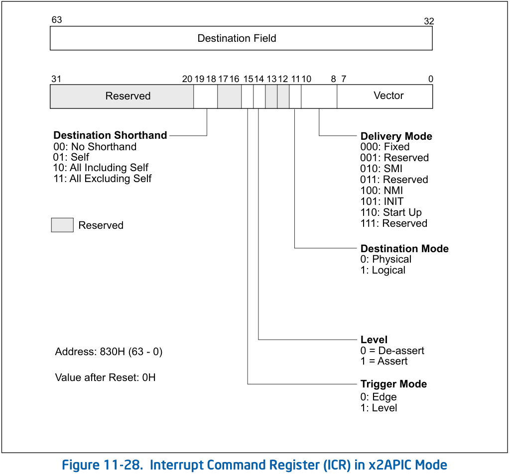

在 x2APIC 模式下，只需对中断命令寄存器执行一次 MSR 写入即可分派中断。由于删除了交付状态位，系统软件不再需要读取 ICR。它保持可读性仅用于调试；然而，软件不应假设读取 ICR 返回的值是最后写入的值。

目标 ID 值 `FFFF_FFFFH` 用于在逻辑目标和物理目标模式下广播中断。

#### 11.12.10 在 x2APIC 模式下确定 IPI 目标

##### 11.12.10.1 x2APIC 模式下的逻辑目标模式

在 x2APIC 模式下，逻辑目标寄存器（LDR）扩展为 32 位宽。它对系统软件是只读的。这个 32 位值被称为“逻辑 x2APIC ID”。系统软件通过 `RDMSR` 指令读取位于地址 80DH 的 MSR 来访问此寄存器。图 11-29 显示了 x2APIC 模式下逻辑目标寄存器的布局。

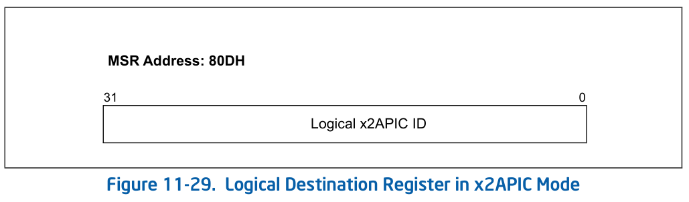

在 xAPIC 模式下，通过 MMIO 接口的目标格式寄存器（DFR）决定使用扁平逻辑模式还是集群逻辑模式。x2APIC 模式不支持扁平逻辑模式，因此在 x2APIC 模式下取消了目标格式寄存器（DFR）。

- LDR 的 32 位逻辑 x2APIC ID 字段分为两个子字段：
    - **集群 ID（LDR\[31:16\]）**：表示目标集群的地址。
    - **逻辑 ID（LDR\[15:0\]）**：定义了指定集群中每个本地 x2APIC 的逻辑 ID。

此布局支持最多 `2^16-1` 个集群，每个集群最多有 16 个唯一的逻辑 ID，有效地在逻辑目标模式下提供了 `(2^20 - 16)` 个处理器的寻址能力。

处理器实现可能选择在逻辑目标寄存器中支持少于 16 位的集群 ID 或逻辑 ID。然而，系统软件应对集群 ID 和逻辑 ID 子字段中实现的位数保持不敏感。x2APIC 硬件初始化将确保适当初始化的逻辑 x2APIC ID 可供系统软件使用，并且读取未实现的位返回零。这是一个只读寄存器，软件必须读取它以确定处理器的逻辑 x2APIC ID。具体来说，软件可以将 16 位掩码应用于逻辑 x2APIC ID 的最低 16 位，以标识集群中处理器的逻辑地址，而无需知道集群 ID 和逻辑 ID 子字段中实现的位数。同样，软件可以通过对具有匹配集群 ID（31:16）的处理器的逻辑 x2APIC ID（31:0）进行按位或操作来创建集群模型的消息目标地址。

为了在与系统拓扑特征相匹配的方式中启用集群 ID 分配，并在基于链路的平台互连中启用逻辑模式最低优先级设备中断的高效路由，LDR 在 x2APIC 状态转换时基于 x2APIC ID 的值由硬件初始化。此初始化的详细信息在第 11.12.10.2 节中提供。

#### 11.12.10.2 从本地 x2APIC ID 派生逻辑 x2APIC ID

在 x2APIC 模式下，可以从 LDR 中读取的 32 位逻辑 x2APIC ID 是从 32 位本地 x2APIC ID 派生的。具体来说，16 位逻辑 ID 子字段是通过将 1 向左移动 x2APIC ID 的最低 4 位得到的，即：
$逻辑 ID = 1 << x2APIC ID[3:0]$ 然后，x2APIC ID 的其余位形成逻辑 x2APIC ID 的集群 ID 部分：
$$逻辑 x2APIC ID = [(x2APIC ID[19:4] << 16) | (1 << x2APIC ID[3:0])]
$$
在 x2APIC ID 中使用最低的 4 位意味着在多插槽配置中，至少为插槽内的逻辑处理器保留 16 个 APIC ID。如果在一个插槽/封装中为逻辑处理器保留了超过 16 个 APIC ID，则一个封装内可以存在多个集群 ID。

LDR 初始化发生在启用 x2APIC 模式时（参见第 11.12.5 节）。

### 11.12.11 SELF IPI 寄存器

一些系统软件广泛使用 SELF IPI。x2APIC 架构引入了一个新的寄存器接口。这个新的寄存器专用于发送 SELF IPI，旨在为发送 SELF IPI 提供高度优化的路径。

图 11-30 显示了 SELF IPI 寄存器的布局。系统软件仅指定与要发送的中断相关的向量。通过 SELF IPI 寄存器发送 SELF IPI 的语义与使用指定向量发送自定向边缘触发固定中断的语义相同。具体来说，语义与通过 ICR 发送的处理器间中断（IPI）的以下设置相同：目标速记（ICR\[19:18\] = 01（自定向）），触发模式（ICR\[15\] = 0（边缘）），传递模式（ICR\[10:8\] = 000（固定）），向量（ICR\[7:0\] = 向量）。

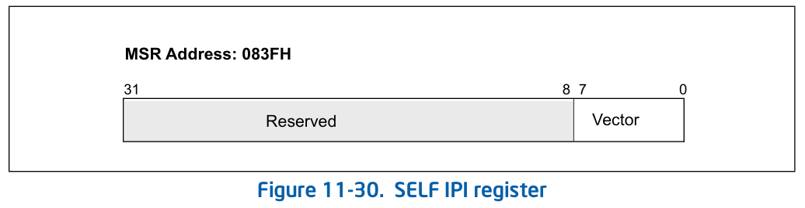

SELF IPI 寄存器是一个只写寄存器。对 SELF IPI 寄存器地址执行 `RDMSR` 指令将导致一般保护异常。

通过 SELF IPI 寄存器发送的 SELF IPI 的处理和优先级与通过 ICR 从传统 xAPIC 单元发送的 IPI 完全相同。具体来说，中断的状态将通过中断请求寄存器（IRR）、正在服务寄存器（ISR）和触发模式寄存器（TMR）进行跟踪，就像它是从系统总线接收到的一样。此外，通过自中断寄存器发送 IPI 确保中断被传递到处理器核心。具体来说，对 SELF IPI 寄存器执行 WRMSR 指令的完成意味着中断已记录到 IRR 中。正如边缘触发中断的预期，根据处理器的优先级和接受中断的准备状态，通过 SELF IPI 寄存器或 ICR 发送的具有相同向量的中断可以被合并。

### 11.13 APIC 总线消息格式

本节描述在串行 APIC 总线上传输消息时使用的消息格式。这里描述的信息仅适用于 Pentium 和 P6 家族的处理器。

#### 11.13.1 总线消息格式

本地 APIC 和 I/O APIC 在串行 APIC 总线上发送三种类型的消息：EOI 消息、短消息和非聚焦最低优先级消息。以下描述了每种消息类型的用途及其格式。

#### 11.13.2 EOI 消息

本地 APIC 发送 14 周期的 EOI 消息到 I/O APIC，以指示处理器已接受一个电平触发中断。这种中断是软件写入本地 APIC 的 EOI 寄存器的结果。表 11-8 显示了 EOI 消息中的周期。

##### 表 11-8. EOI 消息（14 周期）

| 周期  | Bit1   | Bit0 |                        |
| --- | ------ | ---- | ---------------------- |
| 1   | 1      | 1    | 11 = EOI               |
| 2   | ArbID3 | 0    | Arbitration ID 位 3 至 0 |
| 3   | ArbID2 | 0    |                        |
| 4   | ArbID1 | 0    |                        |
| 5   | ArbID0 | 0    |                        |
| 6   | V7     | V6   | 中断向量 V7 - V0           |
| 7   | V5     | V4   |                        |
| 8   | V3     | V2   |                        |
| 9   | V1     | V0   |                        |
| 10  | C      | C    | 周期 6 - 9 的校验和          |
| 11  | 0      | 0    |                        |
| 12  | A      | A    | 状态周期 0                 |
| 13  | A1     | A1   | 状态周期 1                 |
| 14  | 0      | 0    | 空闲                     |

校验和是对周期 6 到 9 的累积和。它是 2 位（Bit1:Bit0）逻辑数据值的累积和。所有加法的进位（除了最后一次加法）都会被加入总和中。如果任何 APIC 计算的校验和与周期 10 上总线上的不同，它将发出错误信号，在周期 12 上驱动 11。在这种情况下，APIC 将忽略该消息。发送 APIC 将收到适当的错误指示（见 11.5.3 节“错误处理”），并重新发送消息。状态周期在表 11-11 中定义。

##### 11.13.2.1 短消息

短消息（21 周期）用于发送固定、中断、NMI、SMI、INIT、启动、ExtINT 和带聚焦的最低优先级中断。表 11-9 显示了短消息中的周期。

###### 表 11-9. 短消息（21 周期）

| 周期  | Bit1   | Bit0 |                  |
| --- | ------ | ---- | ---------------- |
| 1   | 0      | 1    | 01 = 正常          |
| 2   | ArbID3 | 0    | 仲裁 ID 位 3 至 0    |
| 3   | ArbID2 | 0    |                  |
| 4   | ArbID1 | 0    |                  |
| 5   | ArbID0 | 0    |                  |
| 6   | DM     | M2   | DM = 目标模式        |
| 7   | M1     | M0   | M2-M0 = 传递模式     |
| 8   | L      | TM   | L = 电平，TM = 触发模式 |
| 9   | V7     | V6   | V7-V0 = 中断向量     |
| 10  | V5     | V4   |                  |
| 11  | V3     | V2   |                  |
| 12  | V1     | V0   |                  |
| 13  | D7     | D6   | D7-D0 = 目标       |
| 14  | D5     | D4   |                  |
| 15  | D3     | D2   |                  |
| 16  | D1     | D0   |                  |
| 17  | C      | C    | 周期 6-16 的校验和     |
| 18  | 0      | 0    |                  |
| 19  | A      | A    | 状态周期 0           |
| 20  | A1     | A1   | 状态周期 1           |
| 21  | 0      | 0    | 空闲               |
##### 11.13.2.2 非聚焦最低优先级消息

这些 34 周期的消息（参见表 11-10）用于没有焦点处理器时的最低优先级传递模式。周期 1 到 20 与短消息相同。如果在状态周期（周期 19）期间 `(A:A)` 标志状态为 `10B`，则表示已识别出焦点处理器，并使用短消息格式（参见表 11-9）。如果 `(A:A)` 标志设置为 `00B`，则开始最低优先级仲裁，并完成非聚焦最低优先级消息的 34 个周期。对于其他状态标志组合，请参见第 11.13.2.3 节“APIC 总线状态周期”。

###### 表 11-10. 非聚焦最低优先级消息（34 周期）

| 周期  | Bit0   | Bit1 |                     |
| --- | ------ | ---- | ------------------- |
| 1   | 0      | 1    | 0 1 = 正常            |
| 2   | ArbID3 | 0    | 仲裁 ID 位 3 至 0       |
| 3   | ArbID2 | 0    |                     |
| 4   | ArbID1 | 0    |                     |
| 5   | ArbID0 | 0    |                     |
| 6   | DM     | M2   | DM = 目标模式           |
| 7   | M1     | M0   | M2-M0 = 传递模式        |
| 8   | L      | TM   | L = 电平, TM = 触发模式   |
| 9   | V7     | V6   | V7-V0 = 中断向量        |
| 10  | V5     | V4   |                     |
| 11  | V3     | V2   |                     |
| 12  | V1     | V0   |                     |
| 13  | D7     | D6   | D7-D0 = 目标          |
| 14  | D5     | D4   |                     |
| 15  | D3     | D2   |                     |
| 16  | D1     | D0   |                     |
| 17  | C      | C    | 周期 6-16 的校验和        |
| 18  | 0      | 0    |                     |
| 19  | A      | A    | 状态周期 0              |
| 20  | A1     | A1   | 状态周期 1              |
| 21  | P7     | 0    | P7 - P0 = 反转的处理器优先级 |
| 22  | P6     | 0    |                     |
| 23  | P5     | 0    |                     |
| 24  | P4     | 0    |                     |
| 25  | P3     | 0    |                     |
| 26  | P2     | 0    |                     |
| 27  | P1     | 0    |                     |
| 28  | P0     | 0    |                     |
| 29  | ArbID3 | 0    | 仲裁 ID 3 - 0         |
| 30  | ArbID2 | 0    |                     |
| 31  | ArbID1 | 0    |                     |
| 32  | ArbID0 | 0    |                     |
| 33  | A2     | A2   | 状态周期                |
| 34  | 0      | 0    | 空闲                  |

周期 21 到 28 用于仲裁最低优先级处理器。参与仲裁的处理器在总线上驱动其反转的处理器优先级。只有具有空闲中断槽的本地 APIC 参与最低优先级仲裁。如果没有这样的 APIC 存在，则消息将被拒绝，需要在稍后尝试发送。

周期 29 到 32 也用于在两个或多个处理器具有相同最低优先级的情况下进行仲裁。在最低优先级传递模式下，周期 33（A2 A2）中的所有错误组合将设置错误状态寄存器中的“接受错误”位（见图 11-9）。仲裁优先级更新在周期 20 中执行，不受周期 33 中检测到的错误影响。只有在最低优先级仲裁中获胜的本地 APIC 驱动周期 33。周期 33 中的错误将强制发送方重新发送消息。

##### 11.13.2.3 APIC 总线状态周期

在 APIC 总线消息中，某些周期是状态周期。在这些周期中，状态标志 `(A:A)` 和 `(A1:A1)` 被检查。表 11-11 显示了这些状态标志的解释方式，取决于当前传递模式和焦点处理器的存在情况。

###### 表 11-11. APIC 总线状态周期解释

| 传递模式                       | A 状态           | A1 状态     | A2 状态    | 更新 ArbID 和周期 # | 消息长度  | 重试  |
| -------------------------- | -------------- | --------- | -------- | -------------- | ----- | --- |
| EOI                        | 00: CS_OK      | 10: 接受    | XX: 是，13 | 14 周期          | 否     |     |
|                            | 00: CS_OK      | 11: 重试    | XX: 是，13 | 14 周期          | 是     |     |
|                            | 00: CS_OK      | 0X: 接受错误  | XX: 否    | 14 周期          | 是     |     |
|                            | 11: CS_Error   | XX: XX    | 否        | 14 周期          | 是     |     |
|                            | 10: 错误         | XX: XX    | 否        | 14 周期          | 是     |     |
|                            | 01: 错误         | XX: XX    | 否        | 14 周期          | 是     |     |
| 固定                         | 00: CS_OK      | 10: 接受    | XX: 是，20 | 21 周期          | 否     |     |
|                            | 00: CS_OK      | 11: 重试    | XX: 是，20 | 21 周期          | 是     |     |
|                            | 00: CS_OK      | 0X: 接受错误  | XX: 否    | 21 周期          | 是     |     |
|                            | 11: CS_Error   | XX: XX    | 否        | 21 周期          | 是     |     |
|                            | 10: 错误         | XX: XX    | 否        | 21 周期          | 是     |     |
|                            | 01: 错误         | XX: XX    | 否        | 21 周期          | 是     |     |
| NMI, SMI, INIT, ExtINT, 启动 | 00: CS_OK      | 10: 接受    | XX: 是，20 | 21 周期          | 否     |     |
|                            | 00: CS_OK      | 11: 重试    | XX: 是，20 | 21 周期          | 是     |     |
|                            | 00: CS_OK      | 0X: 接受错误  | XX: 否    | 21 周期          | 是     |     |
|                            | 11: CS_Error   | XX: XX    | 否        | 21 周期          | 是     |     |
|                            | 10: 错误         | XX: XX    | 否        | 21 周期          | 是     |     |
|                            | 01: 错误         | XX: XX    | 否        | 21 周期          | 是     |     |
| 最低优先级                      | 00: CS_OK, 无焦点 | 11: 执行最低  | 10: 接受   | 是，20           | 34 周期 | 否   |
|                            | 00: CS_OK, 无焦点 | 11: 执行最低  | 11: 错误   | 是，20           | 34 周期 | 是   |
|                            | 00: CS_OK, 无焦点 | 11: 执行最低  | 0X: 错误   | 是，20           | 34 周期 | 是   |
|                            | 00: CS_OK, 无焦点 | 10: 结束和重试 | XX: 是，20 | 34 周期          | 是     |     |
|                            | 00: CS_OK, 无焦点 | 0X: 错误    | XX: 否    | 34 周期          | 是     |     |
|                            | 10: CS_OK, 焦点  | XX: XX    | 是，20     | 34 周期          | 否     |     |
|                            | 11: CS_Error   | XX: XX    | 否        | 21 周期          | 是     |     |
|                            | 01: 错误         | XX: XX    | 否        | 21 周期          | 是     |     |
