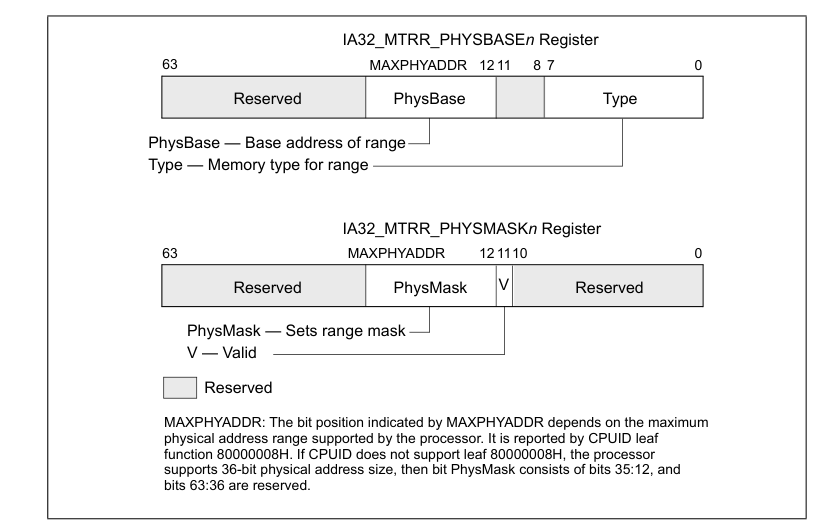
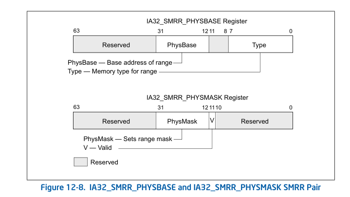

内存类型范围寄存器(MTRR)提供了一种机制，用于将内存类型与系统中的物理地址范围相关联。
MTRR机制允许在物理内存中定义多个范围，并定义了一组用于指定每个范围中包含的内存类型的模型特定寄存器（MSR）。

表1

| 内存类型         | MTRR编码 |
| ------------ | ------ |
| 不可缓存(UC)     | 00H    |
| 写组合(WC)      | 01H    |
| 保留(使用会触发#GP) | 02H    |
| 保留(使用会触发#GP) | 03H    |
| 写通(WT)       | 04H    |
| 写保护(WP)      | 05H    |
| 写回(WB)       | 06H    |
| 保留(使用会触发#GP) | 7H到FFH |

在硬件复位后，P6及更高版本的处理器系列会禁用所有固定和可变的MTRR，从而使所有物理内存都不可缓存。初始化软件应该将MTRR设置为特定的、系统定义的内存映射。通常，BIOS（基本输入/输出系统）软件会配置MTRR。然后，操作系统或执行程序可以使用正常的页面级缓存属性修改内存映射。

MTRR的可用性是特定于模型的。软件可以通过执行`CPUID`指令传入EAX 01H，结果为EDX中的MTTRR标致(第12位)

如果处理器支持MTRR，可以从64位的`IA32_MTRRCAP` MSR (MSR编号FEH)获取有关MTRRs的额外信息。`IA32_MTRRCAP` MSR是一个只读的MSR。
- VCNT（可变范围寄存器计数）字段，位 0 至 7 — 表示处理器上实现的可变范围的数量。
- FIX（支持固定范围寄存器）标志，第 8 位 — 当设置时，支持固定范围 MTRRs（IA32_MTRR_FIX64K_00000 至 IA32_MTRR_FIX4K_0F8000）；当清除时，不支持任何固定范围寄存器。
- WC（写结合）标志，第 10 位 — 当设置时，支持写结合（WC）内存类型；当清除时，不支持 WC 类型。
- SMRR（系统管理范围寄存器）标志，第 11 位 — 当第 11 位设置时，支持系统管理范围寄存器（SMRR）接口；当清除时，不支持 SMRR 接口。

`IA32_MTRRCAP` MSR中的第9位和第12到63位是保留的。如果尝试写入`IA32_MTRRCAP` MSR会触发`#GP`

### 使用 MTRRs 设置内存范围
内存范围和每个范围中指定的内存类型由三组寄存器设置：`IA32_MTRR_DEF_TYPE` MSR(2FFH)、固定范围 MTRRs 和可变范围 MTRRs。可以分别使用 RDMSR 和 WRMSR 指令读写这些寄存器。

`IA32_MTRR_DEF_TYPE` MSR(2FFH) 设置了不被 MTRRs 涵盖的物理内存区域的默认属性。此寄存器中的标志和字段的功能如下：

- 类型字段，位 0 至 7 — 指示对于那些没有通过 MTRR 为其指定内存类型的物理内存地址范围使用的默认内存类型（见表 12-8 以了解此字段的编码）。此字段的合法值为 0、1、4、5 和 6。所有其他值将导致生成一个通用保护异常（#GP）。 英特尔推荐对所有不存在内存的物理地址使用 UC（未缓存）内存类型。为了将 UC 类型分配给不存在的内存位置，可以在类型字段中指定它为默认类型，或者通过固定和可变 MTRRs 明确分配。

- FE（固定 MTRRs 启用）标志，第 10 位 — 当设置时，固定范围 MTRRs 被启用；当清除时，固定范围 MTRRs 被禁用。当固定范围 MTRRs 被启用时，它们在范围重叠时优先于可变范围 MTRRs。如果固定范围 MTRRs 被禁用，可变范围 MTRRs 仍然可以使用，并且可以映射通常由固定范围 MTRRs 覆盖的范围。

- E（MTRRs 启用）标志，第 11 位 — 当设置时，MTRRs 被启用；当清除时，所有 MTRRs 被禁用，并且 UC 内存类型应用于所有物理内存。当此标志设置时，FE 标志可以禁用固定范围 MTRRs；当标志清除时，FE 标志无效。当 E 标志设置时，为未被固定或可变 MTRR 已映射的内存区域使用在默认内存类型字段中指定的类型。

`IA32_MTRR_DEF_TYPE` MSR 中的第 8 和 9 位，以及第 12 至 63 位是保留的；如果尝试写入非零值，会触发#GP。

### 固定范围 MTRRs

固定内存范围由 11 个 64 位的固定范围寄存器映射。每个这样的寄存器被分成 8 位字段，用于指定该寄存器控制的子范围的内存类型：

- 寄存器 IA32_MTRR_FIX64K_00000 — 映射从 0H 到 7FFFFH 的 512-KByte 地址范围。此范围被分成八个 64-KByte 子范围。
- 寄存器 IA32_MTRR_FIX16K_80000 和 IA32_MTRR_FIX16K_A0000 — 映射从 80000H 到 BFFFFH 的两个 128-KByte 地址范围。此范围被分成十六个 16-KByte 子范围，每个寄存器 8 个范围。
- 寄存器 IA32_MTRR_FIX4K_C0000 至 IA32_MTRR_FIX4K_F8000 — 映射从 C0000H 到 FFFFFH 的八个 32-KByte 地址范围。此范围被分成六十四个 4-KByte 子范围，每个寄存器 8 个范围。

表2显示了固定物理地址范围与相应固定范围 MTRRs 字段之间的关系，表1显示了 MTRRs 的内存类型编码。

表2

| 地址范围(十六进制)      |                 |                 |                 |                 |                 |                 |                 | MTRR                       |
| --------------- | --------------- | --------------- | --------------- | --------------- | --------------- | --------------- | --------------- | -------------------------- |
| 63     56       | 55   48         | 47    40        | 39    32        | 24    31        | 23    16        | 15      8       | 7        0      | 位数                         |
| 70000-7FFFF     | 60000-6FFFF     | 50000-5FFFF     | 40000-4FFFF     | 30000-3FFFF     | 20000-2FFFF     | 10000-1FFFF     | 00000-0FFFF     | IA32_MTRR_ FIX64K_00000 |
| 9C000- 9FFFF | 98000- 9BFFF | 94000- 97FFF | 90000- 93FFF | 8C000- 8FFFF | 88000- 8BFFF | 84000- 87FFF | 80000- 83FFF | IA32_MTRR_ FIX16K_80000 |
| BC000- BFFFF | B8000- BBFFF | B4000- B7FFF | B0000- B3FFF | AC000- AFFFF | A8000- ABFFF | A4000- A7FFF | A0000- A3FFF | IA32_MTRR_ FIX16K_A0000 |
| C7000- C7FFF | C6000- C6FFF | C5000- C5FFF | C4000- C4FFF | C3000- C3FFF | C2000- C2FFF | C1000- C1FFF | C0000- C0FFF | IA32_MTRR_ FIX4K_C0000  |
| CF000- CFFFF | CE000- CEFFF | CD000- CDFFF | CC000- CCFFF | CB000- CBFFF | CA000- CAFFF | C9000- C9FFF | C8000- C8FFF | IA32_MTRR_ FIX4K_C8000  |
| D7000- D7FFF | D6000- D6FFF | D5000- D5FFF | D4000- D4FFF | D3000- D3FFF | D2000- D2FFF | D1000- D1FFF | D0000- D0FFF | IA32_MTRR_ FIX4K_D0000  |
| DF000- DFFFF | DE000- DEFFF | DD000- DDFFF | DC000- DCFFF | DB000- DBFFF | DA000- DAFFF | D9000- D9FFF | D8000- D8FFF | IA32_MTRR_ FIX4K_D8000  |
| E7000- E7FFF | E6000- E6FFF | E5000- E5FFF | E4000- E4FFF | E3000- E3FFF | E2000- E2FFF | E1000- E1FFF | E0000- E0FFF | IA32_MTRR_ FIX4K_E0000  |
| EF000- EFFFF | EE000- EEFFF | ED000- EDFFF | EC000- ECFFF | EB000- EBFFF | EA000- EAFFF | E9000- E9FFF | E8000- E8FFF | IA32_MTRR_ FIX4K_E8000  |
| F7000- F7FFF | F6000- F6FFF | F5000- F5FFF | F4000- F4FFF | F3000- F3FFF | F2000- F2FFF | F1000- F1FFF | F0000- F0FFF | IA32_MTRR_ FIX4K_F0000  |
| FF000- FFFFF | FE000- FEFFF | FD000- FDFFF | FC000- FCFFF | FB000- FBFFF | FA000- FAFFF | F9000- F9FFF | F8000- F8FFF | IA32_MTRR_ FIX4K_F8000  |

### 可变范围MTRR
Pentium 4、Intel Xeon 和 P6 系列处理器允许软件为 m 个可变大小地址范围指定内存类型，每个范围使用一对 MTRR。 支持的范围数 m 在 `IA32_MTRRCAP` MSR 的位 7:0 中给出。
每对中的第一个条目 (IA32_MTRR_PHYSBASEn, **200H+n*2**) 定义该范围的基地址和内存类型；第二个条目(IA32_MTRR_PHYSMASKn, **201H+n*2**) 包含用于确定地址范围的掩码。 “n”后缀的范围是 0 到 m–1，标识特定的寄存器对。

显示了这些寄存器中的标志和字段。这些标志和字段的功能如下：

- 类型字段，位 0 到 7 — 指定范围的内存类型（见表 12-8 以了解此字段的编码）。
- PhysBase 字段，位 12 到（MAXPHYADDR-1）— 指定地址范围的基地址。在 MAXPHYADDR 为 36 位的情况下，这个 24 位的值通过在低端扩展 12 位来形成基地址（这自动将地址对齐到 4-KByte 边界）。
- PhysMask 字段，位 12 到（MAXPHYADDR-1）— 指定一个掩码（如果最大物理地址大小是 36 位，则为 24 位；如果是 40 位，则为 28 位）。掩码决定了被映射区域的范围，根据以下关系：
    - Address_Within_Range AND PhysMask = PhysBase AND PhysMask
    - 此值通过在低端扩展 12 位来形成掩码值。
    - PhysMask 字段的宽度取决于处理器支持的最大物理地址大小。
- CPUID.80000008H 报告处理器支持的最大物理地址大小。如果 CPUID.80000008H 不可用，软件可以假设处理器支持 36 位的物理地址大小（那么 PhysMask 宽度为 24 位，IA32_MTRR_PHYSMASKn 的上 28 位被保留）。见下面的注释。
- V（有效）标志，第 11 位 — 设置时启用寄存器对；清除时禁用寄存器对。

IA32_MTRR_PHYSBASEn 和 IA32_MTRR_PHYSMASKn 寄存器中的所有其他位都是保留的；如果软件尝试写入这些位，处理器将生成一个通用保护异常（#GP）。

### 系统管理范围寄存器接口
如果 IA32_MTRRCAP的位11被设置，则处理器支持 SMRR 接口以限制对系统管理模式（SMM）软件使用的指定内存地址范围的访问。

> [!SMRR接口] 
> SMRR接口，全称为系统管理范围寄存器（System Management Range Register）接口，是一种在现代处理器中实现的技术，旨在提高系统安全性。它允许系统管理模式（SMM）软件限制对特定内存地址范围的访问。这个特定的内存范围通常用于存储系统管理中断（SMI）处理程序的代码和数据，这些处理程序和数据位于系统管理RAM（SMRAM）区域内。
> 
> 系统管理模式是一种特殊的执行模式，用于执行各种系统级管理任务，如电源管理和硬件控制。SMM由处理器特权指令触发，通常响应于系统硬件（如BIOS）的请求。
> 
> SMRR的工作原理如下：
> 
> - **寄存器对：** SMRR通过一对模型特定寄存器（MSRs）实现，这对寄存器分别是IA32_SMRR_PHYSBASE和IA32_SMRR_PHYSMASK。这些寄存器定义了受保护的SMRAM内存范围的基址和掩码，从而指定了哪些物理内存地址受SMRR保护。
> - **内存类型和访问控制：** IA32_SMRR_PHYSBASE寄存器指定访问SMRAM时使用的内存类型，而IA32_SMRR_PHYSMASK寄存器包含一个有效位和一个掩码，这个掩码确定了SMRAM地址范围。当有效位设置时，对指定范围内的地址的访问将根据是否处于SMM中以不同方式处理。
> - **保护机制：** 在SMM内，可以正常访问SMRAM区域。但是，当处理器不在SMM中时，对受保护范围内的写入操作会被忽略，读取操作则返回一个固定值，且使用不可缓存（UC）的内存类型。这样可以防止敏感数据在系统的其余部分运行时被读取或修改。

系统管理范围寄存器由一对 MSR 组成（见图 12-8）。`IA32_SMRR_PHYSBASE` MSR 定义 SMM 访问时 SMRAM 内存范围的基址以及用于访问它的内存类型。`IA32_SMRR_PHYSMASK` MSR 包含一个有效位和一个掩码，该掩码确定 SMRR 接口保护的 SMRAM 地址范围。这些 MSR 仅可在 SMM 中写入；在 SMM 外尝试写入它们会引发通用保护异常。

图 12-8 显示了这些寄存器中的标志和字段。这些标志和字段的功能如下：

- 类型字段，位 0 至 7 — 指定范围的内存类型（见表 12-8 对此字段的编码）。
- PhysBase 字段，位 12 至 31 — 指定地址范围的基址。地址必须小于 4 GBytes，并自动对齐到 4-KByte 边界。
- PhysMask 字段，位 12 至 31 — 指定一个掩码，该掩码根据以下关系确定正在映射的区域的范围：
    - Address_Within_Range AND PhysMask = PhysBase AND PhysMask
    - 此值在低端扩展 12 位以形成掩码值。更多信息见第 12.11.3 节，“基址和掩码计算示例”。
- V（有效）标志，位 11 — 设置时启用寄存器对；清除时禁用寄存器对。 在尝试访问这些 SMRR 寄存器之前，软件必须测试 IA32_MTRRCAP 寄存器中的第 11 位。如果不支持 SMRR，从寄存器或写入寄存器的读取会引发通用保护异常。 当 `IA32_SMRR_PHYSMASK` MSR 中的有效标志为 1 时，对指定地址范围的访问如下处理：
	- 如果逻辑处理器处于 SMM 中，访问使用 IA32_SMRR_PHYSBASE MSR 中的内存类型。
	- 如果逻辑处理器不在 SMM 中，写入访问将被忽略，并且读取访问将为每个字节返回一个固定值。在这种情况下，使用不可缓存的内存类型（UC）。 

即使指定的地址范围与 MTRR 指定的范围重叠，上述项目仍适用。

### 基址和掩码计算示例
示例适用于支持最大 36 位物理地址大小的处理器。在可变范围 MTRR 对中输入的基址和掩码值是 24 位值，处理器将其扩展为 36 位。