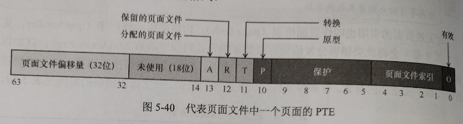
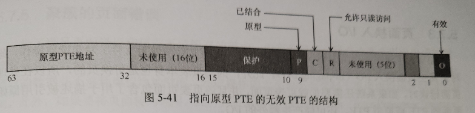
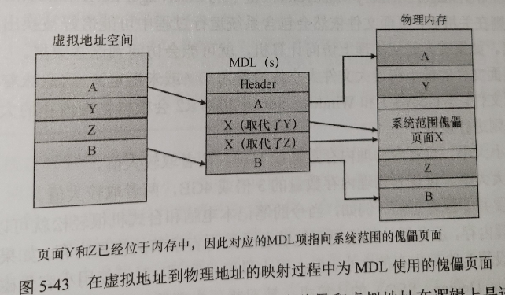

# 页面错误的处理

​	对无效页面的引用也叫作页面错误 (page fault)。内核陷阱处理程序 (trap handier)会将此类错误分发给内存管理器错误处理程序函数 MmAccessFault，以加以解决。该例程运行在产生页面错误的线程上下文中，会负责试图解决该错误(如果能解决的话)，或产生适当的异常。有多种条件会引发这样的错误，产生访问错误的原因见下表。

| 错误原因                                                     | 结果                                                         |
| ------------------------------------------------------------ | ------------------------------------------------------------ |
| PTE/PDE 损坏                                                 | 使用代码0x1A(MEMORY_MANAGEMENT)对系统进行bug-check(崩溃)     |
| 所访问的页面并未驻留在内存中，而是位于磁盘上的页面文件或映射文件中 | 分配物理页面，从磁盘读取所需页面并放入相关工作集内           |
| 所访问的页面位于待命或修改列表中                             | 将页面转换为相关进程、会话或系统工作集                       |
| 所访问的页面尚未提交(例如位于保留的地址空间或尚未分配的地址空间中) | 访问冲突异常                                                 |
| 从用户模式访问了仅能从内核模式访问的页面                     | 访问冲突异常                                                 |
| 向只读页面执行写操作                                         | 访问冲突异常                                                 |
| 访问了要求零 (demand-zero) 的页面                            | 向相关工作集加入填充零的页面                                 |
| 写入受防护的页面                                             | 防护页面冲突(如果是指向用户模式栈的引用，将自动执行栈扩展)   |
| 写入“写入时复制”页面                                         | 为页面创建进程私有(或会话私有)的副本，用其取代进程、会话或系统工作集中的原页面 |
| 所写入的页面虽然有效，但尚未被写入当前后备存储区的副本       | 在PTE中设置Dirty位                                           |
| 执行被标记为不可执行的页面中所包含的代码                     | 访问冲突异常                                                 |
| PTE 权限与飞地 (enclave) 权限不符（CreateEnclave / NtCreateEnclave） | 用户模式：访问冲突异常。内核模式:使用代码 0x50(PAGE_FAULT_IN_NONPAGED_AREA)进行 bug-check |

---

### 无效PTE

​	如果在地址转换过程中发现PTE的Valid位被设置为0，那么该PTE代表了无效页面进而会导致内存管理异常，或称为页面错误。此时，MMU 会忽略该 PTE 的其他位，因此操作系统可以使用这些位来保存有助于解决页面错误所需的其他信息。

​	下面列出了4类无效 PTE 的类型及其结构。这些通常被称为软件 PTE，因为它们是由内存管理器，而非MMU来解读的。

(1) **页面文件**(page file)。所需页面位于页面文件中。PTE 中的4位代表了该页面可能位于16个页面文件中的哪一个里，其他 32 位提供了文件中的页面编号，如图5-40所示。换页器会发起页面换入操作，将页面放入内存并使其有效。页面文件偏移量始终是非零的，并且不可能全部为 1(也就是说，页面文件中的第一个和最后一个页面不用于分页)，这样即可实现下文将要介绍的其他格式。

(2) **要求零**(demand zero)。该PTE 的格式与前文提到的页面文件PTE格式相同，但该格式的页面文件偏移量为0。所需页面必须由全部填充了0的页面来满足。换页器会检查零页面列表，如果该列表为空，换页器会从空闲列表中拿取一个页面，并为其填充0。如果空闲列表同样为空，则会从某个待命列表中拿取页面并填充 0。

(3) **虚拟地址描述符** (virtual address descriptor)。该PTE的格式与前文提到的页面文件PTE 格式相同，但该格式的页面文件偏移量字段均为 1。这意味着对于有定义并且具后备存储的页面，可以在进程的虚拟地址描述符(VAD)树中找到该页面。这种格式将于由映射文件中的节支撑的页面。换页器可以找到包含虚拟页面虚拟地址范围定义的VAD并从VAD引用的映射文件发起换入操作。

(4) **转换** (transition)。转换位为 1。所需页面位于内存中的待命、已修改或修改但不写出列表中，或不位于任何列表中。换页器会从列表中移除该页面(如果位于某个列表中)，并将其加入进程工作集。由于不涉及 I/O，这通常也叫作页面软错误。

(5) **未知** (unknown)。该 PTE 为零，或页表尚不存在。(本应提供页表物理地址的PDE 为零)。在这些情况下，内存管理器必须检查 VAD 以确定该虚拟地址是否已经提交如果已经提交，会建立页表来代表新提交的地址空间;如果尚未提交，也就是说，如果页面被保留或尚未定义，则会将该页面错误报告为访问冲突异常。

---

### 原型PTE

​	如果一个页面可在两个进程之间共享，内存管理器会使用一种名为原型(prototype)页表项(原型PTE)的软件结构映射这些可能需要共享的页面。对于页面文件支撑的节，会在节对象首次创建时创建原型 PTE 数组。对于映射的文件，会在映射每个视图时根据需要创建该数组的部分内容。这些原型PTE还是段(segment)结构的一部分。

​	当进程首次引用映射至节对象视图的页时(只有在映射该视图时才会创建VAD)，内存管理器会使用原型 PTE 所提供的信息填充进程页表中用于地址转换的实际PTE数据。当共享页面变得有效后，进程PTE 和原型PTE 均会指向包含这些数据的物理页面。为了跟踪引用了有效共享页面的进程PTE 的数量，会对PFN数据库项中的一个数器进行累加。借此内存管理器即可确定某个共享页面何时不再被任何页表引用，进而可以令其失效并放入转换列表或写出到磁盘上。

​	当共享页面失效后，进程页表中的PTE会使用一个特殊的PTE填充，被填充的PTE将指向描述该页面的原型PTE。因此当该页面被访问时，内存管理器可以使用该PTE中编码的信息定位到原型 PTE，而原型PTE进一步描述了被引用的页面。

根据原型 PTE 的描述，共享页面可处于下列6 种状态之一

(1)**活动/有效**(active/valid)。因为其他进程可以访问，所以该页面位于物理内存中。

(2)**转换**(transition)。目标页面位于内存中的待命列表或修改列表(或不位于这两个列表中的任一个)内。

(3)**已修改不写出**(modified-no-write)。目标页面位于内存中，且位于已修改不写出列表内。

(4)**要求零** (demand zero)。目标页面应当用一个零页面来满足。

(5)**页面文件** (page file)。目标页面驻留在页面文件内。

(6)**映射文件** (mapped file)。目标页面驻留在映射文件内。

​	原型PTE并不用于地址转换，而是充当了页表和 PFN 数据库之间的一层，并且绝对不会直接应用于页表。

​	通过让一个可能被共享的页面的所有访问者指向同一个原型 PTE 来解决错误，内存管理器可以直接管理共享的页面，而不需要更新共享该页面的每个进程的页表。例如，共享的代码页或数据页可能会在某一刻换出到磁盘。当内存管理器从磁盘获取该页面时，只需要更新原型PTE 以指向该页面新的物理位置即可。共享了该页面的每个进程的PTE可以维持不变，此时 Valid 位已经被清除，因此依然可以指向原型 PTE。随后，当进程引用该页面时，才需要更新真正的PTE。

---

### 页面换入I/O

​	如果为了满足某个页面错误，必须向文件(页面文件或映射文件)发起读取操作，此时会发生页面换入I/O (in-paging I/O)。此外，因为页表本身也是可换页的，所以在处页面错误时，如果系统还需要加载页表页面，并且该页表页面包含了用于描述被引用原始页面的PTE或原型PTE，还可能产生额外的 I/O。

​	页面换入 I/O操作是同步进行的，即线程会等待事件，直到I/O 操作完成，这个过程不会被异步过程调用(APC)的交付打断。换页器会在I/O请求函数中使用一个特殊的修饰符来代表这个换页I/O。换页 I/O 操作完成后，I/O 系统会触发一个事件，借此唤醒换页器，让它继续执行换页工作。

​	在换页I/O操作进行的过程中，产生错误的线程并不拥有任何关键的内存管理同步对象。进程中的其他线程可以执行虚拟内存函数，进而在换页 I/O进行的过程中处理页面错误。但在I/O完成的过程中，换页器必须意识到下列这些条件。

(1) 同一个进程或不同进程中的另一个线程可能会在同一个页面上产生错误(这种情况也叫作冲突的页面错误)。
(2) 该页面已经被从虚拟地址空间中删除 (并且重新映射)了
(3) 该页面的保护属性可能已经改变了。
(4) 该错误可能针对的是原型PTE，映射原型 PTE 的页面可能已经不在工作集中

​	为了处理这些情况，换页器会在执行换页 I/O 请求之前，在线程的内存栈中存储足够多的状态信息。因此当请求完成后，换页器即可检测这些条件，如果有必要，会在不将页面变为有效的同时解除该页面错误。如果再次执行导致页面错误的指令，换页器将被再次调用并根据新状态评估该 PTE。

---

### 冲突的页面错误

​	如果在页面换入的过程中，同一个进程或不同进程中的另一个线程导致该页面出现页面错误，这种情况便称为冲突的页面错误(collided page fault)。换页器必须能检测到冲突的页面错误并以最优方式加以处理，因为这种情况在多线程系统中十分普遍。如果另一个线程或进程对同一个页面产生错误，换页器会检测到冲突的页面错误，并会注意到该页面正处于转换过程中，且有一个正在进行的读取操作。(这些信息都保存在 PFN 数据库项中。)此时，换页器会针对 PFN 数据库项所指定的事件发出等待操作。或者可以选择发起一个并行 I/O以保护文件系统防范死锁。(第一个完成操作的I/O会“胜出”，其他I/O会被丢弃。) 该事件是由为了解决该错误而第一个发起I/O请求的线程初始化而来的。

​	当I/O操作完成后，所有等待该事件的线程都将得到满足。获得 PFN 数据库锁的第一个线程负责执行页面换入完成操作。这些操作包括检查I/O状态以确保I/ 操作成功完成、清除 PFN数据库中的“正在读取中”位、更新PTE。

​	当后续线程获取了 PFN 数据库锁以消除冲突的页面错误时，换页器发现“正在读取中”这个位已经被消除了，进而会确定初始更新已执行完成，因而会检查 PFN 数据库中的页面换入错误标志，以确保页面换入 I/O 已成功完成。如果页面换入错误标志依然存在，此时将不更新 PTE，并会导致正在出现页面错误的线程产生页面换入错误异常。

---

### 聚族的页面错误

​	为了满足页面错误和填充系统缓存的需求，内存管理器会预取由多个页面组成的簇该预取操作会将数据直接读入系统的页面缓存中，而非读入虚拟内存中的工作集内。因此预取的数据并不消耗虚拟地址空间，预取操作的大小也不会受制于可用虚拟地址空间的限制。此外，如果要将页面转为他用，此时并不需要对跨处理器中断 (Inter-Processor Interrupt, IPI)执行成本高昂的 TLB刷新。预取的页面会被放入待命列表，并在PTE 中标记为转换状态。如果随后引用了已经预取的页面，内存管理器会将其加入工作集中。然而，如果预取的页面从未被引用，也不需要耗费任何系统资源来释放它。如果位于预取簇中的任何页面已经位于内存中，内存管理器并不会再次读取它，而是会使用傀儡(dummy)页面代表它，这样只需要一个高效的I/O 请求就够了。

​	当内存管理器构建了能够描述请求的MDL后，会提供指向页面A和B的有效指针。然而页面Y和Z对应的项会指向同一个系统范围内的傀儡页面X。内存管理器可以使用来自后备存储区的，可能已经过时的数据填充傀儡页面X，因此页面X 并不会对外可见。然而，如果有组件访问了MDL中页面Y和Z的偏移量，该组件将看到傀页面X而非页面Y和Z。

​	页面管理器可以将任意数量的已丢弃页面代表为一个傀儡页面，这个傀儡页面可以在同一个MDL中多次嵌入，甚至可以嵌入多个驱动程序所使用的多个并发MDL中。因此代表已丢弃页面位置的内容可以随时更改。

---

### 页面文件

​	页面文件用于存储依然可以被某些进程使用，但由于被取消映射或内存压力导致的修剪操作，而不得不写回到磁盘的已修改页面。当页面最初被提交时，页面文件空间会被保留。但只有在页面写出到磁盘后，才能确定最优化的聚簇页面文件实际的位置。

​	系统引导时，会话管理器进程(Smss.exe) 会检查注册表 HKLM\SYSTEM\CurrentControlSet\Control\Session Manager\Memory Management\PagingFiles 键下的注册表值，借此读取要打开的页面文件列表。这个多字符串注册表值包含了每个页面文件的名称、最小大小和最大大小信息。在x86和x64 系统中，Windows 最多支持使用16个页面文件，ARM系统最多支持使用2个页面文件。在x86 和x64 系统中，每个页面文件最大可达 16TB,ARM系统最大可达4GB。一旦打开后，系统运行过程中将无法删除页面文件，因为System进程会对每个打开的页面文件维持一个打开的句柄。

​	由于页面文件包含了进程和内核虚拟内存的一部分，出于安全方面的考虑，我们可将系统配置为在关机时清空页面文件。为此需要将注册表 HKLM\SYSTEM\CurrentControlSet\Control\Session Manager\Memory Management键下的ClearPageFileAtShutdown注册表值设置为 1。否则在关机后，页面文件依然会包含系统运行过程中可能恰好被换出到页面文件的任何数据。如果有人能从物理上访问计算机，就可能会访问到这些数据。

​	如果页面文件的最小和最大文件大小均设置为 0(或未指定)，这意味着将由系统自行管理页面文件。Windows7和 Windows Server 2008 R2会根据物理内存的大小，使用如下的简单规则进行设置。

(1) 最小大小。设置为物理内存数量或 1GB，两者取较大值。
(2) 最大大小。设置为物理内存数量的 3 倍或 4GB，两者取较大值。

但是现在不同，当前的实现使用了一种更巧妙的方式，不仅可以考虑物理内存的数量，还会结合考虑页面文件的历史用量和其他因素，借此确定“适宜”的页面文件大小最小值。在创建和初始化页面文件的过程中，Smss.exe 会根据4个因素计算页面文件大小的最小值，并将其存储在全局变量中。

(1)RAM(SmpDesiredPfSizeBasedOnRAM)。这是根据物理内存数量推荐的页面文件大小。

(2)崩溃转储(SmpDesiredPfSizeForCrashDump)。这是为了能够存储崩溃转储而推荐的页面文件大小。

(3)历史记录(SmpDesiredPfSizeBasedOnHistory)。这是根据使用情况历史记录推荐的页面文件大小。Smss.exe会用到一个每小时触发一次的计时器记录页面文件的使用情况。

(4)应用(SmpDesiredPfSizeForApps)。这是为 Windows 应用推荐的页面文件大小

页面文件大小建议的基本计算方式见下表

| 建议的基准 | 推荐的页面文件大小                                           |
| ---------- | ------------------------------------------------------------ |
| RAM        | 如果物理内存小于等于1GB，那么大小为1GB。如果物理内存大于1GB，那么额外每GB物理内存增加1/8GB，最多32GB |
| 崩溃转储   | 如果配置了专用转储文件，那么无须用页面文件存储转储文件，因此大小为 0。(若要为专用转储文件配置该选项，可在注册表 HKLM\SYSTEM\CurrentControlSet\Control\CrashControl键下添加DedicatedDumpFile 注册表值)如果转储类型配置为自动(默认值)，那么会有以下几种情况。如果物理内存小于4GB，那么大小为“物理内存数量/6”。否则，大小为2/3 GB，外加物理内存超出4GB的部分额外每GB对应 1/8 GB，但32GB封顶。如果最近出现过崩溃并且页面文件不够大，那么建议的大小为将页面文件增加至与物理内存数量相等或将页面文件设置为 32GB，两者取较小的值。如果配置了完整转储，那么最终的页面文件大小等于物理内存的数量外加转储文件中其他信息需要占用的存储量。如果配置了内核转储，那么页面文件的大小等于物理内存的数量 |
| 历史记录   | 如果已经记录了足够多的样本数据，则会以数据中第 90 百分位的值作为推荐大小。否则会根据物理内存数量提供页面文件大小建议 |
| 应用       | 对于服务器，将返回0。推荐的大小将基于进程生命周期管理器 (Process Lifecycle Manager,PLM)在决定何时终止某个应用时所用的因素。当前该因素为物理内存数量的 2.3倍，这是针对1GB 物理内存(通常为移动设备的物理内存最小值)所做出的考量。(基于上述因素)推荐的大小约为 2.5GB。如果这个数值大于物理内存数量，则会从中减去物理内存数量。否则将返回0 |

对于系统自行管理的页面文件，页面文件大小的最大值会被设置为物理内存数量的3倍或 4GB，两者取较大值。最小 (初始) 页面文件大小则是按照下列规则确定的。

对于系统自行管理的页面文件，页面文件大小的最大值会被设置为物理内存数量的3倍或 4GB，两者取较大值。最小 (初始) 页面文件大小则是按照下列规则确定的。
(1) 对于非第一个由系统自行管理的页面文件，会根据页面文件历史记录来设置基准大小，否则会根据物理内存数量设置基准大小。
(2) 对于第一个由系统自行管理的页面文件：如果基准大小小于计算出来的面向应用的页面文件大小(SmpDesiredPfSizeForApps)，那么会将计算而来的、面向应用的大小作为新的基准大小；如果 (新的)基准大小依然小于面向崩溃转储计算而来的页面文件大小(SmpDesiredPfSizeForCrashDump)，那么会将计算而来的、面向崩溃转储的大小设置为新的基准大小。

​	若要添加新的页面文件，控制面板会使用 Ntdll.dll 中定义的内部专用系统服务NtCreatePagingFile。(需要 SeCreatePagefilePrivilege 特权。)页面文件始终会以未压缩文件的形式创建，哪怕页面文件所在目录已经被压缩。其名称为PageFile.sys。页面文件会被创建到分区根目录，并具备隐藏属性,所以无法直接可见。为了保证新增加的页面文件不被删除，该文件的句柄会被复制给System 进程，这样就算创建过程中关闭了新页面文件的句柄，依然会有一个句柄始终处于打开的状态。

**1.交换文件**

​	在UWP应用的世界中，当一个应用被放入后台，例如被最小化后，该应用进程中的线程会被挂起，这样进程就不再消耗CPU 资源。该进程所用的私有物理内存有可能会被其他进程复用。如果内存压力较大，私有工作集(进程所用的物理内存)可以交换到磁盘上，借此为其他进程释放物理内存。

​	Windows8增加了另一个名为交换 (swap)文件的页面文件。从本质来看，它和普通的页面文件完全相同，但它是专供UWP 应用使用的。在客户端SKU的Windows中，只有在至少创建了一个普通页面文件(正常情况下都会创建)的前提下,才会创建交换文件其名称为SwapFile.sys，位于系统根分区下。

​	在创建了常规页面文件后，系统会查询注册表HKLM\SYSTEM\CurrentControlSet\Control\Session Manager\Memory Management键。如果存在名为 SwapFileControl的DWORD值且其数值为 0，则会忽略交换文件的创建。如果存在名为 SwapFile 的值，则会将其以字符串的形式读取，该值与常规页面文件对应的注册表值格式类似，包含了交换文件的文件名、初始大小和最大大小信息。这里的差异在于文件大小的数值为0会被理解为不创建交换文件。这两个注册表值默认均不存在，因此会导致需要在系统根分区创建一个SwapFile.sys 文件，在较快速(容量较小)的磁盘(例如SSD)上，该文件的最小值为16MB；在速度较慢(或大容量SSD)的磁盘上，该文件的最小值为256MB。交换文件大小的最大值被设置为物理内存总数的 1.5 倍，或系统根分区容量的 10%，两者之间取较小值。

> 注意 交换文件的大小并不会被统计到可支持的页面文件大小最大值中

**2.虚拟页面文件**

​	调试器中的!vm命令暗示了另一种名为“No Name for Paging File(无名页面文件)”的页面文件。这是一种虚拟页面文件。顾名思义，它没有实际的文件名，而是被间接用于内存压缩功能所需的后备存储。这种页面文件很大，但为了不至于耗尽可用空间，也可以随意设置它的大小。对于已经被压缩的页面，其无效的 PTE 将指向这个虚拟页面文件，借此内存压缩存储即可在需要时解读无效 PTE 中的这一位，从而获得确的存储、区域和索引信息，进而获取被压缩的数据。	

> No Name for Paging File主要适用于当分页文件位于非系统分区（例如，不在C盘）时。这种情况下，如果您想要设置一个没有卷名的分页文件，可以使用No Name for Paging File配置。
>
> 要配置No Name for Paging File，请按照以下步骤操作：
>
> 1. 打开注册表编辑器：按下`Win + R`组合键，输入`regedit`，然后按Enter。
> 2. 转到以下路径：`HKEY_LOCAL_MACHINE\SYSTEM\CurrentControlSet\Control\Session Manager\Memory Management`
> 3. 在右侧窗格中，找到名为`PagingFiles`的注册表项。双击该项以打开编辑对话框。
> 4. 在值数据框中，输入以下格式的设置：`\Device\HarddiskVolumeX 初始大小 最大大小`，其中`X`是表示硬盘分区的数字。例如，如果您想要将分页文件设置为D盘（假设为硬盘分区2），初始大小为4096MB，最大大小为8192MB，您应输入`\Device\HarddiskVolume2 4096 8192`。
> 5. 点击`确定`，关闭注册表编辑器。

---

### 提交用量和系统提交限制

​	每当创建虚拟地址空间时，例如调用 VirtualAlloc (用于已提交的内存)或调用MapViewOfie 时，系统必须确保物理内存或后备存储中有足够的空间来存储它们，这样才能成功执行创建请求。系统为映射的内存(而非映射至页面文件的节)，以及MapViewOfile调用中引用的映射对象所关联的文件提供了所需的后备存储。所有其他虚拟分配均依赖于系统管理的共享资源所提供的存储:物理内存，一个或多个页面文件。系统提交限制和提交用量的目的在于跟踪对这些资源的所有使用情况，以确保不会被过度提交。也就是说，所定义的虚拟地址空间绝对不会超出物理内存或(位于磁盘上的)后备存储所能容纳的空间。

> 注意  虽然可以在不使用任何分页文件的情况下运行 Windows(但通常不建议这样做)，但这基本上也就意味着当物理内存耗尽时，将无法提供进一步增长的空间，内存分配可能会失败，进而导致蓝屏死机。因此对于本节所有提到页面文件的地方，都可以认为有一个前提条件-一存在一个或多个页面文件。

​	从概念上来看，系统提交限制代表除了关联到各自后备存储的虚拟分配(即除了映射到内存映射的节)之外，可以额外创建的已提交的虚拟地址空间总量。其数值只是简单地将 Windows 可用物理内存总量与任何页面文件的当前大小相加而来。如果有页面文件被扩展，或新建了页面文件，系统提交限制也会酌情增大。如果不存在页面文件，那么系统提交限制就直接等同于 Windows 可用物理内存的总量。

​	提交用量则是整个系统范围内，必须保存在物理内存或一个页面文件中的所有已提交内存分配的总量。顾名思义，从表面来看，进程私有的已提交虚拟地址空间是提交用量的组成部分之一，然而还有其他很多组成部分，其中一些甚至并不明显。

​	Windows 维护着一种名为进程页面文件配额(Process Pagefile Quota)的每个进程的计数器。它会影响到提交用量的很多分配，同样也会影响到进程页面文件配额。进程页面文件配额代表每个进程对系统提交用量的“私有贡献”。然而需要注意，这并不代表当前页面文件用量，而是代表了当所有这些分配都存储在其中时，潜在或最大的页面文件用量。

下列类型的内存分配会对系统提交用量产生影响，很多情况下也会影响到进程页面文件配额。

(1)**私有已提交内存**。这是指通过MEM_COMMIT选项调用VirtualAlloc分配的内存也是会影响提交用量的最常见分配类型。这些分配也会影响到进程页面文件配额。

(2)**页面文件支撑的映射内存**。这是通过引用节对象(但该节对象不与文件关联)的MapViewOfFile 调用分配的内存。此时系统会将页面文件的部分内容用作后备存储。这类分配不会影响到进程页面文件配额。

(3)**映射内存的写入时复制区域**(即便已关联到常规页面文件)。映射文件为自己未修改的内容提供了后备存储。然而写入时复制区域中的页面一经修改就无法继续使用原先的映射文件作为后备存储，此时必须将其保存在物理内存或页面文件中。这类分配不会影响到进程页面文件配额。

(4)**非换页和换页内存池**，以及系统空间中并非由显式关联的文件来支撑的其他分配类型。系统内存池中当前可用的区域会影响到提交用量。非换页区域也会影响到提交用量,虽然它们由于永久性减小了用于私有可分页数据的物理内存,可能永远不会被写入页面文件。这类分配不会影响到进程页面文件配额。

(5)**内核栈**。在内核模式下执行时的线程栈。

(6)**页表**。大部分页表本身是可换页的，并且无须映射文件的支撑。然而即便是不可换页的页表，也依然会占用物理内存。因此它们占据的空间会被计入提交用量。

(7)**尚未实际分配的页表所占用的空间**。下文将会介绍，如果已经定义了大块虚拟空间，但这些空间尚未被引用(例如私有已提交虚拟空间)，那么系统并不需要真正创建用于描述该空间的页表。然而这些暂时不存在的页表所占用的空间会被计入提交用量，这是为了确保需要时能够成功创建出页表。

(8)**通过地址窗口扩展**(AWE)。API 分配的物理内存 正如前文所述，它们将直接消耗物理内存。

​	以写入时复制方式映射的文件区域也有类似的需求。在进程写入这种区域前，其中的所有页面都是由映射文件支撑的。然而进程可能随时写入该区域中的任何页面。出现这种情况时，被写入的页面将被视作该进程的私有页面，进而它们的后备存储就变成了页面文件。在首次创建这种区域时记录它们的系统提交用量，这确保了稍后发生写访问时，可以为这些页面提供私有存储空间。

​	在首先保留私有内存，随后再提交的情况下，还会出现一种特别有趣的情况。使用VirtualAlloc创建保留区域时，实际的虚拟区域不会被记录到系统提交用量中。在 Window 8和Windows Server 2012以及更早版本的系统中，用于描述该区域的任何新页表页都会被录，哪怕这些页面可能暂时还不存在或者到最后也根本不需要。从Windows 8.1和Windows Server 2012 R2开始，保留区域对应的页表层级关系并不会被立刻记录，这意味着无须耗尽页表即可分配非常巨大的保留内存区域。这一特性在某些安全功能中非常重要，例如控制流防护(Control Flow Guard，CFG)。如果稍后提交了该区域或该区域的一部分，系统提交用量将记录该区域(以及页表)的大小以及进程页面文件配额。

​	换一种方式来看，当系统成功完成某些操作，例如成功调用 VirtualAlloc 提交或成调用MapViewOfFile后，会做出一种“承诺”:所需存储空间会在需要时可用，哪怕目前暂不需要该空间。因此随后对已分配区域的内存引用就不会因为存储空间不足而失败。(当然，这依然可能因为其他情况而失败，如页面保护、区域被取消分配等。) 提交用量机制确保了系统给予这样的承诺。

​	在性能监视器中，提交用量可通过计数器Memory: Committed Bytes 来体现。此外提交用量也体现为任务管理器性能选项卡下两个“已提交”数据中的第一个(第二个数据是指提交限制)。同时Process Explorer 的System Information 窗口中的Memory 选项卡下的Commit Charge-Current 数值也对应着提交用量数值

​	下表列出的性能计数器可供我们针对整个系统、每个进程或每个页面文件查看私有提交内存的用量。

| 性能计数器                   | 描述                                                         |
| ---------------------------- | ------------------------------------------------------------ |
| Memory: Committed Bytes      | 代表已提交的虚拟(非保留)内存字节数。该数值未必代表页面文件用量，因为其中包含位于物理内存中、从未被换出的私有提交页面。实际上该数值代表了必须由页面文件空间或物理内存支撑的用量 |
| Memory: Commit Limit         | 代表无须扩展页面文件的情况下可提交的虚拟内存字节数。如果页面文件可扩展，则可认为这是一种软性限制 |
| Process: Page File Quota     | 代表进程对Memory: Committed Bytes的贡献                      |
| Process: Private Bytes       | 与 Process: Page File Quota 意义相同                         |
| Process: Working Set-Private | 这是Process: Page File Quota 的子集，代表当前位于物理内存中，在引用时不会产生页面错误的部分。同时这也是 Process: Working Set 的子集 |
| Process: Working Set         | 这是Process: Virtual Bytes 的子集，代表当前位于物理内存中，在引用时不会产生页面错误的部分 |
| Process: Virtual Bytes       | 代表为进程分配的虚拟内存总量，其中包括映射区域、私有提交区域以及私有保留区域 |
| Paging File: % Usage         | 代表页面文件空间当前用量所占百分比                           |
| Paging File: % Usage Peak    | 代表Paging File:%Usage 已观测到的最大值                      |

---

### 提交用量和页面文件大小

​	如果希望根据系统引导完成之后所运行的具体应用程序来确定自己真正需要多少页面文件空间，可以在 Process Explorer 的System Information 窗口中的Memory 选项卡下查看Peak commit charge (内存提交量峰值)数据。该数据代表在系统引导后，当系统必须对大部分私有提交虚拟内存进行换出操作(很罕见的情况)时，所需要的页面文件空间量峰值。

如果系统中的页面文件过大，系统将无法充分利用它。换句话说，此时增大页面文件并不能改变系统性能。而这实际上仅仅意味着系统可以获得更多提交的虚拟内存。如果对于试图运行的各类应用程序来说页面文件过小，那么可能会看到“系统虚拟内存不足”的错误消息。
