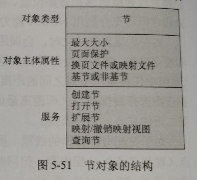
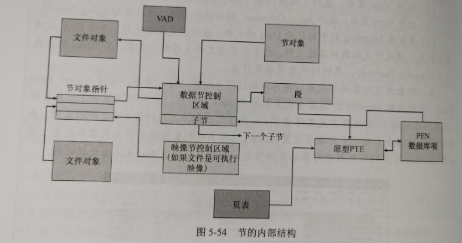

# 节对象

​	节(section)对象，即Windows 子系统调用的文件映射对象，代表两个或更多进程可共享的内存块。节对象可映射至页面文件或磁盘上的其他文件。

​	执行体会使用节将可执行映像载入内存，缓存管理器会使用节访问缓存文件中的数据。我们还可以使用节对象将文件映射至进程地址空间，随后即可映射节对象的不同视图，以“大型数组”的方式访问该文件并读写至内存(而非文件)，这种操作也叫作映射文件I/O。当程序访问了无效的页面后，将引发页面错误，随后内存管理器会自动将该页面从映射文件或页面文件读入内存。如果随后应用程序修改了该页面，内存管理器会在常规换页操作中将改动重新写回文件。(或者应用程序可以使用Windows的FlushViewOiFie函数明确刷新视图。)

​	与其他对象类似，节对象的分配和取消分配由对象管理器负责。对象管理器会创建并初始化用于管理对象的对象头，随后由内存管理器定义节对象的主体。内存管理器还实现了一些可供用户模式线程调用的服务，借此即可获取并更改节对象主体中存储的属性信息。节对象的结构如下图所示



下表总结了节对象中所有存储的各种属性

| 属性                       | 用途                                                         |
| -------------------------- | ------------------------------------------------------------ |
| Maximum size               | 节可以增长到的最大尺寸字节数。对于映射文件，则是指文件的最大尺寸 |
| Page protection            | 在创建节时，分配给其中所有页面的、基于页面的内存保护属性     |
| Paging file 或 Mapped file | 代表该节在创建时是为空(由页面文件支撑，如前所述，页面文件支撑的节只有在页面需要写出到磁盘时才会使用页面文件资源)还是加载了一个文件(由映射文件支撑) |
| Based 或 Not based         | 代表该节是否为基节(based section)，若为基节，必须在所有共享该节的进程中都位于相同虚拟地址上;若为非基节，可以位于不同进程的不同虚拟地址上 |



​	内存管理器为了描述映射节所维护的数据结构如图5-54所示。这些结构确保了无论任何类型的访问(打开文件、映射文件等)，从映射文件读取的数据均可保持一致。每个打开的文件(由文件对象所代表)都存在一个节对象指针结构。该结构是确保所有类型的数据访问均能维持数据一致性的关键，同时还提供了文件缓存。节对象指针结构会指向一个或两个控制区(control area)。其中一个控制区用于在以数据文件形式访问时对文件进行映射，另一个控制区可用于在以可执行映像形式运行时对文件进行映射。随后，控制区会指向为文件中的每个节描述映射信息(只读、读写、写入时复制等)的子节结构。该控制区还会指向在换页池中分配的一种段(segment结构，随后段结构会指向对节对象所映射的实际页面进行映射的原型PTE。正如本章前文所述，进程页表会指向这些原型PTE，进而映射至所引用的页面。

```c
// 节对象指针结构对应于SECTION_OBJECT_POINTERS结构
typedef struct _SECTION_OBJECT_POINTERS {
  PVOID DataSectionObject; //指向一个控制区，该控制区用于以数据文件形式访问时对文件进行映射。
  PVOID SharedCacheMap; // 指向与文件关联的共享缓存映射，用于文件缓存。
  PVOID ImageSectionObject;//指向一个控制区，该控制区用于以可执行映像形式运行时对文件进行映射
} SECTION_OBJECT_POINTERS, *PSECTION_OBJECT_POINTERS;
```

​	虽然Windows 可以保证任何进程在访问(读取或写入)文件时始终可以看到相同一致的数据，但是在一种情况下，物理内存中可能存有一个文件所对应页面的两个副本(就算在这种情况下，所有访问者也都可以得到最新副本，因此数据一致性依然有保障。)如果以数据文件的方式访问(读取或写入)了某个映像文件，随后又以可执行映像的形式运行了该文件，那么就会出现这种形式的副本。(例如，首先链接、随后运行一个映像,链接器打开该文件以供访问，随后运行该映像时，映像加载器将其映射为可执行文件。)从内部来看，此时会执行如下操作

(1)如果可执行文件是使用文件映射 API 或由缓存管理器创建的，将创建一个数据控制区来代表映像文件中被读取或写入的数据页面。

(2)当映像运行且创建了节对象来将映像映射为可执行文件时，内存管理器发现该映像文件的节对象指针指向了一个数据控制区，将会刷新该节。为确保在通过映像控制区访问映像之前，任何已修改页面都已经被写入磁盘，这个步骤是必须有的。

(3)内存管理器为该映像文件创建一个控制区。

(4)执行该映像时，其(只读)页面将通过错误处理从映像文件读入内存，但如果相应数据页面依然驻留在内存中，则会直接从数据文件中复制。

​	数据控制区映射的页面可能依然驻留 (位于待命列表中)，因此这种情况下，相同数据的两个副本将位于内存中两个不同页面内。然而这种副本并不会导致数据不一致的问题，因为就像前面所说的，数据控制区已被刷新到磁盘上，因此从映像读取的页面已处于最新状态(而这些页面永远不会被写回到磁盘)。