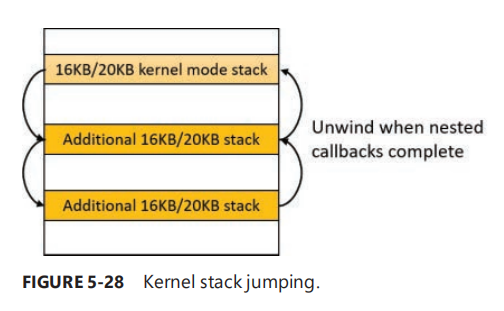

# 栈

在Windows中，每个线程有2个栈，用户栈和内核栈，每个处理器都有一个DPC栈。

### 用户栈

当线程创建时，内存管理器会自动预留一部分虚拟内存，默认为1MB。其大小可以通过CreateThread和CreateRemoteThread(Ex)函数创建线程时设置，或者在MSVC编译时设定/STACK标志，这些信息通常保存在映像头。虽然预留了1MB内存，但是只有栈的第一页内存页会被提交(除非在映像PE头中特别指定)，以及一个保护页也会被提交。当线程栈一直增大到触及保护页时，会触发异常，之后会试图开辟另一个保护页。通过这个机制，用户栈不至于会立即占满1MB的已提交内存，而是一点一点扩张。(但是永远不会收缩，就是说就算不需要那么大的栈了也不会把之前申请的内存立刻还回去)

---

### 内核栈

与用户栈不同，内核栈通常要小的多，32位系统上12KB，64位系统上16KB，另外还有一个保护页，总计16KB到20KB的虚拟内存。在内核上运行的代码应当尽量不使用递归，同时需要更高效的变量运用以及更小的栈缓存区。因为内核栈在系统地址空间中(所有进程共享)，它们的内存运用会对系统有更大的影响。

虽然内核代码通常不用递归，但由Win32k.sys处理的图形系统调用以及其随后对用户模式的回调可能会导致在相同的内核栈上对内核进行递归重入。Windows提供了一个机制用于从内核栈的初始大小动态扩张和收缩。每当在同一个线程增加了图形调用，就会分配16KB的内核栈。(会在系统地址空间的任意区域发生。内存管理器提供了当内核栈接近保护页时跳栈的能力)。当每个调用返回给调用者时，内存管理器会释放刚刚增加的内核栈，如图5-28所示。同时驱动开发者想要使用递归时必须通过KeExpandKernelStackAndCallout(Ex) API



```c
NTSTATUS
KeExpandKernelStackAndCallout (
    _In_ PEXPAND_STACK_CALLOUT Callout, // 一个指向要在扩展的内核栈上调用的回调函数的指针
    _In_opt_ PVOID Parameter, // 要传递给回调函数的可选参数
    _In_ SIZE_T Size // 请求的额外内核栈空间的大小
    ); // 函数原型

```

---

### DPC 栈

Windows为每个处理器保留了一个DPC栈用于系统执行DPC操作。这种方法将DPC代码和当前内核栈分离开来。(这与DPC操作无关因为DPC运行在任意线程的上下文)。DPC堆栈还被配置为处理系统调用期间的sysenter（x86）、svc（ARM）或syscall（x64）指令的初始堆栈。CPU会在执行这些指令时切换栈，基于MSR寄存器。然而，Windows不希望在每次上下文切换时都重新编程MSR（模型特定寄存器），因为这是一个代价高昂的操作。因此，Windows会在MSR中配置每个处理器的DPC堆栈指针。

